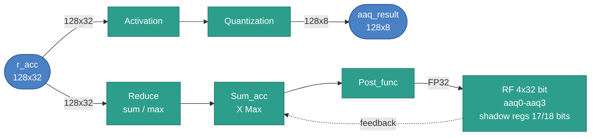
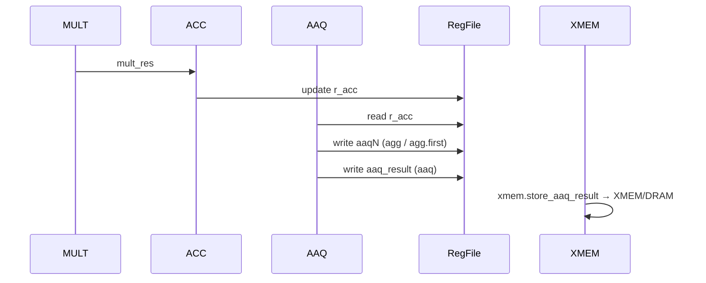

# AAQ Stage

## 1. Purpose

The AAQ (Activation Aggregation and Quantization) stage collapses the 128-lane accumulator
into scalar activation values and/or quantizes the accumulator into an FP8
vector for output. It produces:

- Scalar results in `aaq0`–`aaq3` via `agg` and `agg.first`.
- A 128-byte `aaq_result` vector via `aaq` (any 8-bit format: INT8 or FP8 e(x)m(7-x)).

## 2. Block Diagram



## 3. Interfaces

*Exact bit widths are TBD where noted.*

| Name | Type and Direction | Description |
|------|--------------------|-------------|
| `r_acc` | `input logic [TBD:0]` | 128-lane accumulator (128 × 32-bit). |
| `aaq_regs[0..3]` | `output logic [31:0]` | Scalar AAQ register writeback (`aaq0`–`aaq3`). |
| `aaq_result` | `output logic [1023:0]` | Quantized 128-byte output vector (INT8 or FP8, per `aaq_dtype`). |
| `agg_mode` | `input logic [0:0]` | Aggregation select: 0 = sum, 1 = max. |
| `post_fn` | `input logic [1:0]` | Post-function select (see §8). |
| `cr_idx` | `input logic [TBD:0]` | CR register index used by `value_cr` post function. |
| `aaq_rf_idx` | `input logic [1:0]` | AAQ register index (0–3). |
| `op` | `input logic [TBD:0]` | AAQ slot opcode: `aaq_nop`=0, `agg`=1, `agg.first`=2, `aaq`=3. |
| `aaq_dtype` | `input logic [2:0]` | Target 8-bit format for `aaq`: 0=INT8, 1–7=FP8 e(x)m(7-x). |
| `cr15_dtype` | `input logic [2:0]` | Global data type from `cr15`; governs lane interpretation for `agg`/`agg.first`. |

## 4. Parameters

| Name | Default | Description |
|------|---------|-------------|
| `LANES` | `128` | Number of accumulator lanes. |
| `ACC_LANE_WIDTH` | `32` | Bits per accumulator lane. |
| `AAQ_REG_COUNT` | `4` | Number of AAQ scalar registers (`aaq0`–`aaq3`). |
| `AAQ_RESULT_BYTES` | `128` | Byte width of `aaq_result` output vector. |
| `AGG_MODE_COUNT` | `2` | Aggregation modes: 0 = sum, 1 = max. |
| `POST_FN_COUNT` | `4` | Post functions: 0 = value, 1 = value_cr, 2 = inv, 3 = inv_sqrt. |

## 5. Data and Register Model

- `r_acc` is 512 bytes (128 × 32-bit lanes). Lane interpretation depends on `cr15`:
  - INT8 mode: lanes are signed int32 values.
  - FP8 modes: lanes are treated as float32 values.
- `aaq0`–`aaq3` are 32-bit registers. They store int32 or float32 bit patterns
  depending on the active data type and the post function applied (see §8).
- `aaq_result` is 128 bytes produced only by `aaq`. Each byte holds one
  quantized value in the format selected by the `dtype` operand: INT8 signed
  byte, or an FP8 byte (sign + exponent + mantissa fields). It is written to
  XMEM via `xmem.store_aaq_result`.

## 6. Pipeline / Timing Model

- The AAQ slot executes once per VLIW cycle.
- Slot execution order within a VLIW word: XMEM → MULT → ACC → **AAQ** → COND.
- AAQ consumes `r_acc` as written by ACC in the same cycle.
- `aaq_nop` performs no state changes.

## 7. AAQ Operations

### 7.1 Aggregate (`agg`)

```text
// Collect 128 lane values (int32 in INT8 mode, float32 in FP8 modes)
values = [r_acc[i] for i in 0..127]

if agg_mode == sum:
    raw = sum(values)
else:  // max
    raw = max(values + [aaq[aaq_rf_idx]])  // includes previous register

out = post_fn(raw, cr[cr_idx])
aaq[aaq_rf_idx] = pack32(out)
```

Notes:
- In `max` mode the current value of the target AAQ register is included
  in the comparison. Use `agg.first` to avoid contamination from an
  uninitialised register.
- `pack32` stores the result as a 32-bit bit pattern (int32 or float32
  depending on the post function and dtype — see §8).

### 7.2 Aggregate First (`agg.first`)

Identical to `agg` except that `max` mode ignores the previous AAQ value:

```text
if agg_mode == sum:
    raw = sum(r_acc[0..127])
else:  // max
    raw = max(r_acc[0..127])  // previous aaq value NOT included
```

Use `agg.first` at the start of a new accumulation sequence to avoid
reading stale data from the target register.

### 7.3 Quantize (`aaq dtype`)

The `dtype` operand selects the target 8-bit format. The encoding matches `DType`:
0 = INT8, 1–7 = FP8 e(x)m(7-x) where x is the number of exponent bits
(e.g. 4 = FP8_E4M3, 5 = FP8_E5M2).

**INT8 path** (`dtype == 0`):

```text
// r_acc lanes are int32
for i in 0..127:
    val            = r_acc[i]        // signed int32
    truncated      = val >> 24       // arithmetic right shift: keeps top 8 bits
    aaq_result[i]  = clamp(truncated, -128, 127)
```

**FP8 path** (`dtype == 1..7`, i.e. e(x)m(7-x)):

```text
// r_acc lanes are float32
exp_bits = dtype                     // 1..7
for i in 0..127:
    val            = r_acc[i]        // float32
    aaq_result[i]  = float32_to_fp8(val, exp_bits)
```

`float32_to_fp8` rounds-to-nearest and clamps to the format's finite range.
Special values (±Inf, NaN) map to the format's maximum finite magnitude.

Notes:
- `aaq_result` must be flushed to XMEM with `xmem.store_aaq_result offset base`
  before the next `aaq` overwrites it.
- In wide-vector debug mode `aaq` is a no-op unless
  `wide_vector_quantize_output` is explicitly set (debug feature only).

## 8. Post-Function Details

`post_fn` is applied to the aggregated scalar `raw` before writing to the AAQ register.

| Encoding | Name | Formula | Result type stored in AAQ |
|----------|------|---------|--------------------------|
| 0 | `value` | `raw` | Same as lane type (int32 or float32) |
| 1 | `value_cr` | `raw * cr[cr_idx]` | int32 (INT8 mode, 32-bit wrap); float32 (FP8 modes) |
| 2 | `inv` | `1 / raw` (0 if raw == 0) | **float32 bits** (INT8 mode); float32 (FP8 modes) |
| 3 | `inv_sqrt` | `1 / sqrt(raw)` (0 if raw ≤ 0) | **float32 bits** (INT8 mode); float32 (FP8 modes) |

Important INT8-mode subtleties:
- `value_cr`: CR register value is interpreted as int32; product is truncated to 32 bits with signed wrap.
- `inv` and `inv_sqrt`: even though the input is int32, the result is computed in float and the
  **float32 bit pattern** is stored in the AAQ register. Software reading `aaqN` after these
  functions must reinterpret it as float32.

## 9. Timing Example



## 10. Control and ISA Mapping

The AAQ stage is driven by the AAQ slot. Opcodes are assigned by position in `instruction_spec.py`.

| Opcode | Mnemonic | Operands | Description |
|--------|----------|----------|-------------|
| 0 | `aaq_nop` | — | No operation. |
| 1 | `agg` | `agg_mode post_fn cr_idx aaq_rf_idx` | Aggregate with current AAQ value (max) or sum; apply post function. |
| 2 | `agg.first` | `agg_mode post_fn cr_idx aaq_rf_idx` | Like `agg` but ignores previous AAQ value in max mode. |
| 3 | `aaq` | `dtype` | Quantize `r_acc` into `aaq_result` using the target 8-bit format. INT8: int32>>24 clamped. FP8 e(x)m(7-x): float32→FP8. |

Related instructions in other slots that read/write AAQ registers:

| Instruction | Slot | Description |
|-------------|------|-------------|
| `mult.ve.aaq aaq_rf_idx` | MULT | Use low byte of `aaqN` as the fixed scalar multiplier. |
| `acc.add_aaq aaq_rf_idx` | ACC | Accumulate mult result and add `aaqN` to all 128 lanes. |
| `acc.add_aaq.first aaq_rf_idx` | ACC | Reset accumulator to mult result plus `aaqN`. |
| `acc.max aaq_rf_idx` | ACC | Per-lane max of `r_acc`, `mult_res`, and `aaqN`. |
| `acc.max.first aaq_rf_idx` | ACC | Per-lane max of `mult_res` and `aaqN` (ignores `r_acc`). |
| `xmem.store_aaq_result offset base` | XMEM | Write 128-byte `aaq_result` to XMEM at `offset + base`. |

Opcode and operand encodings are the single source of truth in
`src/tools/ipu-common/src/ipu_common/instruction_spec.py` and must stay in
sync with the emulator and assembler.
