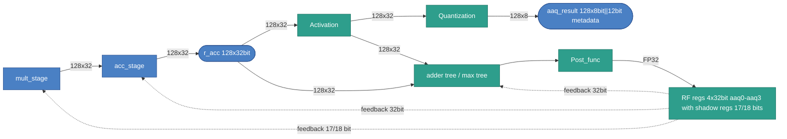

# AAQ Stage

## 1. Purpose

The AAQ (Activation Aggregation and Quantization) stage collapses the 128-lane accumulator
into scalar activation values and/or quantizes the accumulator into an FP8
vector for output. It produces:

- Scalar results in `aaq0`–`aaq3` via `agg` and `agg.first`.
- A 128-byte `aaq_result` vector via `aaq` (any 8-bit format: INT8 or FP8 e(x)m(7-x)).

## 2. Block Diagram



## 3. Interfaces

*Exact bit widths are TBD where noted.*

| Name | Type and Direction | Description |
|------|--------------------|-------------|
| `r_acc` | `input logic [127:0][31:0]` | 128-lane accumulator (128 × 32-bit). |
| `aaq_regs[0..3]` | `output logic [31:0]` | Scalar AAQ register writeback (`aaq0`–`aaq3`). |
| `aaq_result` | `output logic [1035:0]` | Quantized output: 128 × 8-bit lanes (1024 bits) plus 12 bits of metadata. Metadata encoding is TBD. |
| `agg_mode` | `input logic [0:0]` | Aggregation select: 0 = sum, 1 = max. |
| `post_fn` | `input logic [1:0]` | Post-function select (see §8). |
| `cr_idx` | `input logic [3:0]` | CR register index used by `value_cr` post function. |
| `aaq_rf_idx` | `input logic [1:0]` | AAQ register index (0–3). |
| `op` | `input logic [2:0]` | AAQ slot opcode: `aaq_nop`=0, `agg`=1, `agg.first`=2, `aaq`=3. |
| `cr15_dtype` | `input logic [2:0]` | Global data type from `cr15`; governs lane interpretation for all AAQ operations. Must be `DType.INT8` (0) for `aaq`. |

## 4. Parameters

| Name | Default | Description |
|------|---------|-------------|
| `LANES` | `128` | Number of accumulator lanes. |
| `ACC_LANE_WIDTH` | `32` | Bits per accumulator lane. |
| `AAQ_REG_COUNT` | `4` | Number of AAQ scalar registers (`aaq0`–`aaq3`). |
| `AAQ_RESULT_BYTES` | `128` | Byte width of `aaq_result` output vector. |
| `AGG_MODE_COUNT` | `2` | Aggregation modes: 0 = sum, 1 = max. |
| `POST_FN_COUNT` | `4` | Post functions: 0 = value, 1 = value_cr, 2 = inv, 3 = inv_sqrt. |

## 5. Data and Register Model

- `r_acc` is 512 bytes (128 × 32-bit lanes). Lane interpretation depends on `cr15`:
  - INT8 mode: lanes are signed int32 values.
  - FP8 modes: lanes are treated as float32 values.
- `aaq0`–`aaq3` are 32-bit registers. They store int32 or float32 bit patterns
  depending on the active data type and the post function applied (see §8).
- `aaq_result` is produced only by `aaq`. It contains 128 × INT8 quantized
  values (1024 bits) plus 12 bits of metadata appended by the Quantization
  block. The algorithmic content and encoding of the metadata are TBD. It is
  written to XMEM via `xmem.store_aaq_result`.

## 6. Pipeline / Timing Model

- The AAQ slot executes once per VLIW cycle.
- Slot execution order within a VLIW word: XMEM → MULT → ACC → **AAQ** → COND.
- AAQ consumes `r_acc` as written by ACC in the same cycle.
- `aaq_nop` performs no state changes.

## 7. AAQ Operations

### 7.1 Aggregate (`agg`)

```text
// Activation: interpret each lane (int32 in INT8 mode, float32 in FP8 modes)
values = [activation(r_acc[i]) for i in 0..127]

// Adder tree / max tree (feedback from RF included in max mode)
if agg_mode == sum:
    raw = sum(values)
else:  // max
    raw = max(values + [aaq[aaq_rf_idx]])  // includes previous register via RF feedback

out = post_fn(raw, cr[cr_idx])
aaq[aaq_rf_idx] = pack32(out)
```

Notes:
- Activation applies the lane-type interpretation shared with the `aaq` quantize path.
- In `max` mode the current value of the target AAQ register is fed back from RF into
  the adder/max tree. Use `agg.first` to avoid contamination from an uninitialised register.
- `pack32` stores the result as a 32-bit bit pattern (int32 or float32
  depending on the post function and dtype — see §8).

**ISA Interactions** — instructions in other slots that consume `aaqN` written by `agg`:

| Instruction | Slot | Operation |
|-------------|------|-----------|
| `mult.ve.aaq aaq_rf_idx` | MULT | Uses the low byte of `aaqN` as a fixed scalar multiplier applied to every element of the input vector. |
| `acc.add_aaq aaq_rf_idx` | ACC | Accumulates the mult result into `r_acc` and adds `aaqN` (broadcast) to all 128 lanes. |
| `acc.add_aaq.first aaq_rf_idx` | ACC | Resets `r_acc` to the mult result plus `aaqN`, discarding the previous accumulation. |
| `acc.max aaq_rf_idx` | ACC | Per-lane max of `r_acc`, `mult_res`, and `aaqN`. |
| `acc.max.first aaq_rf_idx` | ACC | Per-lane max of `mult_res` and `aaqN`; `r_acc` is ignored (first-cycle reset). |

### 7.2 Aggregate First (`agg.first`)

Identical to `agg` except that `max` mode ignores the RF feedback value:

```text
// Activation: interpret each lane
values = [activation(r_acc[i]) for i in 0..127]

if agg_mode == sum:
    raw = sum(values)
else:  // max
    raw = max(values)  // RF feedback NOT included
```

Use `agg.first` at the start of a new accumulation sequence to avoid
reading stale data from the target register.

**ISA Interactions** — same as `agg`; `agg.first` writes `aaqN` through the same RF writeback path and the result is consumed identically by downstream MULT and ACC instructions (see table in §7.1).

### 7.3 Quantize (`aaq`)

Requires INT8 mode (`cr15 == DType.INT8`). Takes no operands. Reads `r_acc`
lanes as signed int32, truncates to the top 8 bits, clamps, and writes the
128-byte result to `aaq_result`.

```text
// cr15 must be DType.INT8
for i in 0..127:
    val            = r_acc[i]        // signed int32
    truncated      = val >> 24       // arithmetic right shift: keeps top 8 bits
    aaq_result[i]  = clamp(truncated, -128, 127)
```

Notes:
- The Quantization block appends 12 bits of metadata to the 1024-bit data
  payload to form the full 1036-bit `aaq_result`. The algorithmic content
  of this metadata is TBD.
- `aaq_result` must be flushed to XMEM with `xmem.store_aaq_result offset base`
  before the next `aaq` overwrites it.
- In wide-vector debug mode `aaq` is a no-op unless
  `wide_vector_quantize_output` is explicitly set (debug feature only).

**ISA Interactions** — instructions in other slots that consume `aaq_result` written by `aaq`:

| Instruction | Slot | Operation |
|-------------|------|-----------|
| `xmem.store_aaq_result offset base` | XMEM | Writes the 128-byte `aaq_result` register to XMEM at address `offset + base`. Must be issued before the next `aaq` to avoid overwrite. |

## 8. Post-Function Details

`post_fn` is applied to the aggregated scalar `raw` before writing to the AAQ register.

| Encoding | Name | Formula | Result type stored in AAQ |
|----------|------|---------|--------------------------|
| 0 | `value` | `raw` | Same as lane type (int32 or float32) |
| 1 | `value_cr` | `raw * cr[cr_idx]` | int32 (INT8 mode, 32-bit wrap); float32 (FP8 modes) |
| 2 | `inv` | `1 / raw` (0 if raw == 0) | **float32 bits** (INT8 mode); float32 (FP8 modes) |
| 3 | `inv_sqrt` | `1 / sqrt(raw)` (0 if raw ≤ 0) | **float32 bits** (INT8 mode); float32 (FP8 modes) |

Important INT8-mode subtleties:
- `value_cr`: CR register value is interpreted as int32; product is truncated to 32 bits with signed wrap.
- `inv` and `inv_sqrt`: even though the input is int32, the result is computed in float and the
  **float32 bit pattern** is stored in the AAQ register. Software reading `aaqN` after these
  functions must reinterpret it as float32.

## 9. Control and ISA Mapping

The AAQ stage is driven by the AAQ slot. Opcodes are assigned by position in `instruction_spec.py`.

| Opcode | Mnemonic | Operands | Description |
|--------|----------|----------|-------------|
| 0 | `aaq_nop` | — | No operation. |
| 1 | `agg` | `agg_mode post_fn cr_idx aaq_rf_idx` | Aggregate with current AAQ value (max) or sum; apply post function. |
| 2 | `agg.first` | `agg_mode post_fn cr_idx aaq_rf_idx` | Like `agg` but ignores previous AAQ value in max mode. |
| 3 | `aaq` | — | Quantize `r_acc` (128 × int32) into `aaq_result` (128 × INT8). Requires INT8 mode. Each lane: `clamp(r_acc[i] >> 24, -128, 127)`. |

ISA interactions for each operation are described in §7. Opcode and operand encodings are the single source of truth in
`src/tools/ipu-common/src/ipu_common/instruction_spec.py` and must stay in
sync with the emulator and assembler.
