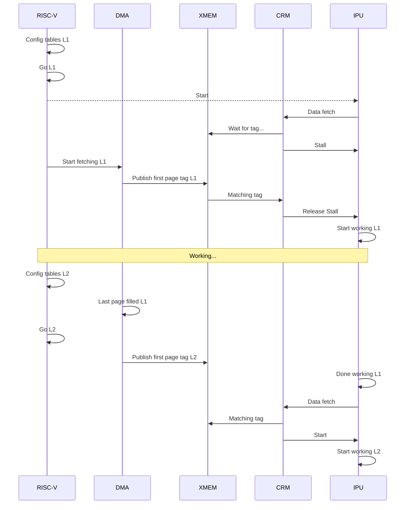

# Cache Unit

## 1. Purpose

The Cache Unit manages data movement between external DRAM and on-chip XMEM so the IPU can run continuously.

- CRM resolves IPU addresses and checks tags.
- DMA moves data between DRAM and XMEM using DMA tables.
- XMEM stores active banks/pages used by IPU.

## 2. Block Diagram

```text
+----------------------------------------------+
|                 CACHE UNIT                   |
|                                              |
|   +------+      +------+      +------+       |
|   | DMA  |<---->| XMEM |<---->| CRM  |       |
|   +------+      +------+      +------+       |
|      ^                          ^            |
+------|--------------------------|------------+
       |                          |
   dram_addr                   ipu_addr
   (DRAM)                      (IPU)
```

## 3. Interfaces

*Exact bit widths are TBD.*

| Name | Type and Direction | Description |
|------|--------------------|-------------|
| `riscv_cfg_bus` | `input logic [TBD:0]` | Config bus from RISC-V for table setup and start signals. |
| `dram_addr` | `output logic [TBD:0]` | Address to DRAM controller. |
| `dram_rd_data` | `input logic [TBD:0]` | Read data from DRAM. |
| `ipu_addr` | `input logic [TBD:0]` | IPU virtual address (`array_id + offset`). |
| `ipu_rd_data` | `output logic [TBD:0]` | Data returned to IPU. |
| `ipu_stall` | `output logic` | Stall to IPU when requested data is not ready. |

## 4. Parameters

| Name | Default | Description |
|------|---------|-------------|
| `NUM_BANKS` | `16` | Number of XMEM banks/pages. |
| `BANK_SIZE` | `1024 rows x 1024 bits` | Size of one BANK/PAGE. |
| `OFFSET_WIDTH` | `20` | Offset width inside the array address space. |
| `ARRAY_ID_WIDTH` | `TBD` | Array ID width. |

## 5. Memory and Tag Model

- Tag = {TABLE_ID, offset[19:0]}
- In this design, **BANK = PAGE**.
- Each BANK/PAGE has **1024 rows**.
- Each row is **1024 bits**.
- Address split:
  - `offset[9:0]` = row index in bank (0..1023)
  - `offset[19:10]` = tag and bank-list index component
- `in_use` each bank contains a bit that signal if the bank is in use by a table  
- `FFFF` tag means bank is free or not ready for the required operation.

## 6. Handshake Model

- IPU and DMA are not directly connected.
- IPU sends two things to CRM:
   - `ipu_addr` (virtual address)
   - Requested table ID (example: `W_Table` or `Xout_Table`)
- CRM checks tag ownership.
- If the tag does not match, CRM asserts `ipu_stall`.
- DMA runs in the background and fills or drains banks.
- When DMA publishes the needed tag, CRM deasserts `ipu_stall` and IPU continues.

## 7. DMA Operations

DMA tables behave like DMA engines.

DMA table note:
- `banklist` is a cyclic linked list.
- `array_size` is the number of pages this table instance must handle during its lifetime.
- `base_dram_addr` is the DRAM base address used for this table's operations.

### 7.1 DMA Read (DRAM -> XMEM)

```text

dram_addr = base_dram_addr + dram_offset
bank_pos = dram_offset[19:10] % NUM_BANKS
bank = banklist[bank_pos]
xmem_addr = {bank, dram_offset[9:0]}
tag = {TABLE_ID, dram_offset[19:10]}

if (bank.tag != FFFF)
   DMA_stall

if (done_filling_bank)
   bank.tag = tag

```

Behavior:
- DMA computes DRAM and XMEM addresses per table entry.
- DMA cannot overwrite a busy bank (`bank.tag != FFFF`).
- Tag is published only after the whole bank is filled.

### 7.2 DMA Write (XMEM -> DRAM)

```text

dram_addr = base_dram_addr + dram_offset
bank_pos = dram_offset[19:10] % NUM_BANKS
bank = banklist[bank_pos]
tag = {TABLE_ID, dram_offset[19:10]}

if (bank.tag != tag)
   DMA_stall

if (dram_offset[9:0] == 0x3FF)   // row 1023
   bank.tag = FFFF
 

```

Behavior:
- DMA drains bank data to DRAM only when bank tag matches required tag.
- At row 1023, drain is complete and bank is released (`FFFF`).

## 8. CRM Operations

### 8.1 CRM Read (XMEM -> IPU)

```text
// IPU request carries: IPU_ADDR (virtual) + TABLE_ID

bank_pos = offset[19:10] % NUM_BANKS
bank = banklist[bank_pos]
xmem_addr = {bank, offset[9:0]}
tag = {TABLE_ID, offset[19:10]}

if (tag != bank.tag)
   IPU_stall

if (offset[9:0] >= jump_back && offset[19:10] != 0)
   banklist[(bank_pos - 1) % NUM_BANKS].tag = FFFF

if (offset == FFFF)
   for bank in banks:
      bank.tag = FFFF
```

Behavior:
- CRM serves IPU reads only on tag match.
- CRM can free previous bank at jump boundary.
- Special invalidate command can clear all tags.

### 8.2 CRM Write (IPU -> XMEM)

```text

thread 0
while (i != array_size):
   bank_pos = i % NUM_BANKS
   bank = banklist[bank_pos]
   if(bank.tag == FFFF)
      bank.tag = i
      i++
      
thread 1

bank_pos = offset[19:10] % NUM_BANKS
bank = banklist[bank_pos]
tag = {TABLE_ID, offset[19:10]}

if (tag != bank.tag)
   IPU_stall

if (offset[9:0] >= jump_back && offset[19:10] != 0 )
   banklist[(bank_pos - 1) % NUM_BANKS].flush = True

if (offset == FFFF && flush_en)
   for bank in banklist:
      if(bank.tag != FFFF)
         bank.flush = True

```

Behavior:
- CRM write path uses jump-based wrap behavior.
- CRM table provides `banklist` (linked list) and `jump_back` (numeric value).
- Previous bank tag can be published after jump condition.
- TODO (special edge case): add a dedicated ISA command to explicitly trigger `publish_tag` for current bank tag publication.

## 9. Layer1/Layer2 Timing Example



## 10. RISC-V Control Tables

### 10.1 DMA Table (Per Array ID)

- `bank_list`: cyclic linked list of BANK/PAGE IDs.
- `array_size`: number of pages this table must handle during its lifetime.
- `base_dram_addr`: DRAM base address used for all table operations.

### 10.2 CRM Table (Per Array ID)

- `bank_list`: linked list of BANK/PAGE IDs used by CRM lookup.
- `jump_back`: numeric wrap/jump threshold.
- `array_size`: number of pages this table must handle during its lifetime.
- `flush_en`: allow the table to be flushed via DMA to DRAM.


