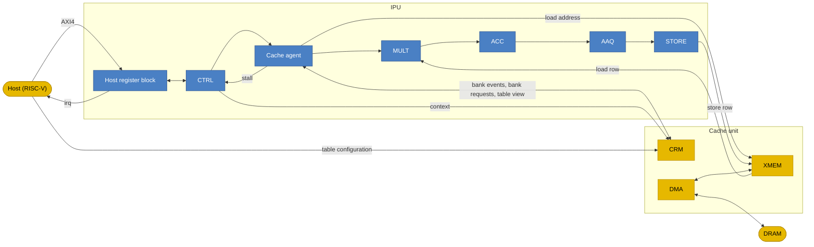

# Architecture and pipeline

## Block diagram

## Blocks

| Block | Inside the IPU | Role |
|---|---|---|
| Host register block | Yes | AXI4 slave. Holds commands, status, interrupt control and debug registers. |
| CTRL | Yes | Holds the PC, the IMEM banks, the CR banks and the LR file. Fetches words, resolves branches, executes the LR slots, and resolves CR and LR operand values for the later stages. |
| Cache agent | Yes | Decides hit or miss for the load and the store of each word. Stalls CTRL on a miss. Issues the XMEM read. |
| MULT | Yes | Holds `R0`, `R1`, `R_CYCLIC` and `R_MASK`. Produces the 128-element multiply result. |
| ACC | Yes | Holds `R_ACC`. Combines the multiply result into it. |
| AAQ | Yes | Applies the activation function to `R_ACC` and quantizes the result. |
| STORE | Yes | Writes the AAQ output row to XMEM. |
| Cache unit | No | CRM, XMEM and DMA. Holds the tables, fills XMEM banks from DRAM and drains them to DRAM. |
| Host | No | Loads kernels, configures tables, and controls and debugs the IPU. |

## Architectural state

| State | Size | Owner | Host access |
|---|---|---|---|
| PC | One. Width is log2 of the IMEM bank depth. | CTRL | Read. Write while `HALTED`. |
| IMEM | Two banks. Depth: [OQ-4](open-questions.md). | CTRL | One address window per bank. Write while the context is not locked. |
| `CR0`–`CR15` | Two banks of 16 registers. `CR0` = 0 and `CR1` = 1 in both banks. Width: [OQ-3](open-questions.md). | CTRL | Read. Write while the context is not locked. |
| `LR0`–`LR15` | 16 registers. Width: [OQ-3](open-questions.md). | CTRL | Read through debug. |
| `R0`, `R1` | 128 elements each | MULT | None |
| `R_CYCLIC` | 512 elements | MULT | None |
| `R_MASK` | 8 masks of 128 bits | MULT | None |
| `R_ACC` | 128 elements of 32 bits | ACC | None |
| AAQ output row | 128 elements of 8 bits, plus metadata. Format: [OQ-7](open-questions.md). | AAQ | None |

## Execution model

| ID | Requirement |
|---|---|
| IPU-ARCH-1 | Each VLIW word shall execute atomically. The state after a word equals the state produced by executing its slots in this order: `COND` and `LR`, `LOAD`, `MULT`, `ACC`, `AAQ`, `STORE`. |
| IPU-ARCH-2 | The `COND` and `LR` slots shall read CR and LR values from before the word. |
| IPU-ARCH-3 | The `LOAD`, `MULT`, `ACC`, `AAQ` and `STORE` slots shall read LR values from after the LR writes of the same word. See [OQ-10](open-questions.md). |
| IPU-ARCH-4 | The IPU shall implement every ISA slot except `ACC_STORE` and `BREAK`. |
| IPU-ARCH-5 | The `COND` slot shall provide `END`. `END` uses the opcode that the instruction reference assigns to `BKPT`. |
| IPU-ARCH-6 | Instruction semantics shall follow the instruction reference. See [OQ-5](open-questions.md) and [OQ-6](open-questions.md). |

## Pipeline

The six stages are architectural. One word moves through them in order.

| ID | Requirement |
|---|---|
| IPU-ARCH-10 | The IPU shall process each word through six stages in this order: CTRL, cache agent, MULT, ACC, AAQ, STORE. |
| IPU-ARCH-11 | The IPU shall accept one word per clock cycle while the cache agent does not stall. |
| IPU-ARCH-12 | MULT, ACC, AAQ and STORE may each take more than one clock cycle. The latency of each stage shall be fixed. |
| IPU-ARCH-13 | Pipelining shall not change any architectural result. Only timing differs from the atomic model of IPU-ARCH-1. |
| IPU-ARCH-14 | The cache agent shall be the only source of backpressure. It stalls CTRL only. |
| IPU-ARCH-15 | A word that the cache agent has accepted shall retire a fixed number of cycles later. |
| IPU-ARCH-16 | CTRL shall take one clock cycle per word: LR update, branch decision and fetch of the next word. A taken branch costs no extra cycle. |
| IPU-ARCH-17 | CTRL shall commit the LR writes and the PC update of a word only when the cache agent accepts the word. See [OQ-16](open-questions.md). |

IPU-ARCH-17 makes stalls, halts and faults precise: a word that is not accepted has changed nothing.
