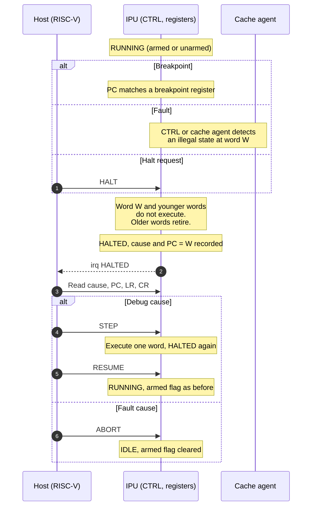

# Debug

The host debugs the IPU through the host port. Step 0 is the debug feature set of the first hardware version.

## Step 0 requirements

| ID | Requirement |
|---|---|
| IPU-DBG-1 | The host shall be the only debugger. All debug access uses the host port. |
| IPU-DBG-2 | `HALTED` shall mean: the pipeline is empty and the architectural state is at a word boundary. This holds for every halt cause. |
| IPU-DBG-3 | The IPU shall record the halt cause: halt request, step done, breakpoint, or fault. |
| IPU-DBG-4 | For a breakpoint the IPU shall record the breakpoint index. For a fault it shall record the fault code. |
| IPU-DBG-5 | When one word meets several halt causes, the IPU shall record the first of: fault, breakpoint, halt request. |
| IPU-DBG-6 | `STEP` shall execute exactly one word, wait for it to retire, and enter `HALTED` with cause "step done". |
| IPU-DBG-7 | During a step the run state shall be `RUNNING_UNARMED` or `RUNNING_ARMED`. The IPU accepts `HALT` and `ABORT`. |
| IPU-DBG-8 | When the stepped word holds `END`, the kernel is done. After a handoff, the IPU shall enter `HALTED` at PC 0 of the next kernel. |
| IPU-DBG-9 | The IPU shall provide PC breakpoints. The number of breakpoints is a parameter with default 4. |
| IPU-DBG-10 | Each breakpoint shall hold an enable bit, a context and a PC. |
| IPU-DBG-11 | When the PC and `active_ctx` match an enabled breakpoint, the IPU shall halt before the matched word executes. |
| IPU-DBG-12 | `RESUME` and `STEP` shall execute the word at the PC without triggering its breakpoint again. |
| IPU-DBG-13 | The host shall be able to read the PC, `LR0`–`LR15`, both CR banks and the run state in every run state. |
| IPU-DBG-14 | The host shall be able to write the PC in `HALTED` with a debug cause. |
| IPU-DBG-15 | The host shall be able to read the IMEM bank of the active context in `HALTED` and `IDLE`. |
| IPU-DBG-16 | LR and the CR bank of a locked context shall be read-only to the host. |

In a running state, the PC and LR values that the host reads change from cycle to cycle.

IPU-DBG-8 without a handoff leaves the IPU in `IDLE`. With a handoff, `kernel_start` pulses and the first word of the next kernel does not execute.

A halt request also takes effect while a word is stalled on a miss: IPU-EXEC-22 in [Execution flow](execution-flow.md).

Step 0 has no read-out of `R0`, `R1`, `R_CYCLIC`, `R_MASK` and `R_ACC`. A kernel exposes vector data by storing it to XMEM.

## Extensibility

| ID | Requirement |
|---|---|
| IPU-DBG-20 | The debug registers shall occupy their own address window in the register file: capability, PC, LR read-out and breakpoints. |
| IPU-DBG-21 | The first register of the window shall be a capability register. It holds the debug version, the number of breakpoints and one bit per optional feature. |
| IPU-DBG-22 | A debug feature beyond step 0 shall add registers in the window and a bit in the capability register. It shall not change IPU-DBG-2. |

Every debug feature reads or writes state while the IPU is `HALTED`. `HALTED` always means an empty pipeline at a word boundary, so a feature beyond step 0 needs no change to halt behaviour.

Candidate features beyond step 0: vector register read-out, LR and CR writes, data watchpoints, and execution trace.

## Flow: halt

