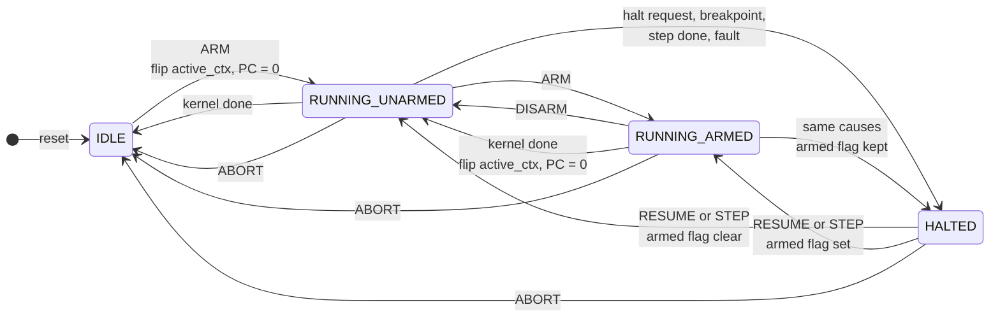
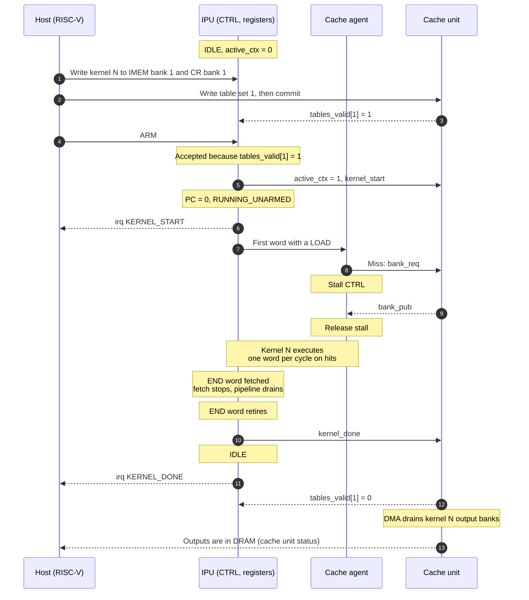
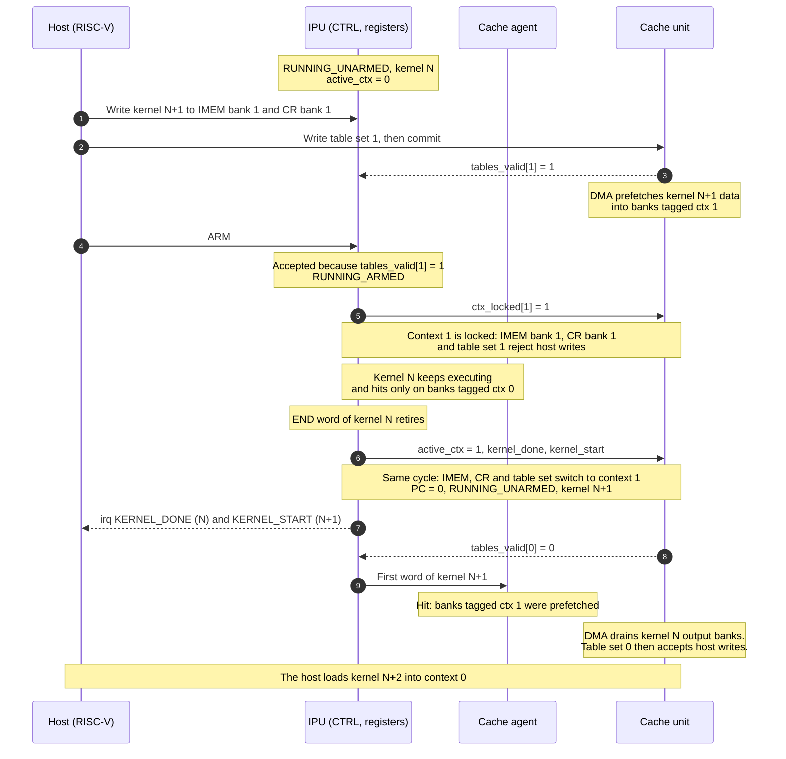

# Execution flow

## Contexts

The IPU has two contexts, 0 and 1. Context `k` holds IMEM bank `k`, CR bank `k` and table set `k`. The `active_ctx` bit selects all three for the running kernel. The IPU owns `active_ctx` and drives it to the cache unit.

A context is locked:

- while it is the active context and the IPU is not `IDLE`, or
- while it is armed.

The host loads a kernel into the inactive context while that context is not locked.

## Run states

| State | Meaning |
|---|---|
| `IDLE` | No kernel runs. The pipeline is empty. Both contexts are unlocked. |
| `RUNNING_UNARMED` | A kernel runs. No kernel is armed. |
| `RUNNING_ARMED` | A kernel runs. The kernel in the inactive context starts when the running kernel is done. |
| `HALTED` | The kernel stands at a word boundary. The pipeline is empty. The armed flag keeps its value. |

`ARM` and `DISARM` in `HALTED` change the armed flag only. The diagram omits them.

## Commands

The host issues a command by writing 1 to its bit in the command register.

| Command | Accepted in | Effect |
|---|---|---|
| `ARM` | `IDLE` | Starts the kernel in the inactive context. |
| `ARM` | `RUNNING_UNARMED`, or `HALTED` with the armed flag clear | Sets the armed flag. |
| `DISARM` | `RUNNING_ARMED`, or `HALTED` with the armed flag set | Clears the armed flag. |
| `HALT` | `RUNNING_UNARMED`, `RUNNING_ARMED` | Halts with cause "halt request". |
| `STEP` | `HALTED` with a debug cause | Executes one word and halts with cause "step done". |
| `RESUME` | `HALTED` with a debug cause | Returns to the running state. |
| `ABORT` | `RUNNING_UNARMED`, `RUNNING_ARMED`, `HALTED` | Stops the kernel and goes to `IDLE`. Clears the armed flag. |

A command written in a state that does not accept it has no effect and returns an AXI error. A `DISARM` that returns an AXI error tells the host that the handoff already happened.

## Requirements

### Start

| ID | Requirement |
|---|---|
| IPU-EXEC-1 | The IPU shall be in exactly one run state: `IDLE`, `RUNNING_UNARMED`, `RUNNING_ARMED` or `HALTED`. |
| IPU-EXEC-2 | The IPU shall accept `ARM` only while `tables_valid` of the inactive context is high. Otherwise `ARM` returns an AXI error. |
| IPU-EXEC-3 | An `ARM` accepted in `IDLE` shall flip `active_ctx`, set PC = 0 and start fetching. See [OQ-13](open-questions.md). |
| IPU-EXEC-4 | An `ARM` accepted in `RUNNING_UNARMED` or `HALTED` shall set the armed flag and lock the inactive context. |
| IPU-EXEC-5 | A kernel start shall change no architectural state except `active_ctx` and the PC. LR and the vector registers keep their values. |
| IPU-EXEC-6 | The IPU shall reject host writes to the IMEM bank and the CR bank of a locked context with an AXI error. |

### Done and handoff

| ID | Requirement |
|---|---|
| IPU-EXEC-10 | The word that holds `END` shall be the last word of the kernel. Its other slots execute. CTRL fetches no word after it. |
| IPU-EXEC-11 | A kernel is done when its `END` word retires. |
| IPU-EXEC-12 | When a kernel is done and the armed flag is clear, the IPU shall go to `IDLE`. `active_ctx` keeps its value. |
| IPU-EXEC-13 | When a kernel is done and the armed flag is set, the IPU shall start the armed kernel in the same clock cycle. It flips `active_ctx`, sets PC = 0 and clears the armed flag. |
| IPU-EXEC-14 | The first word of the next kernel shall enter the pipeline only after the previous kernel is done. |
| IPU-EXEC-15 | The IPU shall pulse `kernel_done` when a kernel is done and `kernel_start` when a kernel starts. |
| IPU-EXEC-16 | At a handoff, `kernel_done`, `kernel_start` and the `active_ctx` flip shall occur in the same cycle. |
| IPU-EXEC-17 | The IPU shall set an interrupt status bit at each kernel start and each kernel done. |
| IPU-EXEC-18 | Kernel done shall not wait for the cache unit to drain output banks to DRAM. |

### Halt and abort

| ID | Requirement |
|---|---|
| IPU-EXEC-20 | On a halt, the cache agent shall stop accepting words. Accepted words retire. The IPU then enters `HALTED`. |
| IPU-EXEC-21 | In `HALTED`, the PC shall hold the address of the next word to execute. |
| IPU-EXEC-22 | A halt or an abort shall take effect while a word is stalled on a miss. The stalled word does not execute. |
| IPU-EXEC-23 | `RESUME` shall return to `RUNNING_ARMED` when the armed flag is set and to `RUNNING_UNARMED` when it is clear. |
| IPU-EXEC-24 | On `ABORT`, the cache agent shall stop accepting words. Accepted words retire. The IPU then enters `IDLE`. |
| IPU-EXEC-25 | On entering `IDLE` after `ABORT`, the IPU shall clear the armed flag and pulse `kernel_abort`. `active_ctx` keeps its value. |
| IPU-EXEC-26 | When the cache agent has accepted the `END` word before a halt takes effect, the kernel shall be done first. |
| IPU-EXEC-27 | After IPU-EXEC-26 with the armed flag clear, the IPU shall go to `IDLE` and drop the halt. With the armed flag set, it shall enter `HALTED` at PC 0 of the next kernel. |
| IPU-EXEC-28 | The IPU shall evaluate a command against the run state that follows any kernel done of the same cycle. |
| IPU-EXEC-29 | A write that sets more than one command bit shall have no effect and shall return an AXI error. |

The effect of `ABORT` on the XMEM banks of the aborted kernel is open: [OQ-12](open-questions.md).

## Flow: one kernel from `IDLE`

After reset `active_ctx` is 0, so the host loads the first kernel into context 1.

## Flow: handoff between two kernels

The handoff is coherent because:

1. One bit, `active_ctx`, selects the IMEM bank, the CR bank and the table set. The IPU owns it. The cache unit follows it.
2. `ARM` succeeds only when the host has committed the table set of the next kernel.
3. An armed context is locked on both sides.
4. XMEM bank tags carry the context bit, so a kernel never hits on a bank of the other context.

## Expected from the cache unit

| ID | Expected behaviour |
|---|---|
| CU-10 | The cache unit holds two table sets, one per context. |
| CU-11 | The cache unit raises `tables_valid[k]` when the host commits table set `k`. One commit allows one kernel run. |
| CU-12 | The cache unit clears `tables_valid[k]` on the `kernel_done` or `kernel_abort` of context `k`. |
| CU-13 | The cache unit rejects host writes to table set `k` while `ctx_locked[k]` is high. |
| CU-14 | The cache unit rejects host writes to table set `k` until it has drained the output banks of the last kernel of context `k`. |
| CU-15 | The cache unit uses the table set that `active_ctx` selects for IPU accesses, in the same cycle `active_ctx` changes. |
| CU-16 | The DMA may fill XMEM banks for a committed table set before its context is active. |
| CU-17 | On `kernel_done`, the cache unit drains every written bank and frees every other bank tagged with the context of that kernel. |
| CU-18 | The cache unit reports to the host when the outputs of a kernel are in DRAM. |

## Expected from host software

| ID | Expected behaviour |
|---|---|
| SW-1 | Before `ARM`, the host writes the kernel to the IMEM bank and the CR bank of the inactive context. |
| SW-2 | Before `ARM`, the host writes and commits the table set of the inactive context. |
| SW-3 | Every path through a kernel reaches an `END` word. |
| SW-4 | A kernel does not read LR or vector register values left by an earlier kernel. |
| SW-5 | The two table sets do not claim the same XMEM bank at the same time. See [OQ-11](open-questions.md). |
