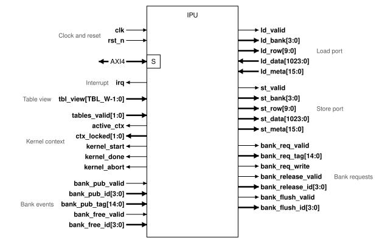

# External interfaces

Signal names and widths are provisional. The IPU block specification fixes them.

## Black-box diagram

## Interface groups

| Group | Peer | Purpose |
|---|---|---|
| Clock and reset | System | One clock and one reset |
| Host AXI4 | Host | Kernel load, commands, status, debug |
| Interrupt | Host | One interrupt line |
| Table view | Cache unit | The contents of both table sets |
| Kernel context | Cache unit | Which context runs, which contexts are locked, which table sets are committed |
| Bank events | Cache unit | State changes of XMEM banks that the cache unit makes |
| Bank requests | Cache unit | State changes of XMEM banks that the cache agent makes or requests |
| Load port | XMEM | Row read for the `LOAD` slot |
| Store port | XMEM | Row write for the `STORE` slot |

## Ports

| Group | Signal | Direction | Width | Description |
|---|---|---|---|---|
| Clock and reset | `clk` | Input | 1 | Clock. |
| | `rst_n` | Input | 1 | Active-low reset. Asserted asynchronously and released synchronously to `clk`. |
| Host AXI4 | `s_axi_*` | Slave | 32-bit data | AXI4 slave with all five channels. Address and ID widths: [OQ-15](open-questions.md). |
| Interrupt | `irq` | Output | 1 | Level-sensitive. High while an enabled interrupt status bit is set. |
| Table view | `tbl_view` | Input | `TBL_W` | Both table sets as configured at the cache unit. `TBL_W` and the signal list: [OQ-15](open-questions.md). |
| Kernel context | `tables_valid` | Input | 2 | Bit `k` is high when the table set of context `k` is committed. |
| | `active_ctx` | Output | 1 | Active context. |
| | `ctx_locked` | Output | 2 | Bit `k` is high while context `k` is locked. |
| | `kernel_start` | Output | 1 | One-cycle pulse when a kernel starts. |
| | `kernel_done` | Output | 1 | One-cycle pulse when a kernel is done. |
| | `kernel_abort` | Output | 1 | One-cycle pulse when an `ABORT` takes the IPU to `IDLE`. |
| Bank events | `bank_pub_valid` | Input | 1 | One-cycle pulse: an XMEM bank became valid. |
| | `bank_pub_id` | Input | 4 | XMEM bank that became valid. |
| | `bank_pub_tag` | Input | 15 | Tag the bank holds: `{ctx, table_id[3:0], page[9:0]}`. |
| | `bank_free_valid` | Input | 1 | One-cycle pulse: a flushed XMEM bank is drained and free. |
| | `bank_free_id` | Input | 4 | XMEM bank that is free. |
| Bank requests | `bank_req_valid` | Output | 1 | One-cycle pulse: the cache agent needs a bank that is not valid. |
| | `bank_req_tag` | Output | 15 | Tag the cache agent needs. |
| | `bank_req_write` | Output | 1 | High when the bank is needed for a store. |
| | `bank_release_valid` | Output | 1 | One-cycle pulse: the cache agent releases a bank the IPU read. |
| | `bank_release_id` | Output | 4 | XMEM bank released. |
| | `bank_flush_valid` | Output | 1 | One-cycle pulse: a bank the IPU wrote is ready to drain to DRAM. |
| | `bank_flush_id` | Output | 4 | XMEM bank to drain. |
| Load port | `ld_valid` | Output | 1 | Load request. |
| | `ld_bank` | Output | 4 | XMEM bank to read. |
| | `ld_row` | Output | 10 | Row in the bank. |
| | `ld_data` | Input | 1024 | Row data. |
| | `ld_meta` | Input | 16 | Row metadata. |
| Store port | `st_valid` | Output | 1 | Store request. |
| | `st_bank` | Output | 4 | XMEM bank to write. |
| | `st_row` | Output | 10 | Row in the bank. |
| | `st_data` | Output | 1024 | Row data. |
| | `st_meta` | Output | 16 | Row metadata. |

The port table is also available as [CSV](assets/ipu-top-ports.csv).

The other pages name each bank event by its prefix. For example, `bank_pub` is the event that `bank_pub_valid`, `bank_pub_id` and `bank_pub_tag` carry.

## Requirements

| ID | Requirement |
|---|---|
| IPU-IF-1 | The IPU shall use one clock domain, `clk`. |
| IPU-IF-2 | The IPU shall use one active-low reset, `rst_n`, asserted asynchronously and released synchronously. |
| IPU-IF-3 | Reset shall put the IPU in `IDLE` with `active_ctx` = 0 and PC = 0. |
| IPU-IF-4 | Reset shall clear the armed flag, the interrupt status and enable bits, and the breakpoint enables. |
| IPU-IF-5 | Reset shall mark every XMEM bank as not valid in the cache agent. |
| IPU-IF-6 | The IPU shall drive `ld_valid` only for the load of a word that the cache agent accepts. |
| IPU-IF-7 | The IPU shall drive `st_valid` only for the store of a word that the cache agent accepted. |
| IPU-IF-8 | The IPU shall never wait on the load port or the store port. Neither port has a ready signal. |

The host port and `irq` requirements are in [Host registers](host-registers.md).

## Expected from the cache unit

| ID | Expected behaviour |
|---|---|
| CU-1 | XMEM returns `ld_data` and `ld_meta` one clock cycle after `ld_valid`. |
| CU-2 | XMEM accepts every store in the cycle `st_valid` is high. |
| CU-3 | `tbl_view` is stable for a context while `ctx_locked` of that context is high. |
| CU-4 | `rst_n` resets the cache unit: every XMEM bank is free and `tables_valid` is 0. |

[Execution flow](execution-flow.md) and [Memory access](memory-access.md) hold the other expected behaviours.
