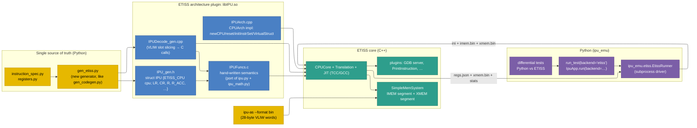

# ETISS Integration (Design Spec)

!!! success "Status"
    **Implemented for the narrow (INT8 / FP8) datapath.** The IPU is a native
    ETISS architecture plugin: an ETISS `CPUCore` executes assembled IPU
    programs directly, one VLIW word per ETISS instruction, JIT-compiled to C.
    Every instruction in `INSTRUCTION_SPEC` is implemented and checked against
    the Python emulator by differential tests that compare the whole machine
    state. The Python emulator remains the reference implementation and the
    default backend.

    **Not implemented:** wide-vector debug mode (§2), which the backend rejects
    with a clear error rather than approximating.

    Code lives in [`src/tools/ipu-etiss/`](https://github.com/rechefe/ipu-emulator/tree/master/src/tools/ipu-etiss);
    see its `README.md` for build instructions. §11 records what each planned
    step delivered.

## 1. Motivation

The Python emulator (`ipu_emu`) is the functional reference for the IPU ISA. It
is easy to change, but it is slow (a pure-Python VLIW interpreter with per-lane
loops), it cannot be co-simulated with a host CPU, and it has no path to the
C/C++ virtual-platform ecosystem (SystemC, GDB remote debug, trace plugins)
that the hardware team will eventually need.

ETISS provides exactly that ecosystem:

- a **translate-to-C JIT** (TCC / GCC / LLVM back ends) that turns fetched
  instruction words into C blocks compiled at run time,
- a plugin model for **architectures** (`etiss::CPUArch`), **JITs** and
  **plugins** (GDB server, instruction tracing, memory-mapped peripherals),
- a ready-made **RISC-V core** (`RV32IMACFD`) that can later become the IPU's
  host CPU (see [RISC-V Host Integration](riscv-host-integration.md)).

"Implementing the emulator over ETISS" therefore means: **make the IPU a
first-class ETISS architecture**, so an ETISS `CPUCore` executes IPU VLIW words
directly, while `instruction_spec.py` / `registers.py` remain the single source
of truth for decode tables and register layout.

## 2. Goals and Non-Goals

### Goals

- An ETISS architecture plugin **`IPU`** (`ArchImpl/IPU` style, built
  out-of-tree in this repository) that executes assembler `--format bin`
  images unchanged.
- **Bit-exact parity** with the Python emulator: identical register file,
  XMEM, and cycle count for every existing test program and application kernel.
- Decode tables, register struct, and operand extraction **generated from
  `instruction_spec.py` / `registers.py`** — no hand-typed opcodes or bit
  offsets in C/C++.
- A Python entry point (`run_test(..., backend="etiss")`) so existing app
  harnesses (`IpuApp`) can run on either backend.
- Everything built and tested under **Bazel**; CI stays green.

### Non-Goals (for the initial epic)

- Cycle-accurate timing of the IPU pipeline. ETISS is instruction-accurate;
  one VLIW word = one ETISS instruction = one IPU cycle, exactly like today.
- Porting the **wide-vector debug mode** (`wide_vector_debug`, 4-byte lanes).
  It is an emulator-only analysis feature and stays Python-only.
- Replacing the Python emulator. It remains the reference and the fast path
  for ISA experiments; the ETISS backend is additive.
- In-process Python bindings for ETISS (ETISS has none; `ETISS_USE_PYTHON`
  only embeds an interpreter for scripting). v1 drives ETISS as a subprocess.
- The RISC-V host virtual platform itself (tracked separately, §10).

## 3. ETISS Facts This Design Relies On

Verified against ETISS `master` at commit `74451e0` (2026-08-12):

| Fact | Where | Consequence for the IPU |
|------|-------|-------------------------|
| `etiss::instr::BitArray` derives from `boost::dynamic_bitset<>`; `VariableInstructionSet`/`InstructionSet` take a `width` in **bits**. | `include/etiss/Instruction.h` | Instruction width is not limited to 32/64 bits. A 224-bit IPU word is representable. |
| Fetch reads `mainba.byteCount()` bytes per instruction through `System.dbg_read` at `cpu->instructionPointer`. | `src/Translation.cpp` | `instructionPointer` is a **byte address**; the IPU word must be byte-sized (224 bits = 28 bytes, matching the assembler's 32-bit-word alignment). |
| **Fetch truncates to 32 bits.** `Translation.cpp` copies the fetched bytes into the decoder with `mainba.set_value(buffer.data())`, and `Buffer::data()` returns only the first `etiss::instr::I` (a `uint32_t`). | `src/Translation.cpp`, `include/etiss/Instruction.h` | **Blocking.** Every ISA shipped with ETISS is 16 or 32 bits wide, so nothing had hit this; a 186-bit IPU word decoded to garbage above bit 31. Fixed by a patch that adds `BitArray::set_value_bytes` and uses it at both fetch sites — bit-identical to the old path for 16/32-bit instructions on a little-endian host. See `src/tools/ipu-etiss/patches/`. |
| `CPUArch::compensateEndianess` **defaults to byte-swapping in 4-byte groups**; the RISC-V architectures override it with an empty body. | `src/CPUArch.cpp` | The IPU overrides it too: the assembler writes words little-endian and the fetch reads them back the same way. |
| `OPCode` has an integral constructor (≤128-bit types) **and** a `BitArray` constructor. | `Instruction.h` | Register the single VLIW "instruction" with `BitArray` code/mask (mask = all zeros → matches every word). |
| An `InstructionDefinition` callback receives `(BitArray&, CodeSet&, InstructionContext&)` and appends C source via `CodePart`; `ic.current_address_` is the word's address. | `Instruction.h`, `ArchImpl/RV32IMACFD/*Instr.cpp` | The callback slices slot fields with `BitArrayRange` and emits calls into a C helper library. |
| Arch plugins ship a C helper library (`<Arch>Funcs.c/.h`) whose header is copied to `include/jit/Arch/<Arch>` and linked into JIT blocks (`ETISSPluginArch` CMake macro). | `ArchImpl/RV32IMACFD/CMakeLists.txt`, `cmake/ETISSPlugin.cmake` | All IPU semantics live in hand-written C (`IPUFuncs.c`), a port of `ipu.py` + `ipu_math.py`. Generated code stays thin. |
| CPU state is a C struct whose **first member is `ETISS_CPU`**; registers are exposed through `VirtualStruct` fields. | `include_c/etiss/jit/CPU.h`, `RV32IMACFD.h` | `struct IPU` is generated from `registers.py`. |
| Return codes: `CPUFINISHED` (1) ends simulation cleanly; `BREAKPOINT` (-19) is used by the GDB server; plugins/archs may define more. | `include_c/etiss/jit/ReturnCode.h` | Halt (`PC >= INST_MEM_SIZE`) → `CPUFINISHED`; `BREAK` → configurable (ignore / stop). |
| Integrated plugins: `gdb` server, `PrintInstruction`, `InstructionAccurateCallback`, `MemMappedPeriph`, `Logger`. | `include/etiss/IntegratedLibrary` | Debugging and tracing come for free; `MemMappedPeriph` is the hook for the future host control block. |
| Build: CMake ≥ 3.13, C++14, Boost (system, filesystem, program_options); TCC JIT bundled, GCC/LLVM optional. | `README.md`, `CMakeLists.txt` | Boost is the only external dependency to manage in Bazel/CI. |
| M2-ISA-R (`pip install m2isar==0.1.6`) generates ETISS archs from **CoreDSL 2**, but scalar types are capped at 128 bits and behaviour must be expressible in CoreDSL. | `m2isar/backends/etiss/instruction_utils.py` | **Rejected for v1**: 128-byte vector registers and the FP8 e(x)m(8-x) datapath would end up as opaque C functions anyway, and CoreDSL would become a second source of truth beside `instruction_spec.py`. Revisit only if the ISA is ever formally described in CoreDSL. |

## 4. Architecture Overview



## 5. Mapping the Python Emulator onto ETISS

| Python emulator concept | ETISS realisation |
|-------------------------|-------------------|
| Compound instruction, **186 bits**, assembled to 7 × 32-bit words (**28 bytes**) | One `VariableInstructionSet` of width **224**; one `InstructionSet` containing a single catch-all `InstructionDefinition` `IPU_VLIW` (mask all-zero). ETISS's opcode tree is bypassed; slot opcodes are decoded inside the callback. |
| `program_counter` (word index), `INST_MEM_SIZE = 1024` | `cpu->instructionPointer = pc × 28` with IMEM at address `0`. Branch targets (10-bit labels) are multiplied by 28 at translate time. `getInstructionSizeInBytes()` / `getMaximumInstructionSizeInBytes()` return 28. |
| `is_halted` (`PC >= INST_MEM_SIZE`) | Emitted at the end of every word: `if (nextPc >= IMEM_END) return ETISS_RETURNCODE_CPUFINISHED;`. IMEM is always a full 1024-word image, padded with the canonical all-NOP word, so run-off cycles count exactly as in `run_until_complete()`. |
| `BreakResult.BREAK` (`BREAK`, `BREAK.IFEQ`, `BKPT`) | Configurable via `ipu.break_mode`: `ignore` (default, mirrors `run_until_complete`) or `stop` (returns a break return code, mirrors `run_with_debug`; also what the GDB server sees). |
| `RegFile` (`LR`, `CR`, `R`, `R_CYCLIC`, `R_MASK`, `R_ACC`, `MULT_RES`, `POST_AAQ_REG`, `LRD` alias) | `struct IPU { ETISS_CPU cpu; etiss_uint32 LR[16]; etiss_uint32 CR[16]; etiss_uint8 R[2][128]; … }` generated from `registers.py`. `LRDn` stays an alias (byte view over `LR[n]`,`LR[n+1]`). Scalars are `VirtualStruct` fields; vector registers are exposed as byte-addressable fields for dumps/GDB. |
| Read-before-write snapshot (`snapshot_regfile`) | A shadow copy inside `struct IPU` (`snap_LR`, `snap_R`, …) refreshed by `ipu_snapshot(cpu)` at the start of every word. Operands flagged `"read": "snapshot"` read the shadow; `"live"` reads the live copy. Same rule as `_resolve_reads` in `ipu.py`. |
| Slot execution order (`break` → `lr`×3 → `load` → `mult` → `acc` → `aaq` → `store` → `acc_store` → `cond`) | Fixed call sequence emitted per word; identical order. |
| `XMem` (8 MB, 128-byte rows) | A `SimpleMemSystem` segment at `XMEM_BASE`. Helpers call `system->dread/dwrite` with 128-byte (row) or 512-byte (`R_ACC`, `POST_AAQ_REG`) buffers. Out-of-range rows return `DBUS_*_ERROR` → simulation stops with an error, matching `EmulatorError`. |
| `inst_mem` (list of decoded dicts) | IMEM segment at `0x0`, byte image = assembler `--format bin` output, padded to 1024 words. |
| `dtype`, `elu_alpha`, `CR15` dstructure, `CR2`–`CR14` | ETISS config keys read by `resetCPU`/the runner: `ipu.dtype`, `ipu.elu_alpha`, `ipu.cr.N` (written into `struct IPU` and visible in `VirtualStruct`). |
| `RunStats` (`mult_active_cycles`, `acc_active_cycles`, `xmem_reads`, `xmem_writes`, `total_cycles`) | Counters in `struct IPU` incremented by the helpers; `total_cycles` = ETISS instruction count. Dumped by the runner. |
| `debug_cli` (`step`, `get lr0`, `save state.json`) | ETISS GDB server plugin for interactive stepping/inspection; runner `--dump-state` emits the same JSON schema as `state_to_json_dict`. |
| Wide-vector debug mode | Not ported (Python-only). The runner rejects `wide_vector_debug=True`. |

## 6. Address Map

| Region | Base | Size | Notes |
|--------|------|------|-------|
| IMEM | `0x0000_0000` | 1024 × 28 B = 28 KiB | Verbatim `--format bin` image, NOP-padded. Executable, read-only for the IPU. |
| XMEM | `0x1000_0000` | 8 MiB | Data. Row `r` (as used by `LDR_*`/`STR_*` `base + offset`) lives at `XMEM_BASE + r × 128`. |
| (reserved) host MMIO | `0x2000_0000` | 4 KiB | Future host-control block (§10); unused by the IPU core itself. |

The bases are generated into `IPU_gen.h` and `ipu_emu.etiss.layout` from one
Python constant table so the runner and the plugin never disagree.

## 7. Code Generation From `instruction_spec.py`

A new generator `ipu_as/gen_etiss.py` (sibling of `gen_codegen.py`, which
already emits SystemVerilog from the same spec) produces:

| Artifact | Content | Source |
|----------|---------|--------|
| `IPU_gen.h` | `struct IPU`, register sizes, `IMEM_*`/`XMEM_*` constants, per-slot opcode enums (`IPU_LOAD_OP_LDR_MULT_REG = 0`, …), `NUM_*` counts | `registers.py`, `instruction_spec.create_emulator_constants()` |
| `IPU_layout_gen.h` | Bit offset/width of every slot and union field inside the 224-bit word (LSB-first, same walk as `CompoundInst.get_fields()` / `decode_instruction_word`) | `SLOT_UNIONS`, `SLOT_COUNT`, `COMPOUND_LAYOUT_SLOT_ORDER` |
| `IPUDecode_gen.cpp` | The `IPU_VLIW` callback: for each slot, read the opcode with `BitArrayRange`, `switch` on it, read that instruction's bound operand fields (`opcode_bindings`), and append `ipu_<slot>_<inst>(cpu, system, plugin_pointers, op1, op2, …)` to the `CodePart`. Also the ASM printer used by `PrintInstruction`/GDB. | `INSTRUCTION_SPEC` (`execute_fn` names → C function names) |
| `IPUFuncs_gen.h` | Prototypes for every `ipu_<slot>_<inst>` helper with keyword-order arguments matching the spec's operand list | `INSTRUCTION_SPEC` |

Rules, mirroring `CLAUDE.md`:

- **No manual opcodes.** Position in `INSTRUCTION_SPEC` is the opcode, exactly
  as for the assembler and the Python emulator.
- **Operand names** in `IPUFuncs.c` match the spec's `"name"` fields; the
  generated prototype header enforces this at compile time (a missing or
  misspelt handler is a link error, the analogue of today's `AttributeError`).
- Adding an instruction = add the spec entry, implement
  `ipu_<slot>_<name>()` in `IPUFuncs.c`, run `bazel test //...`.

Sketch of generated output for the `load` slot:

```cpp
// IPUDecode_gen.cpp (generated — do not edit)
static InstructionDefinition ipu_vliw(
    ISA224_IPU, "IPU_VLIW", BitArray(224, 0), BitArray(224, 0),
    [](BitArray &ba, etiss::CodeSet &cs, InstructionContext &ic) {
        CodePart &cp = cs.append(CodePart::INITIALREQUIRED);
        cp.code() += "ipu_snapshot(cpu);\n";
        // ... break slot, lr slots ...
        static BitArrayRange R_load_op(IPU_LOAD_OP_MSB, IPU_LOAD_OP_LSB);
        switch (R_load_op.read(ba)) {
        case IPU_LOAD_OP_LDR_MULT_REG: {
            static BitArrayRange R_dest(…), R_offset(…), R_base(…);
            cp.code() += "ipu_load_ldr_mult_reg(cpu, system, plugin_pointers, "
                       + std::to_string(R_dest.read(ba)) + ", "
                       + std::to_string(R_offset.read(ba)) + ", "
                       + std::to_string(R_base.read(ba)) + ");\n";
            break; }
        // ...
        }
        // ... mult, acc, aaq, store, acc_store, cond ...
        cp.code() += "cpu->instructionPointer = cpu->nextPc;\n"
                     "if (cpu->instructionPointer >= IPU_IMEM_END) return ETISS_RETURNCODE_CPUFINISHED;\n";
        cp.getAffectedRegisters().add("instructionPointer", 64);
        return true;
    }, 0, ipu_vliw_printer);
```

Operand *indices* (register numbers, immediates, labels) are baked into the
generated C as constants; register *values* are read inside the helpers from
the live or shadow copy according to the spec's `"read"` flag, so the
translate-time/run-time split matches the Python dispatcher.

## 8. Execution Semantics of One VLIW Word

```c
// generated per word, calls into IPUFuncs.c
ipu_snapshot(cpu);                                   // regfile → shadow copy
if (ipu_break_<op>(cpu, …) == IPU_BREAK && break_mode == STOP) return IPU_RC_BREAK;
ipu_lr_<op0>(…); ipu_lr_<op1>(…); ipu_lr_<op2>(…);   // three LR sub-slots
ipu_load_<op>(…);                                    // reads shadow LR/CR, writes R/R_CYCLIC/R_MASK
ipu_mult_<op>(…);                                    // reads shadow R, writes MULT_RES
ipu_acc_<op>(…);                                     // reads shadow MULT_RES/R_ACC, writes R_ACC
ipu_aaq_<op>(…);                                     // reads shadow R_ACC, writes POST_AAQ_REG
ipu_store_<op>(…); ipu_acc_store_<op>(…);            // XMEM writes
ipu_cond_<op>(…);                                    // sets cpu->nextPc (default: +28)
```

`nextPc` defaults to `current_address + 28`; branch helpers overwrite it with
`label × 28`. `BR reg` uses the register value × 28. `ipu_snapshot` is a fixed
set of `memcpy`s of the registers that have `"read": "snapshot"` consumers.

## 9. Numerical Parity Rules

The C port must reproduce the Python results bit for bit:

- **FP8 codec.** Port `_fp8_to_float32_scalar` / `_float32_to_fp8_scalar`
  (generic e(x)m(8-x), x = 1…7, NaN on all-ones exponent, clamp on overflow,
  subnormals) as table-driven C (`uint8 → float` LUT per dtype, 256 entries;
  encode via the same frexp/round algorithm, `round()` half-away-from-zero
  like Python's `round` on `.5` cases — verify with an exhaustive 256 × 8 test).
- **Accumulation.** INT8 mode: `int32` two's-complement wrap. FP modes: Python
  computes in double (`float` objects) and packs with `struct.pack("<f")`, so C
  computes in `double` and stores `(float)`. Same for `AGG.SUM`/`AGG.MAX`,
  `ACC.MAX`, `ACC.SUB`.
- **Activations.** Port `activations.py` using `<math.h>` in double, then
  narrow to float on store; identical libm on Linux keeps `exp`, `tanh`, `erf`
  results equal. Exhaustive comparison over a dense float32 grid is part of
  the test plan.
- **Masking / padding.** `pad_mode` fill values (`0`, `+inf`, `-inf` encoded
  in the active dtype) and the partition vectors from
  `_build_partition_vector` are ported verbatim.

## 10. Relationship to the RISC-V Host Plan

[`riscv-host-integration.md`](riscv-host-integration.md) proposes a Unicorn
RISC-V core driving the Python emulator through an MMIO register block. With
the IPU as an ETISS architecture, the natural evolution is a **single ETISS
virtual platform** holding an `RV32IMACFD` core and an `IPU` core that share a
`System`, with the SystemRDL control block realised as a `MemMappedPeriph`.
That keeps the register block, Rust firmware and end-to-end test from the
existing plan intact and removes the Unicorn dependency. It is deliberately a
**follow-up** (issue 7 in the plan): the IPU core must be at parity first.

## 11. Implementation Plan and Results

Issue drafts live in `planning/etiss-integration/`. What each step delivered:

| # | Title | Status |
|---|-------|--------|
| 1 | Spike: minimal `IPU` ETISS arch executing a 224-bit program | **Done.** Answers recorded in §3 and §12; the one blocker (32-bit fetch truncation) is fixed by a patch. |
| 2 | Build integration | **Partly done.** `src/tools/ipu-etiss/CMakeLists.txt` plus `build_etiss.sh` fetch, patch and build ETISS and the plugin reproducibly. Bazel gained a `gen-etiss` generator target and both parity-test targets; fetching the ETISS toolchain *through* Bazel (`rules_foreign_cc`) is still open. |
| 3 | `gen_etiss.py`: struct, layout and decode from the spec | **Done.** `ipu_as/gen_etiss.py` emits `IPU_gen.h`, `IPUFuncs_gen.h`, `IPUDecode_gen.cpp` and `ipu_etiss_layout.py`. |
| 4 | Port instruction semantics and numerics | **Done** for the narrow datapath: `arch/IPUFuncs.c`, `runtime/ipu_math.c`, `runtime/ipu_activations.c`. |
| 5 | Python backend and differential tests | **Done.** `run_test(backend="etiss")`, `IpuApp.run(backend=...)`, `$IPU_EMU_BACKEND`, and two parity suites. |
| 6 | Debug, stats, tracing, documentation | **Partly done.** `RunStats` and the register file round-trip through the runner and registers are exposed through `VirtualStruct` (so ETISS's GDB stub can see them); a GDB workflow and trace docs are still open. |
| 7 | Host virtual platform on ETISS | Not started (follow-up). |

### Measured results

Parity is checked by comparing the complete register file, the full 8 MB XMEM,
the program counter, the cycle count and every `RunStats` counter.

| Check | Result |
|-------|--------|
| Instruction corpus (`test_etiss_parity.py`) | 35 programs, every instruction in `INSTRUCTION_SPEC` covered, all identical |
| FP8 codec and activations (`runtime/test`) | 413,510 cases, bit-exact |
| `fully_connected`, INT8 / FP8 E4M3 / FP8 E5M2 | identical state and cycle count; output matches the golden files |
| Throughput, 201k-cycle loop (load + multiply + accumulate + 2 LR ops + branch per cycle) | Python 8k cycles/s, ETISS 100k cycles/s — **12.7x** |

The speed-up only shows on runs long enough to amortise process start and JIT
compilation; below roughly ten thousand cycles the Python emulator is faster,
which is why it stays the default backend.

## 12. Risks and Open Questions

How the risks identified before implementation turned out:

| Risk | Outcome |
|------|---------|
| A 224-bit instruction width is legal but exotic in ETISS. | **Hit, and worse than expected**: the width is accepted by the decoder but the *fetch* silently truncates to 32 bits (§3). Fixed with a 24-line patch to ETISS rather than the planned 256-bit fallback. The patch is behaviour-preserving for 16/32-bit ISAs and worth sending upstream. |
| Float parity between Python and C. | Handled by computing in `double` and narrowing only on store, and by porting Python's `round()` — which is round-half-to-even, unlike C's `round()`. Getting that wrong produced 1450 one-ULP mismatches in the FP8 encoder, caught by the exhaustive codec test. |
| JIT block compilation cost. | TCC is the default and compiles fast enough that block translation is not the bottleneck; `--jit gcc` is available for long runs. |
| Boost / CMake in a Bazel-first repo. | Not resolved: ETISS is built by `build_etiss.sh` with system Boost, outside Bazel. Bazel builds the generator and runs the parity tests (which skip when the runner is absent). |
| `instructionPointer` is a byte address, the ISA uses word indices. | All conversions are generated in one place; the `PC` field of the `VirtualStruct` reports word indices, so debuggers see the ISA's unit. |
| `EmulatorError` conditions must fail loudly. | Handlers set a typed error code (`IPU_ERR_*`, generated) that the runner maps back to an `EmulatorError` naming the condition. |
| Two implementations can drift. | The parity suite asserts that every instruction in `INSTRUCTION_SPEC` appears in the corpus, so adding an instruction without cross-backend coverage fails a test; a missing C handler fails the link. |

Known divergences, all in paths where the Python reference itself raises:

- `math.exp` overflow. CPython raises `OverflowError` for a finite input whose
  result overflows; C returns `+inf`. This reaches `exp2` at large positive
  inputs. The C side returns infinity.
- `ACTIVATE.QUANTIZE` on a NaN accumulator. Python's `int(round(nan))` raises
  `ValueError`; the C handler quantizes NaN to 0 so the run continues.

Open:

1. Fetching and building ETISS through Bazel instead of `build_etiss.sh`.
2. Whether to port wide-vector debug mode, which would let the softmax
   applications run on this backend.
3. Sending the wide-instruction fetch patch upstream.
