# RISC-V Host Integration (Design Spec)

!!! note "Status"
    **Proposal / design spec.** This page describes a planned *big feature*: an
    emulated RISC-V host core that drives the IPU emulator through a
    memory-mapped control register block. The register block is the single
    source of truth (authored in **SystemRDL**), and is the same definition
    used by the Python emulator, the on-device **Rust** driver, and the
    generated documentation. The implementation is tracked as an epic and a
    set of sub-issues — see [§9 Implementation Plan](#9-implementation-plan).

## 1. Motivation

Today the Python emulator is driven *directly* from Python: a test or app
harness builds an `IpuState`, loads a program, sets `CR` registers, and calls
`run_until_complete()`. The real hardware works differently — the
[Control Stage spec](stage-control.md) and the
[Cache Unit spec](cache-unit.md) both describe an **external RISC-V host** that
configures and sequences the IPU over an **APB** slave port: it writes the
instruction memory and the `CR` file (inactive banks), triggers bank swaps,
starts/stops the core, and reads back status.

This feature closes the gap between the emulator and the hardware model by:

1. **Emulating the host CPU itself.** A RISC-V core (via the
   [Unicorn](https://www.unicorn-engine.org/) CPU-emulation framework, embedded
   in the Python environment) runs the same firmware that would run on real
   silicon.
2. **Defining a real control/configuration register block** that both the host
   firmware and the IPU emulator agree on, authored once in **SystemRDL** so
   that the Python model, the Rust driver, and the docs are all generated from
   one source.
3. **Driving IPU execution through that register block** — start, halt,
   single-step, reprogram instruction memory, read/write the program counter,
   and reset — instead of via ad-hoc Python calls.

The end state: an integration test loads a **Rust** firmware image into the
emulated RISC-V core; the firmware configures the IPU (CRs, dtype, dstructure),
loads a program into the fully mapped instruction-memory region, starts the IPU,
polls for completion, and reads back results — all through MMIO, exactly as it
would on hardware.

## 2. Goals and Non-Goals

### Goals

- A memory-mapped **IPU host-control register block** authored in SystemRDL.
- All current configuration surface reachable through the register block:
  `dtype`, `dstructure` (`valid_elements` / `partition`), `CR2`–`CR14`
  application constants, and the activation `elu_alpha`.
- Execution-flow control through the register block:
    1. **Start** execution.
    2. **Halt** execution.
    3. **Reprogram** the IPU instruction memory.
    4. **Read and write** the program counter.
    5. **Reset** the IPU (resets everything *except* instruction memory).
- A RISC-V core emulated in-process via Unicorn, with the register block exposed
  as MMIO.
- **Rust** (not C) firmware/driver running on the emulated core, generated from
  the same SystemRDL source.
- Single source of truth preserved: no hand-duplicated register metadata.

### Non-Goals (for the initial epic)

- Cycle-accurate co-simulation of host ↔ IPU timing. The host/IPU handshake is
  functional, not cycle-accurate.
- Modeling the full APB wire protocol (`psel`/`penable`/`pready` handshakes).
  We model the *register semantics* the APB slave exposes, addressed as a flat
  MMIO window; APB timing is out of scope.
- DMA / CRM cache-unit modeling (see [cache-unit.md](cache-unit.md)). The
  control block focuses on CTRL-stage configuration and sequencing.
- Replacing the existing direct-Python harness. `run_until_complete()` and the
  debug CLI keep working; the host path is additive.

## 3. Architecture Overview

```mermaid
%%{init: {'flowchart': {'defaultRenderer': 'elk'}}}%%
flowchart LR
    subgraph RUST["Rust firmware (no_std)"]
        FW["application firmware\n(main loop)"]:::purple
        DRV["ipu-pac\n(generated register driver)"]:::purple
    end

    subgraph UC["Unicorn RISC-V core (in Python)"]
        CPU["rv32 / rv64 CPU"]:::teal
        RAM["code + data + stack RAM"]:::teal
        MMIO["MMIO window\n(IPU control block)"]:::teal
    end

    subgraph PY["Python IPU emulator"]
        BRIDGE["MMIO bridge\n(read/write callbacks)"]:::blue
        CTRLMODEL["host-control register model\n(generated from SystemRDL)"]:::blue
        ENGINE["steppable execution engine"]:::blue
        STATE["IpuState\n(regfile, xmem, PC, inst_mem)"]:::blue
    end

    RDL["ipu_ctrl.rdl\n(SystemRDL — source of truth)"]:::yellow

    FW --> DRV
    DRV -->|"lw / sw to MMIO"| CPU
    CPU --> RAM
    CPU --> MMIO
    MMIO -->|read/write callback| BRIDGE
    BRIDGE --> CTRLMODEL
    CTRLMODEL -->|"start / halt / step / reset / imem / pc"| ENGINE
    ENGINE --> STATE
    CTRLMODEL -.->|"config: dtype, dstructure, CR2-14"| STATE

    RDL -. "peakrdl: Python field constants" .-> CTRLMODEL
    RDL -. "peakrdl: Rust driver crate" .-> DRV
    RDL -. "peakrdl-html: docs" .-> DOCS["register-map docs"]:::yellow

    classDef blue fill:#4a80c4,stroke:#2a5090,color:#fff
    classDef teal fill:#2e9e8c,stroke:#1a7060,color:#fff
    classDef purple fill:#7b5ea7,stroke:#5a3d8a,color:#fff
    classDef yellow fill:#e6b800,stroke:#b38a00,color:#000
```



Data flow for a typical run:

1. The Rust firmware image is loaded into the Unicorn core's RAM; execution
   starts at the firmware reset vector.
2. The firmware uses the generated driver to write config registers (dtype,
   dstructure, `CR2`–`CR14`), then copies the assembled IPU program into the
   fully mapped instruction-memory region (while halted).
3. The firmware writes `CTRL.START`. The MMIO write callback bridges into the
   Python execution engine, which runs the IPU program (functionally) and
   latches `STATUS.HALTED` (plus cycle count / error fields).
4. The firmware polls `STATUS`, then reads back results from XMEM (or via
   read-back registers), and the integration test asserts on the final
   `IpuState`.

## 4. The IPU Host-Control Register Block

The register block models what the CTRL-stage **APB slave** exposes to the
host. It is addressed as a flat 32-bit MMIO window. Offsets below are a
**proposed** starting layout — the authoritative layout lives in the SystemRDL
source delivered by [Issue 1](#9-implementation-plan).

| Offset  | Name          | Access | Description |
|---------|---------------|--------|-------------|
| `0x000` | `ID`          | RO     | Magic + version of the control block (sanity check for firmware). |
| `0x004` | `CTRL`        | RW/W1S | Command bits: `START`, `HALT`, `STEP`, `RESET` (soft, excludes IMEM), `IMEM_SWAP` (bank swap), `CONTINUE`. Self-clearing pulse semantics. |
| `0x008` | `STATUS`      | RO     | `RUNNING`, `HALTED`, `BREAK` (hit a `BKPT`/`BREAK`), `ERROR`, plus an `ERR_CODE` field. |
| `0x00C` | `PC`          | RW     | Program counter. Read returns the current PC; write sets the next PC (only valid while halted). |
| `0x010` | `CYCLES`      | RO     | Cycles executed since the last start/reset. |
| `0x014` | `MAX_CYCLES`  | RW     | Watchdog limit; `0` = use engine default. Guards against runaway programs. |
| `0x018` | `PROG_LEN`    | RW     | Program length in VLIW words (entries in `inst_mem`). Writable only while halted; used by the engine halt condition (`PC >= PROG_LEN`). |
| `0x020` | `DTYPE`       | RW     | Arithmetic data type selector (enum mirroring `DType`). |
| `0x024` | `DSTRUCTURE`  | RW     | `valid_elements[7:0]`, `partition[11:8]` — mirrors `CR15`. |
| `0x028` | `ELU_ALPHA`   | RW     | Activation α (IEEE-754 float bits; emulator-only knob). |
| `0x040` | `CR[0..15]`   | RW\*   | Application config window. `CR0`/`CR1` are hard-wired (`0`/`1`) and reject writes (`ERROR`); `CR15` aliases `DSTRUCTURE`. `CR2`–`CR14` are writable. |

The control block occupies the first **4 KiB** of the host MMIO window. Instruction
memory is **not** accessed through indirect programming registers; it is a
separate, fully mapped region in the host address space (see below).

### Instruction memory (fully mapped)

| Host address (example) | Size | Access | Description |
|------------------------|------|--------|-------------|
| `IMEM_BASE` (`0x1001_0000`) | `IMEM_MAP_SIZE` | RW\* | Flat, byte-addressable instruction-memory image. |

- **`IMEM_MAP_SIZE`** = `IMEM_DEPTH × INSTRUCTION_ALIGNED_BYTES`, where
  `INSTRUCTION_ALIGNED_BYTES` is the per-instruction size of the assembler
  `--format bin` stream (see `instruction_aligned_bytes_len()` /
  `_instruction_aligned_bytes()`). The emulator uses `INST_MEM_SIZE` (1024) for
  `IMEM_DEPTH`; hardware uses `IMEM_DEPTH = 256` per
  [stage-control.md](stage-control.md) — the SystemRDL parameter drives the
  generated map size.
- **Contents.** The mapped region is a verbatim image of the assembled binary:
  each VLIW occupies `INSTRUCTION_ALIGNED_BYTES` bytes, 32-bit-word-aligned. On
  **write**, the bridge decodes the affected instruction word(s) with
  `decode_instruction_word` and updates `inst_mem` (same semantics as
  `load_program_from_binary`). On **read**, the bridge returns the stored encoded
  bytes (unprogrammed slots read as zero).
- **Halt-only access.** Instruction memory is **not** reachable while the IPU is
  executing. Any read or write to `[IMEM_BASE, IMEM_BASE + IMEM_MAP_SIZE)` when
  `STATUS.RUNNING` is set must **fail**: latch `STATUS.ERROR`, set
  `ERR_CODE = IMEM_ACCESS_WHILE_RUNNING`, and return a bus error to the host
  (Unicorn: failed MMIO callback; hardware: `apb_pslverr`). While halted (and on
  initial power-up before the first `START`), IMEM is freely readable and
  writable. This matches the hardware rule that the host programs only the
  *inactive* IMEM bank and never contends with the execute pipeline.
- **Banking.** Hardware double-buffers IMEM and CR (`IMEM_BANKS = 2`,
  `CR_BANKS = 2`); the host maps/writes the *inactive* bank and swaps via
  `IMEM_SWAP`. The initial emulator model MAY collapse this to a single bank
  (one `IMEM_BASE` region) and treat `IMEM_SWAP` as a no-op or commit barrier;
  full double-buffering adds a second `IMEM_BASE` offset or bank-select bit in
  `CTRL`.

## 5. Execution-Flow Control Semantics

The control block drives a **steppable execution engine** (see
[Issue 3](#9-implementation-plan)). The five required operations map to register
actions as follows.

| Operation | Register action | Engine semantics |
|-----------|-----------------|------------------|
| **Start execution** | write `CTRL.START` | Run from the current `PC` until halt, breakpoint, or `MAX_CYCLES`. Sets `STATUS.RUNNING`, then `STATUS.HALTED` on completion. |
| **Halt execution** | write `CTRL.HALT` | Stop the engine at an instruction boundary; clear `RUNNING`, set `HALTED`. Cooperative when the run is driven inside the MMIO callback; preemptive when driven step-by-step. |
| **Single step** | write `CTRL.STEP` | Execute exactly one VLIW cycle, then re-enter halted state. Mirrors the existing debug-CLI `step`. |
| **Reprogram IMEM** | read/write `IMEM_BASE` region (+ `PROG_LEN`) | Copy or memset the assembled `--format bin` image into the mapped IMEM window while halted; writes decode into `inst_mem`. Set `PROG_LEN` to the number of VLIW words. Rejected with `ERROR` while `RUNNING`. |
| **Read PC** | read `PC` | Returns `IpuState.program_counter`. |
| **Write PC** | write `PC` | Sets `IpuState.program_counter` (only honored while halted; otherwise `ERROR`). |
| **Reset** | write `CTRL.RESET` | Resets **everything except instruction memory** (see below). |

### Reset semantics

`CTRL.RESET` performs a **soft reset that preserves `inst_mem`**:

- **Reset:** register file (re-init to defaults — `CR0=0`, `CR1=1`, default
  `dstructure`), `R_ACC`/`R`/AAQ/post-AAQ staging, `program_counter → 0`,
  `stats`/`CYCLES`, `STATUS` flags, and XMEM contents.
- **Preserved:** `inst_mem` (the loaded program), the IMEM map contents, and
  `PROG_LEN`.

This matches the user requirement ("resets everything but the instruction
memory") and lets firmware re-run the same program with fresh inputs without
re-streaming it.

### Decoupling the run loop

The current `run_until_complete()` owns the loop and the halt condition
(`PC >= INST_MEM_SIZE`). To support host-driven start/halt/step, the engine is
refactored so a single primitive — "execute one VLIW cycle and report
`RUNNING`/`HALTED`/`BREAK`" — can be called either in a tight Python loop (today's
behavior, unchanged) or one step at a time from the MMIO bridge. `is_halted`,
breakpoints, and `RunStats` are folded into the engine's reported status.

## 6. SystemRDL as the Single Source of Truth

Consistent with the project's existing philosophy (`instruction_spec.py` and
`registers.py` are single sources of truth), the host-control register block is
authored **once** in SystemRDL (`ipu_ctrl.rdl`) and all consumers are generated
from it via the open-source [PeakRDL](https://peakrdl.readthedocs.io/) toolchain:

| Consumer | Generated artifact | Tooling |
|----------|--------------------|---------|
| Python emulator | Field offsets / masks / enums (control-register model) | `peakrdl-python` *or* a small custom exporter walking the `systemrdl-compiler` IR |
| Rust firmware | A PAC-like register-access crate (`ipu-pac`) | `peakrdl` → SVD → `svd2rust`, *or* a custom Rust template over the same IR |
| Documentation | Register-map HTML / Markdown | `peakrdl-html` (linked from these docs) |

!!! tip "Why a custom IR walker is a strong default for Rust"
    RDL→SVD→`svd2rust` is the most "standard" Rust path, but the RDL→SVD step
    relies on community exporters of varying completeness. Because
    `systemrdl-compiler` exposes a clean Python IR, a small Jinja template that
    emits both the Python constants *and* a `no_std` Rust module from that same
    IR keeps the two perfectly in lock-step with the least fragile tooling.
    [Issue 1](#9-implementation-plan) evaluates both and picks one.

All generation runs under Bazel so the build stays hermetic; generated files are
build outputs, never hand-edited.

## 7. Emulating the RISC-V Host with Unicorn

[Unicorn](https://www.unicorn-engine.org/) exposes a CPU-only emulator with a
Python binding (`pip install unicorn`) and a RISC-V backend
(`UC_ARCH_RISCV`, `UC_MODE_RISCV32` / `UC_MODE_RISCV64`). Integration sketch:

```python
from unicorn import Uc, UC_ARCH_RISCV, UC_MODE_RISCV32
from unicorn.riscv_const import UC_RISCV_REG_PC

RAM_BASE,  RAM_SIZE  = 0x8000_0000, 0x0010_0000   # firmware code + data + stack
MMIO_BASE, MMIO_SIZE = 0x1000_0000, 0x0000_1000   # IPU control registers
IMEM_BASE, IMEM_SIZE = 0x1001_0000, IMEM_MAP_SIZE # fully mapped instruction memory

uc = Uc(UC_ARCH_RISCV, UC_MODE_RISCV32)
uc.mem_map(RAM_BASE, RAM_SIZE)
uc.mem_write(RAM_BASE, firmware_image)

# Bridge MMIO: control registers + halt-gated IMEM map.
uc.mmio_map(MMIO_BASE, MMIO_SIZE, read_cb=bridge.on_ctrl_read, write_cb=bridge.on_ctrl_write)
uc.mmio_map(IMEM_BASE, IMEM_SIZE, read_cb=bridge.on_imem_read, write_cb=bridge.on_imem_write)

uc.reg_write(UC_RISCV_REG_PC, RAM_BASE)
uc.emu_start(RAM_BASE, RAM_BASE + len(firmware_image))
```

- `bridge.on_ctrl_read` / `on_ctrl_write` decode offsets against the generated
  register map, apply side effects (e.g. a `START` write runs the program), and
  latch status.
- `bridge.on_imem_read` / `on_imem_write` perform byte/word accesses into the
  IMEM map. If `STATUS.RUNNING`, they reject the access (`ERROR`,
  `IMEM_ACCESS_WHILE_RUNNING`) without modifying `inst_mem`.
- The IPU "runs" functionally inside the `START`/`STEP` write callback; from the
  firmware's point of view the store simply takes a while and `STATUS.HALTED` is
  set when control returns. This keeps the model simple and deterministic
  without threads.

The firmware is built for a bare-metal target (e.g.
`riscv32imac-unknown-none-elf`), linked to the `RAM_BASE` layout, and converted
to a flat binary for loading.

## 8. Rust Firmware and Driver

The on-device code is **Rust**, `no_std`:

- **`ipu-pac`** — generated register-access crate (volatile reads/writes,
  typed fields/enums) produced from `ipu_ctrl.rdl` (see §6).
- **`ipu-rt`** — a thin hand-written HAL on top of `ipu-pac` exposing ergonomic
  operations: `configure(dtype, dstructure, crs)`, `load_program(ptr, len)`,
  `start()`, `wait_until_halted()`, `read_pc()`, `write_pc()`, `reset()`.
- **`firmware`** — an example `no_std` binary with a `main` that mirrors the
  fully-connected app flow: configure → load program → start → wait → done.

Build via `rules_rust` under Bazel, targeting the bare-metal RISC-V triple, and
emit a flat binary artifact consumed by the integration harness.

## 9. Implementation Plan

The work is tracked as an **epic** plus focused sub-issues. Drafts of every
issue live under `planning/riscv-host-integration/` in this repository and are
ready to file.

| # | Issue | Summary |
|---|-------|---------|
| 0 | **Epic** | Umbrella tracking issue: emulated RISC-V host drives the IPU through a SystemRDL-defined control register block. |
| 1 | SystemRDL control-register block + codegen | Author `ipu_ctrl.rdl`; wire PeakRDL into Bazel; generate Python constants, the Rust `ipu-pac` crate, and HTML docs. |
| 2 | Emulator MMIO control-register model | Map the generated register block onto `IpuState`: config (dtype/dstructure/CR2-14/α) + execution control (start/halt/step/reset/PC) + halt-gated fully mapped IMEM. |
| 3 | Steppable execution engine | Refactor the run loop into a host-drivable engine that reports `RUNNING`/`HALTED`/`BREAK`, with soft-reset (preserving IMEM) and PC R/W. |
| 4 | Unicorn RISC-V integration | Embed Unicorn; map firmware RAM + the IPU MMIO window; bridge MMIO callbacks to the control-register model. |
| 5 | Rust firmware + driver | `ipu-rt` HAL over generated `ipu-pac`; example `no_std` firmware; `rules_rust` bare-metal build to a flat binary. |
| 6 | End-to-end integration + app + tests + docs | Firmware-driven run of an existing app (e.g. fully-connected); tests asserting parity with the direct-Python path; user-facing docs. |

Suggested dependency order: **1 → {2, 3} → 4 → 5 → 6**. Issues 2 and 3 can
proceed in parallel once the register map (1) is fixed.

## 10. Open Questions / Risks

- **RV32 vs RV64.** RV32IMAC is the smaller, more typical embedded host; RV64 is
  also supported by Unicorn. Pick in Issue 4/5; the driver is width-agnostic.
- **Rust register codegen path.** RDL→SVD→`svd2rust` vs a custom IR template
  (see §6). Resolved in Issue 1 with a small spike.
- **Run-inside-callback vs cooperative stepping.** Running the whole IPU program
  inside a single `START` store is simplest and deterministic; a cooperative
  model (firmware polls while the IPU steps) is more realistic but needs care to
  avoid re-entrancy. Issue 3/4 decide; the register contract supports both.
- **Bazel toolchains.** Adds `rules_rust` + a bare-metal RISC-V toolchain and the
  `unicorn` / `peakrdl*` Python deps. These are new build dependencies and the
  Cloud Agent environment will need them provisioned.
- **Double-buffered banking.** Initial model may use a single bank; full
  `IMEM_BANKS`/`CR_BANKS` double-buffering with host-triggered swaps can be a
  follow-up.
