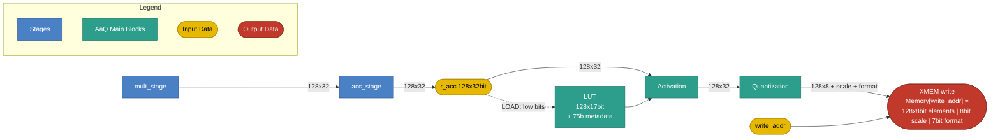

# AaQ Stage

## 1. Purpose

The AaQ (Activation and Quantization) stage applies element-wise activation
and special functions to the 128-element accumulator, quantizes the
128-element vector into an 8-bit vector, and **writes the result to external
memory (XMEM) itself** — there is no separate Store stage. It produces:

- A 128-element vector of 8-bit quantized values.
- A scale factor.
- A format field.

The stage also owns the activation **LUT**, which is filled by the `LOAD`
instruction (section 6.3).

## 2. Block Diagram



## 3. Interfaces

### 3.0 Black Box Diagram

```
                         ┌──────────────────────────────────────┐
              clk  ─────>│                                      │
            rst_n  ─────>│                                      │
               op  ─────>│                                      │
            r_acc  ─────>│                                      │
    function_type  ─────>│                                      ├────> XMEM write
         lut_addr  ─────>│             AaQ Stage                │      Memory[write_addr] =
   valid_elements  ─────>│                                      │      [128×8b elements | 8b scale
        partition  ─────>│                                      │       | 7b format]
   partition_mask  ─────>│                                      │
           format  ─────>│                                      │
        quan_mode  ─────>│                                      │
       write_addr  ─────>│                                      │
                         └──────────────────────────────────────┘
```


### 3.1 Inputs

| Name | Type and Direction | Description |
|------|--------------------|-------------|
| `clk` | `input logic` | Clock signal. |
| `rst_n` | `input logic` | Asynchronous, active-low  |
| `op` | `input logic [1:0]` | Selects the AaQ operation: `AAQ_INST_OPCODE_NOP` = 0, `AAQ_INST_OPCODE_ACTIVATE_QUANTIZE` = 1, `AAQ_INST_OPCODE_LOAD` = 2. |
| `r_acc` | `input logic [127:0][31:0]` | 128-element accumulator (128 × 32-bit FP32). Also the data source for `LOAD` (section 6.3). |
| `function_type` | `input logic [2:0]` | Encoded activation/special-function selector for `ACTIVATE.QUANTIZE` (see section 5.0). |
| `lut_addr` | `input logic [2:0]` | LUT segment address for `LOAD` (section 6.3); selects which of the 8 segments the instruction writes. Ignored for every other `op`. |
| `valid_elements` | `input logic [7:0]` | Number of valid elements in `r_acc`, range `0`–`128`. 8 bits are required because `128` is not representable in 7. |
| `partition` | `input logic [1:0]` | Element partition grouping: enum of `1`/`2`/`4`/`8` (encoded `00`/`01`/`10`/`11`). Exact semantics TBD. |
| `partition_mask` | `input logic [2:0]` | Count of `partition` groups, counted from the right (highest-indexed group), that are masked out entirely. `0` = all `partition` groups valid; `k` = the rightmost `k` groups are masked — their elements do not participate in activation/quantization and their output elements are forced to 0 (section 6.2). `k` must not exceed `partition - 1` (masking every group is not a supported configuration). Example: `partition = 8` splits the 128 elements into 8 groups of 16 (`elements[0:15] \| elements[16:31] \| ... \| elements[112:127]`); `partition_mask = 2` masks the rightmost 2 groups, i.e. `elements[96:127]`. |
| `format` | `input logic [6:0]` | Output element format. See section 3.3. |
| `quan_mode` | `input logic` | Scale-factor mode: `1` = dynamic, `0` = static. |
| `write_addr` | `input logic [XMEM_ADDR_W-1:0]` | Destination XMEM address for the quantized result (see `XMEM_ADDR_W` in the Control stage spec, section 4). The stage writes to this address directly. |

*`op` is sourced from the `opcode` field of the generated `aaq_slot_t` struct, typed `aaq_inst_opcode_t` (package `ipu_instr_pkg`). Generated from [`instruction_spec.py`](../../../src/tools/ipu-common/src/ipu_common/instruction_spec.py) (the AAQ slot's `"aaq"` entry) by [`gen_codegen.py`](../../../src/tools/ipu-as-py/src/ipu_as/gen_codegen.py) via the [`ipu_instr_pkg.sv.j2`](../../../src/tools/ipu-as-py/src/ipu_as/templates/ipu_instr_pkg.sv.j2) template (`bazel run //src/tools/ipu-as-py:ipu-as -- sv-package --output <path>`).*

### 3.2 Output

AaQ performs the XMEM write itself. On `ACTIVATE.QUANTIZE` (and only on that
opcode — see section 4) the stage drives a single 1039-bit write to
`Memory[write_addr]`:

| Field | Width | Description |
|-------|-------|-------------|
| `elements` | 128 × 8 = 1024 bits | 128 quantized elements, 8 bits each (section 5.1). |
| `scale` | 8 bits | Batch scale factor, `e8m0` (section 5.1). |
| `format` | 7 bits | Passed through unchanged from the `format` input (section 3.3). |

Total write payload: 1024 + 8 + 7 = **1039 bits**, to address `write_addr`.

`aaq_out` is used below as the pseudocode name for this bundle; the concrete
storage/register implementation is left to the designer.

### 3.3 `format` Field Layout

`format` is 7 bits:

| Bits | Name | Description |
|------|------|-------------|
| `[6]` | `sign` | `0` = unsigned, `1` = signed. |
| `[5:3]` | `exp_bits` (`fe`) | Number of exponent bits, `0`–`7`. |
| `[2:0]` | `width` | Total element width, encoded as `width - 1`; field value `0`–`7` means a total width `W` of `1`–`8` bits. |

The mantissa is **the remainder** — what is left of the element width once the
sign and exponent bits are taken out:

```text
sign_bit = format[6]                 // 0 or 1
fe       = format[5:3]               // exponent bits
W        = format[2:0] + 1           // total element width, 1..8 bits
fm       = W - fe - sign_bit         // mantissa bits (the leftover)
```

`fm` must be `>= 0`, i.e. `W >= fe + sign_bit`; encodings that violate this are
invalid. `fm = 0` is legal (no mantissa bits). `W <= 8` always, so a quantized
element always fits in its 8-bit output slot; when `W < 8` the unused
high-order bits are zero-padded.

Example: signed, 2 exponent bits, 8-bit width (`e2m5`) is
`format = {1, 3'd2, 3'd7}` → `fm = 8 - 2 - 1 = 5`.

## 4. Disclaimers

- The AaQ slot executes once per VLIW cycle.
- AaQ is the pipeline's last stage; slot execution order within a VLIW word: CTRL → MULT → ACC → **AaQ**.
- The XMEM write happens **only** on `ACTIVATE.QUANTIZE`. `NOP` and `LOAD` perform no memory write, so no separate store opcode is needed.
- `NOP` performs no state changes.

## 5. AaQ Operations

### 5.0 Activate and Quantize (`ACTIVATE.QUANTIZE`)

Activation and quantization happen in a single instruction; there is no
separate activate-only or quantize-only instruction. It applies an
element-wise activation function to every element of `r_acc`.

The function is selected via `function_type` and applied directly to the
FP32 elements. Functions besides `relu`,
`relu6`, and `identity` are loaded into the LUT; functions called by name `exp2`,`rsqrt`, `reciprocal`, or `generic`, require the function to be
present in the LUT.

```text
for i in 0..127:
    case function_type:
        identity:    activated[i] = r_acc[i]
        relu:        activated[i] = max(0, r_acc[i])
        relu6:       activated[i] = min(max(0, r_acc[i]), 6)
        reciprocal:  activated[i] = (r_acc[i] == 0) ? inf : LUT[function_type](r_acc[i])
        rsqrt:       activated[i] = (r_acc[i] == 0) ? inf : (r_acc[i] < 0) ? 0 : LUT[function_type](r_acc[i])
        exp2:        activated[i] = LUT[function_type](r_acc[i])
        generic:     activated[i] = LUT[function_type](r_acc[i])
```

Supported function types: activation and special functions grouped onto a
single field:


| Encoding | Name | Formula | Explicit Function(s) | Notes |
|----------|------|---------|----------------------|-------|
| 1 | `identity` | `f(x) = x` | `identity`: `f(x) = x` | Pass-through; no transform. |
| 2 | `relu` | `f(x) = max(0, x)` | `relu`: `f(x) = max(0, x)` | Most common non-linearity. |
| 3 | `relu6` | `f(x) = min(max(0, x), 6)` | `relu6`: `f(x) = min(max(0, x), 6)` | Clipped ReLU; used in MobileNet. |
| 4 | `generic` | `f(x) = LUT[generic](x)` | `sigmoid`: `f(x) = 1 / (1 + e^-x)`<br>`tanh`: `f(x) = (e^x - e^-x) / (e^x + e^-x)`<br>`gelu`: `f(x) = x · Φ(x) = 0.5 · x · (1 + erf(x / √2))`<br>`softplus`: `f(x) = ln(1 + e^x)`<br>`elu`: `f(x) = x` if `x ≥ 0`, else `α · (e^x - 1)` (α = 1.0)<br>`silu`: `f(x) = x · sigmoid(x) = x / (1 + e^-x)` | Covers all activations except `relu` and `relu6`. All of them are called by the single name `generic`; which one is applied is decided by whichever function was loaded into the LUT, not by the encoding. |
| 5 | `reciprocal` | `f(x) = 1/x` (inf if x = 0) | `reciprocal`: `f(x) = 1/x` (inf if x = 0) | Multiplicative inverse; useful for normalization. |
| 6 | `rsqrt` | `f(x) = 1/√x` (inf if x = 0, 0 if x < 0) | `rsqrt`: `f(x) = 1/√x` (inf if x = 0, 0 if x < 0) | Reciprocal square root; used in layer normalization. |
| 7 | `exp2` | `f(x) = 2^x` | `exp2`: `f(x) = 2^x` | Used for dequantization, softmax and attention scaling. |

### 5.1 Quantization Algorithm

After activation (section 5.0), each activated FP32 element `a` (IEEE-754 single
precision: 1-bit sign `S`, 8-bit exponent `e`, 23-bit mantissa) is quantized
to the format selected by `format` (section 3.3): a sign bit present only if
`format[6] = 1` (signed; omitted when unsigned), `fe` exponent bits
(`format[5:3]`), and `fm` mantissa bits derived as the leftover
`fm = W - fe - sign_bit`, where `W = format[2:0] + 1` is the total element
width. Since the mantissa is the remainder of the width, `sign + fe + fm`
always totals exactly `W`; when `W < 8` the leftover high-order bits of the
8-bit quantized element are zero-padded. `fe` is at minimum 1 bit; `fm` may be
0 bits. FP32 inputs are always treated as normalized (implicit leading 1);
subnormal inputs are not specially handled.

The scale factor `s` (8 bits, `e8m0`: exponent only, no mantissa) is the
batch's shared scale, computed as the maximum raw exponent across the 128
elements of the batch, before quantization:

```text
s = max(e[i] for i in 0..127)
```

For each element, define the exponent distance from the batch scale:

```text
E = -(e - s)   // = s - e
```

Since `s` is the batch maximum, `E >= 0` for every element, with `E = 0` at
the batch-max element(s) and `E` growing as an element's magnitude shrinks
relative to the batch max. The output exponent and mantissa fields are then:

```text
if 0 <= E <= 2^fe - 1:               // representable directly in fe bits
    Exp = E
    M   = RTN(1.M)                   // round the 23-bit mantissa (implicit leading 1) to fm bits
else:                                  // E exceeds what fe bits can represent
    Exp = 2^fe - 1                    // exponent field saturates at its max value
    M   = RTN(1.M >> [E - (2^fe - 1) + 1])  // extra right-shift preserves magnitude instead of flushing to zero
```

`RTN` = round to nearest. Sign `S` (when present, `format[6] = 1`) is passed
through unchanged. The final 8-bit quantized element is
`{0-pad, S?, Exp, M}`: `S`, `Exp` (`fe` bits), and `M` (`fm` bits) packed at
the low end, zero-padded at the high end to fill 8 bits. The write payload
also carries `Format` (passed through unchanged from the `format` input) and
the batch `Scale` (`s`), as described in section 3.2.

> **Note:** the `S`/`Exp`/`M` encoding above is the same for both
> `quan_mode` values, and `s` is computed the same way (batch max, as shown
> above) regardless of `quan_mode`. `quan_mode = 1` (dynamic) restricts
> `format` to exactly two supported formats, both signed and both 8 bits
> wide (`format[2:0] = 7`): `e2m5` and `e1m6`. How the hardware chooses
> between `e2m5` and `e1m6` in dynamic mode is **TBD**.

### 5.2 Activation LUT

The stage holds an activation lookup table of **128 entries × 17 bits**,
plus a **75-bit metadata block** that configures range handling. Both are
filled by `LOAD` (section 6.3), which writes one **segment** per instruction;
the 3-bit `lut_addr` selects the segment.

#### 5.2.1 Segment Transfer

A segment is **1024 bits**, sourced from the **lower 32 words** of the
accumulator, `r_acc[31:0]` (32 words × 32 bits = 1024 bits). The upper words
`r_acc[127:32]` are ignored by `LOAD`. The 1024-bit payload is the little-endian
concatenation of those words:

```text
payload[1023:0] = {r_acc[31], r_acc[30], ..., r_acc[1], r_acc[0]}
                                          // payload[32*j +: 32] == r_acc[j]
```

How the payload is interpreted depends on `lut_addr`:

| `lut_addr` | Contents | Interpretation |
|------------|----------|----------------|
| `0`–`3` | Table entries | **Per-word.** Each 32-bit word contributes one 17-bit entry from its low-order bits; bits `[31:17]` of every word are ignored. Segment `k` fills `LUT[k*32 .. k*32+31]`: `LUT[k*32 + j] = r_acc[j][16:0]` for `j` in `0..31`. Four segments cover all 128 entries. |
| `4` | Metadata block | **Flat.** The metadata is a contiguous 75-bit field at `payload[74:0]`, not split per word (section 5.2.2). |
| `5`–`7` | Reserved / unused | — |

> **Assumption to confirm:** the metadata is placed in the **5th** segment,
> counted from 1 — i.e. `lut_addr = 4`, the first segment past the four that
> carry the table.

#### 5.2.2 Metadata Block

The metadata occupies bits `[74:0]` of the metadata segment's 1024-bit
payload; the remaining bits `[1023:75]` are unused. Because the field is flat,
it straddles word boundaries — for example `max_exp_num` is `r_acc[0][7:0]`
and `neg_c` spans `r_acc[0][31:8]` together with `r_acc[1][7:0]`.

| Bits | Name | Consumed by | Meaning |
|------|------|-------------|---------|
| `[7:0]` | `max_exp_num` | `Quantactivation` | Largest **biased** FP32 exponent still inside the LUT range. `exp > max_exp_num` → lane flagged out-of-range. |
| `[39:8]` | `neg_c` | `pack_lutout_activ` | FP32 constant substituted for negative out-of-range lanes. |
| `[71:40]` | `pos_c` | `pack_lutout_activ` | FP32 constant substituted for positive out-of-range lanes. |
| `[72]` | `asymetric` | `Quantactivation` | Table domain + address form. |
| `[74:73]` | `range_mode` | `pack_lutout_activ` | Out-of-range policy. |

> **TBD:** the encodings of `asymetric` (which table domain and address form
> each value selects) and of `range_mode` (which out-of-range policy each of
> the 4 values selects) are not yet specified.

## 6. ISA-AaQ: Instruction Reference

The opcode enum
(`aaq_inst_opcode_t`, package `ipu_instr_pkg`) is generated from
[`instruction_spec.py`](../../../src/tools/ipu-common/src/ipu_common/instruction_spec.py)
by [`gen_codegen.py`](../../../src/tools/ipu-as-py/src/ipu_as/gen_codegen.py).

The AaQ slot is resolved by CTRL and forwarded down the pipeline;
the stage does not read the CR/LR register files itself (see the
Control Stage spec, section 5). The active element count is determined by each
instruction's mandatory `cr_idx` operand together with `partition_mask`
(section 3.1): `masked = partition_mask * (128 / partition)` elements are
excluded from the right, so `n = min(valid_elements, 128 - masked)`
at cycle start. There is no implicit default register; `cr_idx` must always
be named explicitly (any `CR0`-`CR15`; `CR15` remains the conventional choice
but is never assumed).

### 6.1 `NOP`: No Operation

- **Summary:** No operation for the AaQ slot; performs no state changes and no memory write.
- **Syntax:** `NOP`
- **Operands:** none.

### 6.2 `ACTIVATE.QUANTIZE`: Activate, Quantize and Store

- **Summary:** Apply an element-wise activation function to the active elements of `r_acc`, quantize the result, and write the resulting 8-bit values, scale factor, and format to `Memory[write_addr]`. This is the only AaQ opcode that drives an XMEM write. Activation functions are pre-configured into the LUT by `LOAD` (section 6.3); naming an activation in `function_type` triggers the corresponding loaded LUT entry. `r_acc` is not modified.
- **Syntax:** `ACTIVATE.QUANTIZE function_type, cr_idx`
- **Operands:**
  - `function_type`: activation/special-function keyword (see section 5.0): `identity`, `relu`, `relu6`, `generic`, `reciprocal`, `rsqrt`, `exp2`.
  - `cr_idx`: `CR0`…`CR15`, dstructure register supplying `valid_elements` (must be given explicitly; no implicit default).
- **Operation:**
  ```text
  masked = partition_mask * (128 / partition)          // section 3.1
  n = min(valid_elements, 128 - masked)
  for i in 0..n-1:
      activated[i] = LUT[function_type](r_acc[i])      // section 5.0
      aaq_out.elements[i] = quantize(activated[i])     // section 5.1
  aaq_out.elements[n..127] = 0
  aaq_out.scale = s                                    // section 5.1
  aaq_out.format = format
  Memory[write_addr] = aaq_out                         // 1039 bits, section 3.2
  ```
- **Example:** `ACTIVATE.QUANTIZE relu, CR15;;`

### 6.3 `LOAD`: Load Activation LUT Segment

- **Summary:** Fill one 1024-bit segment of the activation LUT (section 5.2) from the lower 32 words of `r_acc`. The 3-bit `lut_addr` selects the target segment: `0`–`3` load table entries, `4` loads the metadata block. Performs no XMEM write and does not modify `r_acc`.
- **Syntax:** `LOAD lut_addr`
- **Operands:**
  - `lut_addr`: LUT segment index, `0`–`7` (`0`–`3` = table, `4` = metadata, `5`–`7` reserved).
- **Operation:**
  ```text
  payload[1023:0] = {r_acc[31], ..., r_acc[0]}        // 32 words x 32 bits

  if lut_addr <= 3:                                  // table segment
      for j in 0..31:                                // low 17 bits per word;
          LUT[lut_addr*32 + j] = r_acc[j][16:0]      // word bits [31:17] ignored
  else if lut_addr == 4:                             // metadata segment
      {range_mode, asymetric, pos_c, neg_c, max_exp_num} = payload[74:0]
      // payload[1023:75] unused; field layout in section 5.2.2
  ```
- **Example:** `LOAD 4;;` (load the metadata block)

### 6.4 Summary Table

| Slot | Mnemonic | Operands | One-line Effect |
|------|----------|----------|-----------------|
| AaQ | `NOP`               | -                       | no state change |
| AaQ | `ACTIVATE.QUANTIZE` | `function_type, cr_idx` | `aaq_out.elements[0..n-1] = quantize(LUT[function_type](r_acc[i]))`, `aaq_out.scale/format` set, `Memory[write_addr] = aaq_out`, n = min(valid_elements, 128 - partition_mask * (128/partition)) |
| AaQ | `LOAD`              | `lut_addr`              | `LUT.segment[lut_addr] = r_acc[31:0]` low 17 bits per word; `lut_addr` `0`-`3` = 32 table entries each, `4` = metadata block |
