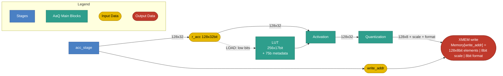

# AaQ Stage

## 1. Purpose

The AaQ (Activation and Quantization) stage applies element-wise activation
and special functions to the 128-element accumulator, quantizes the
128-element vector into an 8-bit vector, and writes the result to external
memory (XMEM) It produces:

- A 128-element vector of 8-bit quantized values.
- A scale factor.
- A format field.

The stage also owns the function estimation **LUT**, which is filled by the `LOAD`
instruction (section 6.3).

## 2. Block Diagram



## 3. Interfaces

### 3.0 Black Box Diagram

```
                         ┌──────────────────────────────────────┐
              clk  ─────>│                                      │
            rst_n  ─────>│                                      │
               op  ─────>│                                      │
            r_acc  ─────>│                                      │
    function_type  ─────>│                                      ├────> XMEM write
         lut_addr  ─────>│             AaQ Stage                │      Memory[write_addr] =
   valid_elements  ─────>│                                      │      [128×8b elements | 8b scale
        partition  ─────>│                                      │       | 8b format]
   partition_mask  ─────>│                                      │
           format  ─────>│                                      │
        quan_mode  ─────>│                                      │
       write_addr  ─────>│                                      │
                         └──────────────────────────────────────┘
```


### 3.1 Inputs

| Name | Type and Direction | Description |
|------|--------------------|-------------|
| `clk` | `input logic` | Clock signal. |
| `rst_n` | `input logic` | Asynchronous, active-low  |
| `op` | `input logic [1:0]` | Selects the AaQ operation: `AAQ_INST_OPCODE_NOP` = 0, `AAQ_INST_OPCODE_ACTIVATE_QUANTIZE` = 1, `AAQ_INST_OPCODE_LOAD` = 2. |
| `r_acc` | `input logic [127:0][31:0]` | 128-element accumulator (128 × 32-bit FP32). Also the data source for `LOAD` (section 6.3). |
| `function_type` | `input logic [2:0]` | Encoded activation/special-function selector for `ACTIVATE.QUANTIZE` (see section 5.0). |
| `lut_addr` | `input logic [2:0]` | LUT segment address for `LOAD` (section 6.3); selects which of the 8 segments the instruction writes. Ignored for every other `op`. |
| `valid_elements` | `input logic [7:0]` | Number of valid elements in `r_acc`, range `0`–`128`. 8 bits are required because `128` is not representable in 7. |
| `partition` | `input logic [1:0]` | Element partition grouping: enum of `1`/`2`/`4`/`8` (encoded `00`/`01`/`10`/`11`). Exact semantics TBD. |
| `partition_mask` | `input logic [2:0]` | Count of `partition` groups, counted from the right (highest-indexed group), that are masked out entirely. `0` = all `partition` groups valid; `k` = the rightmost `k` groups are masked — their elements do not participate in activation/quantization and their output elements are forced to 0 (section 6.2). `k` must not exceed `partition - 1` (masking every group is not a supported configuration). Example: `partition = 8` splits the 128 elements into 8 groups of 16 (`elements[0:15] \| elements[16:31] \| ... \| elements[112:127]`); `partition_mask = 2` masks the rightmost 2 groups, i.e. `elements[96:127]`. |
| `format` | `input logic [7:0]` | Output element format. See section 3.3. |
| `quan_mode` | `input logic` | Scale-factor mode: `1` = dynamic, `0` = static. |
| `write_addr` | `input logic [XMEM_ADDR_W-1:0]` | Destination XMEM address for the quantized result (see `XMEM_ADDR_W` in the Control stage spec, section 4). The stage writes to this address directly. |

*`op` is sourced from the `opcode` field of the generated `aaq_slot_t` struct, typed `aaq_inst_opcode_t` (package `ipu_instr_pkg`). Generated from [`instruction_spec.py`](../../../src/tools/ipu-common/src/ipu_common/instruction_spec.py) (the AAQ slot's `"aaq"` entry) by [`gen_codegen.py`](../../../src/tools/ipu-as-py/src/ipu_as/gen_codegen.py) via the [`ipu_instr_pkg.sv.j2`](../../../src/tools/ipu-as-py/src/ipu_as/templates/ipu_instr_pkg.sv.j2) template (`bazel run //src/tools/ipu-as-py:ipu-as -- sv-package --output <path>`).*

### 3.2 Output

AaQ performs the XMEM write itself. On `ACTIVATE.QUANTIZE` (and only on that
opcode — see section 4) the stage drives a single 1040-bit write to
`Memory[write_addr]`:

| Field | Width | Description |
|-------|-------|-------------|
| `elements` | 128 × 8 = 1024 bits | 128 quantized elements, 8 bits each (section 5.1). |
| `scale` | 8 bits | Batch scale factor, `e8m0` (section 5.1). |
| `format` | 8 bits | Passed through unchanged from the `format` input (section 3.3). |

Total write payload: 1024 + 8 + 8 = **1040 bits**, to address `write_addr`.

`aaq_out` is used below as the pseudocode name for this bundle; the concrete
storage/register implementation is left to the designer.

### 3.3 `format` Field Layout

`format` is 8 bits:

| Bits | Name | Description |
|------|------|-------------|
| `[7]` | `sign` | `0` = unsigned, `1` = signed. |
| `[6:4]` | `exp_bits` (`fe`) | Number of exponent bits, `0`–`7`. |
| `[3:0]` | `width` | Total element width `W`, stored directly (no offset): value `1`–`8`. `0` is reserved/invalid. |

The mantissa is **the remainder** — what is left of the element width once the
sign and exponent bits are taken out:

```text
sign_bit = format[7]                 // 0 or 1
fe       = format[6:4]               // exponent bits
W        = format[3:0]               // total element width, 1..8 bits (stored directly)
fm       = W - fe - sign_bit         // mantissa bits (the leftover)
```

`fm` must be `>= 0`, i.e. `W >= fe + sign_bit`; encodings that violate this are
invalid. `fm = 0` is legal (no mantissa bits). `W <= 8` always, so a quantized
element always fits in its 8-bit output slot; when `W < 8` the unused
low-order bits are zero-padded.

Example: signed, 2 exponent bits, 8-bit width (`e2m5`) is
`format = {1, 3'd2, 4'd8}` → `fm = 8 - 2 - 1 = 5`.

## 4. Disclaimers

- The AaQ slot executes once per VLIW cycle.
- AaQ is the pipeline's last stage; slot execution order within a VLIW word: CTRL → MULT → ACC → **AaQ**.
- The XMEM write happens **only** on `ACTIVATE.QUANTIZE`. `NOP` and `LOAD` perform no memory write, so no separate store opcode is needed.
- `NOP` performs no state changes.

## 5. AaQ Operations

### 5.0 Activate and Quantize (`ACTIVATE.QUANTIZE`)

Activation and quantization happen in a single instruction; there is no
separate activate-only or quantize-only instruction. It applies an
element-wise activation function to every element of `r_acc`.

The function is selected via `function_type` and applied to each FP32
element. `identity`, `relu`, and `relu6` are computed directly; `exp2`,
`reciprocal`, `rsqrt`, and `generic` are evaluated through the LUT, so the
selected function must already be loaded there (section 5.2).

```text
for i in 0..127:
    x = r_acc[i]
    case function_type:
        // computed directly
        identity:    activated[i] = x
        relu:        activated[i] = max(0, x)
        relu6:       activated[i] = min(max(0, x), 6)

        // evaluated through the LUT, no special-casing
        exp2:        activated[i] = LUT[function_type](x)
        generic:     activated[i] = LUT[function_type](x)

        // evaluated through the LUT, with a guard for x's sign/zero
        reciprocal:  if x == 0:      activated[i] = inf
                     else:           activated[i] = LUT[function_type](x)
        rsqrt:       if x == 0:      activated[i] = inf
                     elif x < 0:     activated[i] = 0
                     else:           activated[i] = LUT[function_type](x)
```

Supported function types: activation and special functions grouped onto a
single field:


| Encoding | Name | Formula | Notes |
|----------|------|---------|-------|
| 1 | `identity` | `f(x) = x` | Pass-through; no transform. |
| 2 | `relu` | `f(x) = max(0, x)` | Most common non-linearity. |
| 3 | `relu6` | `f(x) = min(max(0, x), 6)` | Clipped ReLU; used in MobileNet. |
| 4 | `generic` | `f(x) = LUT[generic](x)` | Covers all activations except `relu` and `relu6` — see the table below for the explicit function each one computes. All of them are called by the single name `generic`; which one is applied is decided by whichever function was loaded into the LUT, not by the encoding. |
| 5 | `reciprocal` | `f(x) = 1/x` (0 if x = 0) | Multiplicative inverse; useful for normalization. |
| 6 | `rsqrt` | `f(x) = 1/√x` (0 if x ≤ 0) | Reciprocal square root; used in layer normalization. |
| 7 | `exp2` | `f(x) = 2^x` | Used for dequantization, softmax and attention scaling. |

`generic` (encoding 4) covers seven functions, all loaded into and called through the same LUT entry:

| Name | Formula |
|------|---------|
| `sigmoid` | `f(x) = 1 / (1 + e^-x)` |
| `tanh` | `f(x) = (e^x - e^-x) / (e^x + e^-x)` |
| `gelu` | `f(x) = x · Φ(x) = 0.5 · x · (1 + erf(x / √2))` |
| `softplus` | `f(x) = ln(1 + e^x)` |
| `elu` | `f(x) = x` if `x ≥ 0`, else `α · (e^x - 1)` (`α = 1.0`) |
| `silu` | `f(x) = x · sigmoid(x) = x / (1 + e^-x)` |
| `window` | `f(x) = 1` if `a ≤ x < b`, else `0` (rectangular window over `[a, b)`) |

### 5.1 Quantization Algorithm

After activation (section 5.0), each activated FP32 element `a` (IEEE-754 single
precision: 1-bit sign `S`, 8-bit exponent `e`, 23-bit mantissa) is quantized
to the format selected by `format` (section 3.3): a sign bit present only if
`format[7] = 1` (signed; omitted when unsigned), `fe` exponent bits
(`format[6:4]`), and `fm` mantissa bits derived as the leftover
`fm = W - fe - sign_bit`, where `W = format[3:0]` (stored directly, no
offset) is the total element width. Since the mantissa is the remainder of the width, `sign + fe + fm`
always totals exactly `W`; when `W < 8` the leftover low-order bits of the
8-bit quantized element are zero-padded. `fe` is at minimum 1 bit; `fm` may be
0 bits. FP32 inputs are always treated as normalized (implicit leading 1);
subnormal inputs are not specially handled.

The scale factor `s` (8 bits, `e8m0`: exponent only, no mantissa) is the
batch's shared scale, computed as the maximum raw exponent across the 128
elements of the batch, before quantization:

```text
s = max(e[i] for i in 0..254)
```

For each element, define the exponent distance from the batch scale:

```text
E = -(e - s)   // = s - e
```

Since `s` is the batch maximum, `E >= 0` for every element, with `E = 0` at
the batch-max element(s) and `E` growing as an element's magnitude shrinks
relative to the batch max. The output exponent and mantissa fields are then:

```text
if 0 <= E < 2^fe - 1:                // representable directly in fe bits
    Exp = E
    M   = RTN(1.M)                   // round the 23-bit mantissa (implicit leading 1) to fm bits

    if M == 2^fm:                    // edge 1: 1.11...1 rounded up to 10.00...0
        if E > 0:
            Exp = E - 1              // the carry moved the value one binade up
            M   = 0
        else:                        // E = 0: no binade above the batch scale
            Exp = 0
            M   = 2^fm - 1           // saturate at the largest representable value

else:                                // E exceeds what fe bits can represent
    Exp = 2^fe - 1                   // exponent field saturates at its max value
    M   = RTN(1.M >> [E - (2^fe - 1) + 1])  // extra right-shift preserves magnitude instead of flushing to zero

    if M == 2^fm:                    // edge 2: 0.11...1 rounded up to 1.00...0
        Exp = 2^fe - 2               // the smallest directly-encoded exponent
        M   = 0
```

Both edges are the same event — `RTN` carrying out of the `fm` mantissa bits —
resolved differently per branch. In the direct branch the carry means the value
moved one binade up, so the exponent decrements and the mantissa clears; at
`E = 0` there is no binade above the batch scale, so the element saturates at
the largest representable value instead of wrapping. In the clamp branch the
carry turns the shifted fraction into `1.00...0`, which is no longer a
saturated value but the smallest directly-encoded one, so it is re-encoded as
`Exp = 2^fe - 2`, `M = 0`.

`RTN` = round to nearest. Sign `S` (when present, `format[7] = 1`) is passed
through unchanged. The final 8-bit quantized element is
`{S?, Exp, M, 0-pad}`: `S`, `Exp` (`fe` bits), and `M` (`fm` bits) packed at
the high end, zero-padded at the low end to fill 8 bits. The write payload
also carries `Format` (passed through unchanged from the `format` input) and
the batch `Scale` (`s`), as described in section 3.2.

> **Note:** the `S`/`Exp`/`M` encoding above is the same for both
> `quan_mode` values, and `s` is computed the same way (batch max, as shown
> above) regardless of `quan_mode`. `quan_mode = 1` (dynamic) restricts
> `format` to exactly two supported formats, both signed and both 8 bits
> wide (`format[3:0] = 8`): `e2m5` and `e1m6` — that pair is exactly
> `fe = 2` and `fe = 1` at `W = 8`, signed, since `fm` is the leftover
> (section 3.3). Only `fe` is chosen; the rule in section 5.1.1 makes
> that choice per block.

#### 5.1.1 Dynamic Exponent-Field Selection (`fe = 1` vs `fe = 2`)

Applies only when `quan_mode = 1`. The dynamic decision selects **the exponent
field width alone**: `fe = 1` or `fe = 2` (`format[6:4]`). The mantissa is not
chosen independently — it is the leftover `fm = W - fe - sign_bit` (section
3.3), so moving from `fe = 1` to `fe = 2` always buys one more exponent bit at
the cost of exactly one mantissa bit, whatever `W` and `sign_bit` are. Each
block shares one scale `s` and the quantizer picks one of the two splits per
block:

| Split | Exponent bits | Mantissa bits | Encodable `E` | Step at `E` |
|---|---|---|---|---|
| `fe1` | 1 | `fm1 = W - 1 - sign_bit` | 0, 1 | `2^(s - E - fm1)`, clamped at `E >= 1` |
| `fe2` | 2 | `fm1 - 1` | 0, 1, 2, 3 | `2^(s - E - fm1 + 1)`, clamped at `E >= 3` |

`fe1` is one bit finer near the top of the block. `fe2` reaches two binades
further down before it clamps. The rule below decides which trade is better for
the block actually being quantized. It depends on `fm1` only through the two
multipliers, so it holds for any `W`/`sign_bit` pairing, not just the signed
8-bit one.

##### Definitions

- `s`: shared block scale exponent, selected by the same block scale procedure
  used for static quantization (section 5.1).
- `e`: exponent of the individual element.
- `E = s - e`. Always non-negative (section 5.1). `E = 0` means the scale
  represents the element exactly.
- `fm1 = W - 1 - sign_bit`: the last mantissa bits under `fe1`. `fe2` always has exactly
  one fewer. For the signed, 8-bit case `fm1 = 6`.
- `err1`: truncation error of the element under `fe1`.
- `err2`: truncation error of the element under `fe2`.

##### Element classification

Each element contributes to at most one accumulator:

| Condition | Accumulator | Meaning |
|---|---|---|
| `E = 0` | A | `fe1` is finer here. A measures the cost of choosing `fe2`. |
| `E = 1` | none | Don't care. |
| `1 < E <= fm1 + 2` | B | `fe2` is finer here. B measures the cost of choosing `fe1`. |
| `E > fm1 + 2` | none | Out of range for both splits. |

Elements at `E = 1` are don't cares. They enter neither sum and have no effect
on the decision.

##### Per-element terms

```text
A = RTN( |err2^2 - err1^2| * 2^(2*fm1) )
B = RTN( |err2^2 - err1^2| * 2^(2*(fm1 + 1)) )
```

`RTN` is round to nearest integer, and an exact half rounds **up**: `0.5 -> 1`,
`1.5 -> 2`, `2.5 -> 3`. 

##### Decision

```text
if sum(B) - 4 * sum(A) < 0:  choose fe1        // format[6:4] = 1
else:                        choose fe2        // format[6:4] = 2
```

The constant 4 is a unit reconciliation, not a tuning parameter. The B
multiplier `2^(2*(fm1 + 1))` is exactly four times the A multiplier
`2^(2*fm1)`, so scaling A by 4 returns both accumulators to a common error.

##### Both estimators are unbiased

Assume mantissa bits are uniformly distributed, so `r` — the finer split's
error as a fraction of its own step — is uniform on `[0, 1)` and the dropped
bit is 1 with probability one half.

| Term | Pre-RTN value | Distribution | Outcomes | E[RTN] | E[pre-RTN] |
|---|---|---|---|---|---|
| A | `1 + 2r` | uniform on `[1, 3)` | 1, 2, 3 at 0.25, 0.5, 0.25 | 2 | 2 |
| B | `(1 + 2r) / 4` | uniform on `[0.25, 0.75)` | 0, 1 at 0.5, 0.5 | 0.5 | 0.5 |

In both rows the rounded mean equals the unrounded mean exactly. Including the
zero case, `E[A] = 1` and `E[B] = 0.25`. Neither sum drifts as the block length
grows, so rounding contributes noise but never a systematic tilt toward one
format.

##### Worked example

Block of ten values, `s = 0`, `fm1 = 4` (signed, `W = 6`). The A multiplier is
`2^8 = 256` and the B multiplier is `2^10 = 1024`. `fm1 = 4` keeps the numbers
short; for the signed 8-bit case `fm1 = 6`, the multipliers are `2^12` and
`2^14`, and the B region is `1 < E <= 8`.

| # | v | e | E | Acc | err1 | err2 | \|err2^2 - err1^2\| | Pre-RTN | A | B |
|---|---|---|---|---|---|---|---|---|---|---|
| 1 | 1.83 | 0 | 0 | A | 0.0175 | 0.0800 | 6.09375e-3 | 1.560 | 2 | |
| 2 | 1.21 | 0 | 0 | A | 0.0225 | 0.0850 | 6.71875e-3 | 1.720 | 2 | |
| 3 | 1.57 | 0 | 0 | A | 0.0075 | 0.0700 | 4.84375e-3 | 1.240 | 1 | |
| 4 | 0.94 | -1 | 1 | none | don't care | don't care | | | | |
| 5 | 0.67 | -1 | 1 | none | don't care | don't care | | | | |
| 6 | 0.41 | -2 | 2 | B | 0.00375 | 0.00375 | 0 | 0 | | 0 |
| 7 | 0.2345 | -3 | 3 | B | 0.01575 | 0.000125 | 2.48047e-4 | 0.254 | | 0 |
| 8 | 0.1780 | -3 | 3 | B | 0.02175 | 0.006125 | 4.35547e-4 | 0.446 | | 0 |
| 9 | 0.0920 | -4 | 4 | B | 0.02950 | 0.013875 | 6.77734e-4 | 0.694 | | 1 |
| 10 | 0.0555 | -5 | 5 | B | 0.02425 | 0.008625 | 5.13672e-4 | 0.526 | | 1 |

`sum(A) = 5`, `sum(B) = 2`.

`2 - 4 * 5 = -18`, which is negative, so the block selects **`fe1`**.


### 5.2 Function Estimation LUT

The stage holds a function estimation LUT of **256 entries × 17 bits**,
plus a **75-bit metadata block** that configures range handling. Both are
filled by `LOAD` (section 6.3), which writes one **segment** per instruction;
the 3-bit `lut_addr` selects the segment.

#### 5.2.1 Segment Transfer

A segment is **1024 bits**, sourced from the **lower 32 words** of the
accumulator, `r_acc[31:0]` (32 words × 32 bits = 1024 bits). The upper words
`r_acc[127:32]` are ignored by `LOAD`. The 1024-bit payload is the little-endian
concatenation of those words:

```text
payload[1023:0] = {r_acc[31], r_acc[30], ..., r_acc[1], r_acc[0]}
                                          // payload[32*j +: 32] == r_acc[j]
```

The table itself is a **4,352-bit flat bitstream** — not split per word, and
not reset per segment: `LOAD` transfers one 1024-bit slice of that stream
per instruction, and a table entry may straddle the boundary between two
segments (the same way the metadata field straddles word boundaries,
section 5.2.2). `lut_addr` selects which slice:

| `lut_addr` | Contents | Interpretation |
|------------|----------|----------------|
| `0` | Table bits `[1023:0]` | 1st 1024-bit slice of the flat table bitstream. |
| `1` | Table bits `[2047:1024]` | 2nd slice. |
| `2` | Table bits `[3071:2048]` | 3rd slice. |
| `3` | Table bits `[4095:3072]` | 4th slice — the table's first 4,096 bits are now fully loaded. |
| `4` | Table bits `[4351:4096]` (the last 256 bits) + metadata | **Mixed.** `payload[255:0]` = the table's last 256 bits; `payload[330:256]` = the 75-bit metadata block (section 5.2.2); `payload[1023:331]` is unused/reserved. |
| `5`–`7` | Reserved / unused | — |

Five `LOAD`s (`lut_addr` `0`–`4`) are required to fully program the LUT and
its metadata. Only the last of them (`lut_addr = 4`) is partially reserved —
the first four are fully packed with table bits (256 entries × 17 bits =
4,352 bits total).

#### 5.2.2 Metadata Block

The metadata occupies bits `[330:256]` of the `lut_addr = 4` segment's
1024-bit payload (i.e. local bits `[74:0]` of the metadata field itself,
offset by the 256 bits of leftover table data ahead of it); the remaining
bits `[1023:331]` are unused. Bits-to-word mapping follows
`payload[32*j +: 32] == r_acc[j]` (section 5.2.1), so absolute bit `256 + m`
(for local metadata bit `m`) lands in `r_acc[(256+m) / 32][(256+m) % 32]`.
Because the field is flat, it straddles word boundaries — for example
`max_exp_num` is `r_acc[8][7:0]` and `neg_c` spans `r_acc[8][31:8]` together
with `r_acc[9][7:0]`.

| Bits (local, within metadata) | Name | Consumed by | Meaning |
|------|------|-------------|---------|
| `[7:0]` | `max_exp_num` | `Quantactivation` | Largest **biased** FP32 exponent still inside the LUT range. `exp > max_exp_num` → lane flagged out-of-range. |
| `[39:8]` | `neg_c` | `pack_lutout_activ` | FP32 constant substituted for negative out-of-range lanes. |
| `[71:40]` | `pos_c` | `pack_lutout_activ` | FP32 constant substituted for positive out-of-range lanes. |
| `[72]` | `asymetric` | `Quantactivation` | Table domain + address form. |
| `[74:73]` | `range_mode` | `pack_lutout_activ` | Out-of-range policy. |

> **TBD:** the encodings of `asymetric` (which table domain and address form
> each value selects) and of `range_mode` (which out-of-range policy each of
> the 4 values selects) are not yet specified.

## 6. ISA-AaQ: Instruction Reference

The opcode enum
(`aaq_inst_opcode_t`, package `ipu_instr_pkg`) is generated from
[`instruction_spec.py`](../../../src/tools/ipu-common/src/ipu_common/instruction_spec.py)
by [`gen_codegen.py`](../../../src/tools/ipu-as-py/src/ipu_as/gen_codegen.py).

The AaQ slot is resolved by CTRL and forwarded down the pipeline;
the stage does not read the CR/LR register files itself (see the
Control Stage spec, section 5). The active element count is determined by each
instruction's mandatory `cr_idx` operand together with `partition_mask`
(section 3.1): `masked = partition_mask * (128 / partition)` elements are
excluded from the right, so `n = min(valid_elements, 128 - masked)`
at cycle start. There is no implicit default register; `cr_idx` must always
be named explicitly (any `CR0`-`CR15`; `CR15` remains the conventional choice
but is never assumed).

### 6.1 `NOP`: No Operation

- **Summary:** No operation for the AaQ slot; performs no state changes and no memory write.
- **Syntax:** `NOP`
- **Operands:** none.

### 6.2 `ACTIVATE.QUANTIZE`: Activate, Quantize and Store

- **Summary:** Apply an element-wise activation function to the active elements of `r_acc`, quantize the result, and write the resulting 8-bit values, scale factor, and format to `Memory[write_addr]`. This is the only AaQ opcode that drives an XMEM write. Activation functions are pre-configured into the LUT by `LOAD` (section 6.3); naming an activation in `function_type` triggers the corresponding loaded LUT entry. `r_acc` is not modified.
- **Syntax:** `ACTIVATE.QUANTIZE function_type, cr_idx`
- **Operands:**
  - `function_type`: activation/special-function keyword (see section 5.0): `identity`, `relu`, `relu6`, `generic`, `reciprocal`, `rsqrt`, `exp2`.
  - `cr_idx`: `CR0`…`CR15`, dstructure register supplying `valid_elements` (must be given explicitly; no implicit default).
- **Operation:**
  ```text
  masked = partition_mask * (128 / partition)          // section 3.1
  n = min(valid_elements, 128 - masked)
  for i in 0..n-1:
      activated[i] = LUT[function_type](r_acc[i])      // section 5.0
      aaq_out.elements[i] = quantize(activated[i])     // section 5.1
  aaq_out.elements[n..127] = 0
  aaq_out.scale = s                                    // section 5.1
  aaq_out.format = format
  Memory[write_addr] = aaq_out                         // 1040 bits, section 3.2
  ```
- **Example:** `ACTIVATE.QUANTIZE relu, CR15;;`

### 6.3 `LOAD`: Load Function Estimation LUT Segment

- **Summary:** Fill one 1024-bit segment of the function estimation LUT (section 5.2) from the lower 32 words of `r_acc`. The 3-bit `lut_addr` selects the target segment: `0`–`3` load table entries, `4` loads the metadata block. Performs no XMEM write and does not modify `r_acc`.
- **Syntax:** `LOAD lut_addr`
- **Operands:**
  - `lut_addr`: LUT segment index, `0`–`7` (`0`–`3` = table, `4` = metadata, `5`–`7` reserved).
- **Operation:**
  ```text
  payload[1023:0] = {r_acc[31], ..., r_acc[0]}        // 32 words x 32 bits

  if lut_addr <= 3:                                  // table segment
      for j in 0..31:                                // low 17 bits per word;
          LUT[lut_addr*32 + j] = r_acc[j][16:0]      // word bits [31:17] ignored
  else if lut_addr == 4:                             // metadata segment
      {range_mode, asymetric, pos_c, neg_c, max_exp_num} = payload[74:0]
      // payload[1023:75] unused; field layout in section 5.2.2
  ```
- **Example:** `LOAD 4;;` (load the metadata block)

### 6.4 Summary Table

| Slot | Mnemonic | Operands | One-line Effect |
|------|----------|----------|-----------------|
| AaQ | `NOP`               | -                       | no state change |
| AaQ | `ACTIVATE.QUANTIZE` | `function_type, cr_idx` | `aaq_out.elements[0..n-1] = quantize(LUT[function_type](r_acc[i]))`, `aaq_out.scale/format` set, `Memory[write_addr] = aaq_out`, n = min(valid_elements, 128 - partition_mask * (128/partition)) |
| AaQ | `LOAD`              | `lut_addr`              | `LUT.segment[lut_addr] = r_acc[31:0]` low 17 bits per word; `lut_addr` `0`-`3` = 32 table entries each, `4` = metadata block |
