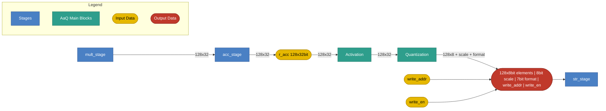

# AaQ and Store Stage

## 1. Purpose

This spec covers two consecutive VLIW pipeline stages: **AaQ**
(Activation and Quantization) and **STR** (Store), which write AaQ's
output to external memory. AaQ is §§1-6 below; STR is §7.

The AaQ (Activation and Quantization) stage applies element-wise activation
and special functions to the 128-element accumulator, and quantizes the
128-element vector into an 8-bit vector for output. It produces:

- A 128-element vector of 8-bit quantized values.
- A scale factor.
- A format field.

## 2. Block Diagram



## 3. Interfaces

### 3.0 Black Box Diagram

```
                         ┌──────────────────────────────────────┐
              clk  ─────>│                                      │
              rst  ─────>│                                      │
               op  ─────>│                                      │
            r_acc  ─────>│                                      │
    function_type  ─────>│             AaQ Stage                ├────> to STR stage
 invalid_elements  ─────>│                                      │      [128×8b elements | 8b scale | 7b format
        partition  ─────>│                                      │       | write_addr | write_en]
           format  ─────>│                                      │
        quan_mode  ─────>│                                      │
       write_addr  ─────>│                                      │
         write_en  ─────>│                                      │
                         └──────────────────────────────────────┘
```


### 3.1 Inputs

| Name | Type and Direction | Description |
|------|--------------------|-------------|
| `clk` | `input logic` | Clock signal. |
| `rst` | `input logic` | Synchronous reset. |
| `op` | `input logic [0:0]` | Selects the AaQ operation: `AAQ_INST_OPCODE_NOP` = 0, `AAQ_INST_OPCODE_ACTIVATE_QUANTIZE` = 1. |
| `r_acc` | `input logic [127:0][31:0]` | 128-element accumulator (128 × 32-bit FP32). |
| `function_type` | `input logic [2:0]` | Encoded activation/special-function selector for `ACTIVATE.QUANTIZE` (see §5.0). |
| `invalid_elements` | `input logic [6:0]` | Element count. |
| `partition` | `input logic [1:0]` | Element partition grouping: enum of `1`/`2`/`4`/`8` (encoded `00`/`01`/`10`/`11`). Exact semantics TBD. |
| `format` | `input logic [6:0]` | Output element format, replacing the old fixed `dtype`: bit `[6]` = sign (`0`=unsigned, `1`=signed), bits `[5:3]` = exponent bits (3 bits), bits `[2:0]` = mantissa bits (3 bits). |
| `quan_mode` | `input logic` | Scale-factor mode: `1` = dynamic, `0` = static. |
| `write_addr` | `input logic [XMEM_ADDR_W-1:0]` | Destination XMEM address for the quantized result (see `XMEM_ADDR_W` in the Control stage spec, §4). Received here and passed through to the STR stage, which performs the actual XMEM write. |
| `write_en` | `input logic` | Write enable. Received here and passed through to the STR stage alongside `write_addr` and the quantized data. |

*`op` is sourced from the `opcode` field of the generated `aaq_slot_t` struct, typed `aaq_inst_opcode_t` (package `ipu_instr_pkg`). Generated from [`instruction_spec.py`](../../../src/tools/ipu-common/src/ipu_common/instruction_spec.py) (the AAQ slot's `"aaq"` entry) by [`gen_codegen.py`](../../../src/tools/ipu-as-py/src/ipu_as/gen_codegen.py) via the [`ipu_instr_pkg.sv.j2`](../../../src/tools/ipu-as-py/src/ipu_as/templates/ipu_instr_pkg.sv.j2) template (`bazel run //src/tools/ipu-as-py:ipu-as -- sv-package --output <path>`).*

### 3.2 Output

The Quantization block passes the following payload to the **STR stage**, which performs the actual XMEM write; AaQ itself does not write to XMEM.

| Field | Width | Description |
|-------|-------|-------------|
| Quantized elements | 128 × 8 bit = 1024 bits | Quantized value of each of the 128 elements. |
| Scale factor | 8 bits | Scale factor applied across the quantized elements. |
| Format | 7 bits (matching the `format` input width, §3.1: 1 sign + 3 exponent + 3 mantissa) | Encodes the output element format so downstream readers can interpret the quantized data. |
| `write_addr` | `[XMEM_ADDR_W-1:0]` | Passed through unchanged from the `write_addr` input (§3.1). |
| `write_en` | `1 bit` | Passed through unchanged from the `write_en` input (§3.1). |

Total payload width: 1024 + 8 + 7 = 1039 bits, plus `write_addr` (`XMEM_ADDR_W` bits) and `write_en` (1 bit).

## 4. Disclaimers

- The AaQ slot executes once per VLIW cycle.
- The STR slot executes once per VLIW cycle; STR is the pipeline's last stage.
- Slot execution order within a VLIW word: CTRL → MULT → ACC → **AaQ** → **STR**.
- `NOP` performs no state changes, in either the AaQ or STR slot.

## 5. AaQ Operations

### 5.0 Activate and Quantize (`ACTIVATE.QUANTIZE`)

Activation and quantization happen in a single instruction — there is no
separate activate-only or quantize-only instruction. It applies an
element-wise activation function to every valid element of `r_acc`.

The function is selected via `function_type` and applied directly to the
FP32 elements, unlike other write activations. Activation
functions are pre-configured into a LUT; naming an activation in
`function_type` triggers the corresponding loaded LUT entry. The active
element count comes from `invalid_elements`.

```text
n = min(invalid_elements, 128)
for i in 0..n-1:
    activated[i] = LUT[function_type](r_acc[i])
activated[n..127] = 0
```

Supported function types — activation and special functions grouped onto a
single field:

> **Note:** this grouped 7-value encoding does not match the implemented
> 12-value encoding in `activations.py` (`ACTIVATION_FN_NAMES`) and
> `instruction_spec.py`, which remains the source of truth per `CLAUDE.md`
> until the code is updated to match.

| Encoding | Name | Formula | Notes |
|----------|------|---------|-------|
| 1 | `identity` | `f(x) = x` | Pass-through; no transform. |
| 2 | `relu` | `f(x) = max(0, x)` | Most common non-linearity. |
| 3 | `relu6` | `f(x) = min(max(0, x), 6)` | Clipped ReLU; used in MobileNet. |
| 4 | `activation` | — | Covers all activations except `relu` and `relu6`: `sigmoid`, `tanh`, `gelu`, `softplus`, `elu`, `silu`. |
| 5 | `reciprocal` | `f(x) = 1/x` (0 if x = 0) | Multiplicative inverse; useful for normalization. |
| 6 | `rsqrt` | `f(x) = 1/√x` (0 if x ≤ 0) | Reciprocal square root; used in layer normalization. |
| 7 | `exp2` | `f(x) = 2^x` | Used for dequantization, softmax and attention scaling. |

## 6. ISA — Instruction Reference

The AaQ stage executes **two mnemonics** in its single AaQ slot (one
per VLIW word): `NOP` and `ACTIVATE.QUANTIZE`. The opcode enum
(`aaq_inst_opcode_t`, package `ipu_instr_pkg`) is generated from
[`instruction_spec.py`](../../../src/tools/ipu-common/src/ipu_common/instruction_spec.py)
by [`gen_codegen.py`](../../../src/tools/ipu-as-py/src/ipu_as/gen_codegen.py)
and is not duplicated here.

> **Aggregation instructions** (`AGG.SUM`, `AGG.SUM.FIRST`, `AGG.MAX`,
> `AGG.MAX.FIRST`) live in the **ACC slot**, not the AaQ slot. They write a
> single reduced scalar into a chosen `R_ACC` element; see the ACC stage spec.

The AaQ slot is resolved by CTRL and forwarded down the dispatch chain;
the stage does not read the CR/LR register files itself (see the
Control Stage spec, §5). The active element count is determined by each
instruction's mandatory `cr_idx` operand: `n = min(invalid_elements, 128)`
at cycle start. There is no implicit default register — `cr_idx` must always
be named explicitly (any `CR0`-`CR15`; `CR15` remains the conventional choice
but is never assumed).

### 6.1 `NOP` — No Operation

- **Summary:** No operation for the AaQ slot; performs no state changes.
- **Syntax:** `NOP`
- **Operands:** none.
- **Operation:** none — `r_acc` and `POST_AaQ_REG` are unchanged.
- **Notes:** Inserted automatically when the AaQ slot is omitted from a VLIW word (see §3.1).

### 6.2 `ACTIVATE.QUANTIZE` — Activate and Quantize

- **Summary:** Apply an element-wise activation function to the active elements of `r_acc` and write the resulting FP32 values into `POST_AaQ_REG`. Activation functions are pre-configured into a LUT; naming an activation in `function_type` triggers the corresponding loaded LUT entry. `r_acc` is not modified.
- **Syntax:** `ACTIVATE.QUANTIZE function_type, cr_idx`
- **Operands:**
  - `function_type` — activation/special-function keyword (see §5.0): `identity`, `relu`, `relu6`, `activation`, `reciprocal`, `rsqrt`, `exp2`.
  - `cr_idx` — `CR0`…`CR15` — dstructure register supplying `valid_elements` (must be given explicitly; no implicit default).
- **Operation:**
  ```text
  n = min(invalid_elements, 128)
  for i in 0..n-1:
      POST_AaQ_REG[i] = LUT[function_type](r_acc[i])
  POST_AaQ_REG[n..511] = 0
  ```
- **Example:** `ACTIVATE.QUANTIZE relu, CR15;;`
- **Notes:** Reads `r_acc` from the cycle-start snapshot, so an ACC-slot instruction (e.g. `AGG.*`) issued in the same VLIW word does not affect the result.

### 6.3 Summary Table

| Slot | Mnemonic | Operands | One-line Effect |
|------|----------|----------|-----------------|
| AaQ | `NOP`               | —                       | no state change |
| AaQ | `ACTIVATE.QUANTIZE` | `function_type, cr_idx` | `POST_AaQ_REG[0..n-1] = LUT[function_type](r_acc[i])`, n = min(invalid_elements, 128) |

## 7. STR (Store) Stage

### 7.0 Purpose

STR is the pipeline's last stage — it drains `POST_AaQ_REG` (written by
`ACTIVATE.QUANTIZE`, §6.2) to external memory. Slot execution order within
a VLIW word: CTRL → MULT → ACC → AaQ → **STR**.

> **Note on the AaQ redesign (§3):** the speculative `write_addr`/`write_en`
> passthrough described in AaQ's interface — where AaQ forwards an address,
> enable, and a quantized+scale+format payload to STR — does not match the
> real STR instruction below. The real `STR_POST_AAQ_REG` computes its own
> address from its own `offset`/`base` operands and stores the raw
> `POST_AaQ_REG` bytes; it does not receive an address or enable from AaQ,
> and there is no scale/format metadata in the real store path. This is
> flagged, not reconciled — pick one model when the redesign is finalized.

### 7.1 Interfaces

```
                         ┌──────────────────────────────────────┐
              clk  ─────>│                                      │
              rst  ─────>│                                      │
               op  ─────>│                                      │
           offset  ─────>│              STR Stage               ├────> XMEM write
             base  ─────>│                                      │      Memory[offset + base] = POST_AaQ_REG
     POST_AaQ_REG  ─────>│                                      │
                         └──────────────────────────────────────┘
```

| Name | Type and Direction | Description |
|------|--------------------|-------------|
| `clk` | `input logic` | Clock signal. |
| `rst` | `input logic` | Synchronous reset. |
| `op` | `input logic [0:0]` | Selects the STORE operation: `STORE_INST_OPCODE_STR_POST_AAQ_REG` = 0, `STORE_INST_OPCODE_NOP` = 1. |
| `offset` | `input logic [3:0]` | Offset register, `LR0`–`LR15` (live value). |
| `base` | `input logic [3:0]` | Base address register, `CR0`–`CR15` (live value). |
| `POST_AaQ_REG` | `input logic [511:0][7:0]` | 512-byte register written by `ACTIVATE.QUANTIZE` (§6.2). |

*`op` is sourced from the `opcode` field of the generated `store_slot_t` struct, typed `store_inst_opcode_t` (package `ipu_instr_pkg`), generated from [`instruction_spec.py`](../../../src/tools/ipu-common/src/ipu_common/instruction_spec.py) (the STORE slot's `"store"` entry) the same way as AaQ's `op` (§3.1).*

### 7.2 ISA — Instruction Reference

The STORE slot executes **two mnemonics**: `NOP` and `STR_POST_AAQ_REG`.

#### 7.2.1 `NOP` — No Operation

- **Summary:** No operation for the STORE slot.
- **Syntax:** `NOP`
- **Operands:** none.

#### 7.2.2 `STR_POST_AAQ_REG` — Store Post-AAQ Register

- **Summary:** Write 512 bytes of `POST_AaQ_REG` to external memory.
- **Syntax:** `STR_POST_AAQ_REG offset, base`
- **Operands:**
  - `offset` — `LR0`…`LR15`, live value.
  - `base` — `CR0`…`CR15`, live value.
- **Operation:**
  ```text
  Memory[offset + base] = POST_AaQ_REG  // 512 bytes
  ```
- **Example:** `STR_POST_AAQ_REG LR0, CR0;;`

#### 7.2.3 Summary Table

| Slot | Mnemonic | Operands | One-line Effect |
|------|----------|----------|-----------------|
| STR | `NOP`               | —              | no state change |
| STR | `STR_POST_AAQ_REG`  | `offset, base` | `Memory[offset + base] = POST_AaQ_REG` |
