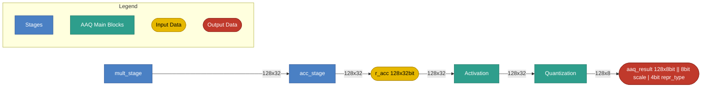

# AAQ Stage

## 1. Purpose

The AAQ (Activation and Quantization) stage applies element-wise activation
functions to the 128-lane accumulator and/or quantizes the activated lanes
into an 8-bit vector for output. It produces:

- Activated 32-bit lanes in `POST_AAQ_REG` via `activate`.
- A 128-byte `aaq_result` vector via `aaq` (any 8-bit format: INT8 or FP8 e(x)m(7-x)).

Cross-lane **aggregation** (sum / max reduction of `r_acc`) is no longer an
AAQ-stage operation: it is performed in the **ACC slot** by the
`AGG.SUM` / `AGG.SUM.FIRST` / `AGG.MAX` / `AGG.MAX.FIRST` instructions, which
reduce `r_acc` in place and write the scalar result into a single `r_acc`
slot selected by an LR register. See the generated
[instruction reference](../instructions.md) for their full semantics.

## 2. Block Diagram



## 3. Interfaces

### 3.0 Black Box Diagram

```
                         ┌──────────────────────────────────────┐
              clk  ─────>│                                      │
              rst  ─────>│                                      │
            valid  ─────>│                                      │
               op  ─────>│             AAQ Stage                ├────> aaq_result        [1035:0]
            r_acc  ─────>│                                      │
       act_cr_idx  ─────>│                                      │
            dtype  ─────>│                                      │
   valid_elements  ─────>│                                      │
    full_xmem_row  ─────>│                                      │
                         └──────────────────────────────────────┘
```

### 3.1 Inputs

| Name | Type and Direction | Description |
|------|--------------------|-------------|
| `clk` | `input logic` | Clock signal. |
| `rst` | `input logic` | Synchronous reset. |
| `valid` | `input logic` | Stage enable. When deasserted(valid = 0), the stage executes `aaq_nop` regardless of `op`. |
| `op` | `input logic [1:0]` | Selects the AAQ operation: `aaq`=1, `activate`=2. Sampled only when `valid`=1. |
| `r_acc` | `input logic [127:0][31:0]` | 128-lane accumulator (128 × 32-bit). |
| `act_cr_idx` | `input logic [3:0]` | CR register index whose value selects the activation function (see §7.0). |
| `dtype` | `input logic [2:0]` | Global data type forwarded from outside configuration; governs lane interpretation for all AAQ operations. Must be `DType.INT8` (0) for `aaq`. |
| `valid_elements` | `input logic [7:0]` | Active lane count. Sourced from `CR15.valid_elements` (bits [7:0] of the CR15 dstructure register). Ignored when `full_xmem_row` = 1. |
| `full_xmem_row` | `input logic [0:0]` | Lane-count override. 1 = always use all 128 lanes (ignore `valid_elements`); 0 = use `valid_elements`. Applies to `AAQ` and `ACTIVATE`. |

### 3.2 Outputs

| Name | Type and Direction | Description |
|------|--------------------|-------------|
| `aaq_result` | `output logic [1035:0]` | Quantized output: 128 × 8-bit lanes (1024 bits) plus 12 bits of metadata: bits [1035:1028] = 8-bit scale factor, bits [1027:1024] = 4-bit representation type (e.g. INT8, e6m1). |

## 4. Parameters

| Name | Default | Description |
|------|---------|-------------|
| `LANES` | `128` | Number of accumulator lanes. |
| `ACC_LANE_WIDTH` | `32` | Bits per accumulator lane. |
| `AAQ_RESULT_BYTES` | `128` | Byte width of `aaq_result` output vector. |

## 5. Data and Register Model

- `r_acc` is 512 bytes (128 × 32-bit lanes). Lanes are always FP32.
- `POST_AAQ_REG` is a 512-byte staging register (same lane layout as `r_acc`)
  written by `activate` and consumed by `aaq`.
- `aaq_result` is produced only by `aaq`. It contains 128 × 8 bit quantized
  values (1024 bits) plus 12 bits of metadata appended by the Quantization
  block: bits [11:4] = 8-bit scale factor, bits [3:0] = 4-bit representation
  type (INT8, e6m1, e5m2, …). It is written to XMEM via `xmem.store_aaq_result`.

## 6. Disclaimers

- The AAQ slot executes once per VLIW cycle.
- Slot execution order within a VLIW word: CTRL → MULT → ACC → **AAQ** → STR.
- `aaq_nop` performs no state changes.

## 7. AAQ Operations

### 7.0 Activation (`ACTIVATE`)

The Activation block applies an element-wise function to every valid lane of
`r_acc` and writes the results to `POST_AAQ_REG` for downstream quantization.

The function is selected at runtime by reading the CR register indexed by
`act_cr_idx`: `activation_fn = cr[act_cr_idx]`.

```text
// Applied to all valid lanes before quantization
activation_fn = cr[act_cr_idx]
n             = 128 if full_xmem_row else min(valid_elements, 128)
POST_AAQ_REG[i]  = activation_fn(r_acc[i])   for i in 0..n-1
POST_AAQ_REG[n..127] = 0
```

Supported activation functions:

| Encoding | Name | Formula | Notes |
|----------|------|---------|-------|
| 0 | `identity` | `f(x) = x` | Pass-through; no transform. |
| 1 | `relu` | `f(x) = max(0, x)` | Most common non-linearity. |
| 2 | `relu6` | `f(x) = min(max(0, x), 6)` | Clipped ReLU; used in MobileNet. |
| 3 | `sigmoid` | `f(x) = 1 / (1 + e^−x)` | Squashes to (0, 1). |
| 4 | `tanh` | `f(x) = (e^x − e^−x) / (e^x + e^−x)` | Squashes to (−1, 1). |
| 5 | `gelu` | `f(x) = x · Φ(x)` | Φ = standard normal CDF; used in BERT/GPT. |
| 6 | `softplus` | `f(x) = ln(1 + e^x)` | Smooth approximation of ReLU. |
| 7 | `elu` | `f(x) = x if x ≥ 0 else α·(e^x − 1)` | Smooth negative region; reduces vanishing gradient. |
| 8 | `exp2` | `f(x) = 2^x` | Used for dequantization, softmax and attention scaling. |
| 9 | `reciprocal` | `f(x) = 1/x` (0 if x = 0) | Multiplicative inverse; useful for normalization. |
| 10 | `rsqrt` | `f(x) = 1/√x` (0 if x ≤ 0) | Reciprocal square root; used in layer normalization. |

### 7.1 Aggregation (moved to the ACC stage)

Earlier revisions of this stage owned the cross-lane sum/max reduction
(`agg` / `agg.first`) and a 4 × 32-bit scalar register file (`aaq0`–`aaq3`)
with post functions. That functionality has been replaced by the ACC-slot
`AGG.SUM`, `AGG.SUM.FIRST`, `AGG.MAX`, and `AGG.MAX.FIRST` instructions,
which reduce `r_acc[0..n-1]` (with `n` selected by `full_xmem_row` /
`CR15.valid_elements` exactly as in §3.1) and write the scalar result into
the `r_acc` slot given by an LR register. The AAQ stage no longer holds a
register file and exposes no RF feedback to the MULT or ACC stages.

### 7.2 Quantize (`TBD`) Work in progress

Requires INT8 mode (`dtype == DType.INT8`). Reads `POST_AAQ_REG`
lanes as FP32, quantizes to INT8, clamps, and writes the 128-byte result to
`aaq_result`.

```text
// dtype must be DType.INT8; POST_AAQ_REG lanes are FP32
n = 128 if full_xmem_row else min(CR15.valid_elements, 128)
for i in 0..n-1:
    val            = POST_AAQ_REG[i]        // FP32
    aaq_result[i]  = clamp(round(val), -128, 127)
aaq_result[n..127] = 0
```

Notes:
- The Quantization block appends 12 bits of metadata to the 1024-bit data
  payload to form the full 1036-bit `aaq_result`: bits [11:4] = 8-bit scale
  factor, bits [3:0] = 4-bit representation type (INT8, e6m1, e5m2, …).
- `aaq_result` must be flushed to XMEM with `XMEM.STORE_AAQ_RESULT offset base`
  before the next `AAQ` overwrites it.
- In wide-vector debug mode `AAQ` is a no-op unless
  `wide_vector_quantize_output` is explicitly set (debug feature only).

**ISA Interactions** — instructions in other slots that consume `aaq_result` written by `AAQ`:

| Instruction | Slot | Operation |
|-------------|------|-----------|
| `XMEM.STORE_AAQ_RESULT offset base` | XMEM | Writes the 128-byte `aaq_result` register to XMEM at address `offset + base`. Must be issued before the next `AAQ` to avoid overwrite. |

## 8. ISA — Instruction Reference

The AAQ stage executes **three mnemonics** in its single AAQ slot (one
per VLIW word): `AAQ_NOP`, `AAQ`, and `ACTIVATE`. Detailed
binary encoding is maintained in `SLOT_BINARY_LAYOUT` in
`src/tools/ipu-common/src/ipu_common/instruction_spec.py` and is not
duplicated here.

> **Aggregation instructions** (`AGG.SUM`, `AGG.SUM.FIRST`, `AGG.MAX`,
> `AGG.MAX.FIRST`) live in the **ACC slot**, not the AAQ slot. They write a
> single reduced scalar into a chosen `R_ACC` lane; see the ACC stage spec.

The AAQ slot is resolved by CTRL and forwarded down the dispatch chain;
the stage does not read the CR/LR register files itself (see the
Control Stage spec, §5). The active lane count is determined by `full_xmem_row`:
`1` = always 128, `0` = `CR15.valid_elements` at cycle start.

### 8.1 `AAQ_NOP` — No Operation

- **Summary:** No operation for the AAQ slot; performs no state changes.
- **Syntax:** `AAQ_NOP`
- **Operands:** none.
- **Operation:** none — `r_acc`, `POST_AAQ_REG`, and `aaq_result` are unchanged.
- **Notes:** Inserted automatically when the AAQ slot is omitted from a VLIW word, or whenever `valid = 0` (see §3.1).

### 8.2 `AAQ` — Quantize Accumulator

- **Summary:** Quantize wide lanes in `POST_AAQ_REG` to 8-bit and write the 128-byte `aaq_result` register. Requires INT8 mode. The `full_xmem_row` flag controls how many lanes are active.
- **Syntax:** `AAQ full_xmem_row`
- **Operands:**
  - `full_xmem_row`: `1` = always process all 128 lanes (full XMEM row, ignores `CR15.valid_elements`); `0` = process only the first `CR15.valid_elements` lanes (clamped to 128) and zero the rest. Defaults to `0`.
- **Operation:**
  ```text
  // requires dtype == DType.INT8
  n = 128 if full_xmem_row else min(CR15.valid_elements, 128)
  for i in 0..n-1:
      aaq_result[i] = clamp(trunc(POST_AAQ_REG[i]), -128, 127)
  aaq_result[n..127] = 0
  ```
  The Quantization block appends 12 bits of metadata to the 1024-bit payload (see §7.2).
- **Example:** `AAQ 1;;` (full row), `AAQ 0;;` (use `CR15.valid_elements`).
- **Notes:** `aaq_result` must be flushed with `XMEM.STORE_AAQ_RESULT offset base` before the next `AAQ` overwrites it (see §7.2).

### 8.3 `ACTIVATE` — Apply Activation Function

- **Summary:** Apply an element-wise activation function to the active lanes of `r_acc` and write the activated 32-bit lanes into `POST_AAQ_REG`. `r_acc` is not modified.
- **Syntax:** `ACTIVATE activation_fn, full_xmem_row`
- **Operands:**
  - `activation_fn` — activation keyword (see §7.0): `identity`, `relu`, `relu6`, `sigmoid`, `tanh`, `gelu`, `softplus`, `elu`, `exp2`, `reciprocal`, `rsqrt`.
  - `full_xmem_row` — `1` = always use 128 lanes; `0` = use `CR15.valid_elements`.
- **Operation:**
  ```text
  n = 128 if full_xmem_row else min(CR15.valid_elements, 128)
  POST_AAQ_REG[i] = activation_fn(r_acc[i])   for i in 0..n-1
  ```
- **Example:** `ACTIVATE relu, 0;;`
- **Notes:** Reads `r_acc` from the cycle-start snapshot, so an ACC-slot instruction (e.g. `AGG.*`) issued in the same VLIW word does not affect the activated values.

### 8.4 Summary Table

| Slot | Mnemonic | Operands | One-line Effect |
|------|----------|----------|-----------------|
| AAQ | `AAQ_NOP`   | —                              | no state change |
| AAQ | `AAQ`       | `full_xmem_row`                | `aaq_result[0..n-1] = clamp(trunc(POST_AAQ_REG[i]), -128, 127)`, n = 128 if full_xmem_row else CR15.valid_elements |
| AAQ | `ACTIVATE`  | `activation_fn, full_xmem_row` | `POST_AAQ_REG[0..n-1] = activation_fn(r_acc[i])`, n = 128 if full_xmem_row else CR15.valid_elements |
