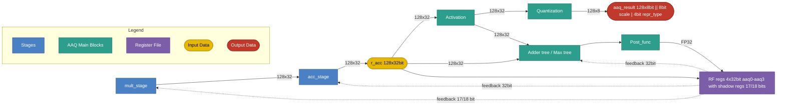
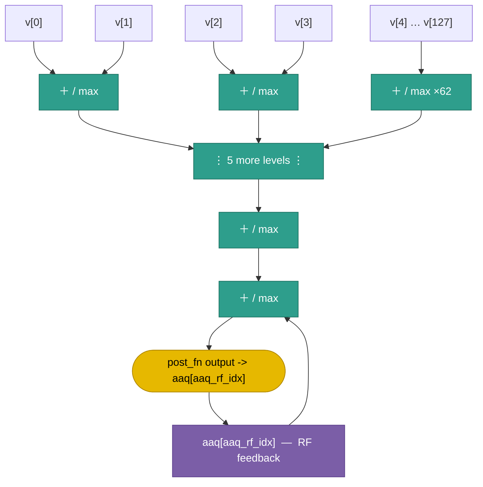

# AAQ Stage

## 1. Purpose

The AAQ (Activation Aggregation and Quantization) stage collapses the 128-lane accumulator
into scalar activation values and/or quantizes the accumulator into an FP8
vector for output. It produces:

- Scalar results in `aaq0`–`aaq3` via `agg` and `agg.first`.
- A 128-byte `aaq_result` vector via `aaq` (any 8-bit format: INT8 or FP8 e(x)m(7-x)).

## 2. Block Diagram



## 3. Interfaces

### 3.0 Black Box Diagram

```
                         ┌──────────────────────────────────────┐
              clk  ─────>│                                      │
              rst  ─────>│                                      ├────> aaq_result        [1035:0]
            valid  ─────>│                                      │
               op  ─────>│                                      ├────> aaq_rf_to_acc[0..3] [31:0]
            r_acc  ─────>│             AAQ Stage                │
         agg_mode  ─────>│                                      ├────> aaq_rf_to_mult[0..3][17:0]
          post_fn  ─────>│                                      │
           cr_idx  ─────>│                                      │
       act_cr_idx  ─────>│                                      │
       aaq_rf_idx  ─────>│                                      │
       cr15_dtype  ─────>│                                      │
   valid_elements  ─────>│                                      │
                         └──────────────────────────────────────┘
```

### 3.1 Inputs

| Name | Type and Direction | Description |
|------|--------------------|-------------|
| `clk` | `input logic` | Clock signal. |
| `rst` | `input logic` | Synchronous reset. |
| `valid` | `input logic` | Stage enable. When deasserted(valid = 0), the stage executes `aaq_nop` regardless of `op`. |
| `op` | `input logic [2:0]` | Selects the AAQ operation: `agg`=1, `agg.first`=2, `aaq`=3. Sampled only when `valid`=1. |
| `r_acc` | `input logic [127:0][31:0]` | 128-lane accumulator (128 × 32-bit). |
| `agg_mode` | `input logic [0:0]` | Aggregation select: 0 = sum, 1 = max. |
| `post_fn` | `input logic [1:0]` | Post-function select (see §8). |
| `cr_idx` | `input logic [3:0]` | CR register index used by `value_cr` post function. |
| `act_cr_idx` | `input logic [3:0]` | CR register index whose value selects the activation function (see §7.0). |
| `aaq_rf_idx` | `input logic [1:0]` | AAQ register index (0–3). |
| `cr15_dtype` | `input logic [2:0]` | Global data type from `cr15`; governs lane interpretation for all AAQ operations. Must be `DType.INT8` (0) for `aaq`. |
| `valid_elements` | `input logic [4:0]` | Number of valid elements. Sourced from either an LR register (lr0–lr15) or a CR register (cr0–cr15); the 5-bit encoding selects among all 32 registers (16 LR + 16 CR). |

### 3.2 Outputs

| Name | Type and Direction | Description |
|------|--------------------|-------------|
| `aaq_result` | `output logic [1035:0]` | Quantized output: 128 × 8-bit lanes (1024 bits) plus 12 bits of metadata: bits [1035:1028] = 8-bit scale factor, bits [1027:1024] = 4-bit representation type (e.g. INT8, e6m1). |
| `aaq_rf_to_acc[0..3]` | `output logic [31:0]` | Full 32-bit view of the AAQ RF registers (`aaq0`–`aaq3`) fed back to the ACC stage. |
| `aaq_rf_to_mult[0..3]` | `output logic [17:0]` | Same AAQ RF registers as `aaq_rf_to_acc`, exposed to the MULT stage with only the lower 17/18 bits; the MULT stage does not require the full 32-bit precision. Exact width TBD. |

## 4. Parameters

| Name | Default | Description |
|------|---------|-------------|
| `LANES` | `128` | Number of accumulator lanes. |
| `ACC_LANE_WIDTH` | `32` | Bits per accumulator lane. |
| `AAQ_REG_COUNT` | `4` | Number of AAQ scalar registers (`aaq0`–`aaq3`). |
| `AAQ_RESULT_BYTES` | `128` | Byte width of `aaq_result` output vector. |
| `AGG_MODE_COUNT` | `2` | Aggregation modes: 0 = sum, 1 = max. |
| `POST_FN_COUNT` | `5` | Post functions: 0 = identity, 1 = value_cr, 2 = inv, 3 = inv_sqrt, 4 = sqrt. |

## 5. Data and Register Model

- `r_acc` is 512 bytes (128 × 32-bit lanes). Lanes are always FP32.
- `aaq0`–`aaq3` are 32-bit registers. They store float32 bit patterns.
- `aaq_result` is produced only by `aaq`. It contains 128 × 8 bit quantized
  values (1024 bits) plus 12 bits of metadata appended by the Quantization
  block: bits [11:4] = 8-bit scale factor, bits [3:0] = 4-bit representation
  type (INT8, e6m1, e5m2, …). It is written to XMEM via `xmem.store_aaq_result`.

## 6. Disclaimers

- The AAQ slot executes once per VLIW cycle.
- Slot execution order within a VLIW word: CTRL → MULT → ACC → **AAQ** → STR.
- `aaq_nop` performs no state changes.

## 7. AAQ Operations

### 7.0 Activation

The Activation block applies an element-wise function to every valid lane of `r_acc` before the result is passed downstream — both to the Adder/Max tree (`agg`, `agg.first`) and to the Quantization block (`aaq`).

The function is selected at runtime by reading the CR register indexed by `act_cr_idx`: `activation_fn = cr[act_cr_idx]`.

```text
// Applied to all valid lanes before aggregation or quantization
activation_fn = cr[act_cr_idx]
activated[i]  = activation_fn(r_acc[i])   for i in 0..valid_elements-1
```

Supported activation functions:

| Encoding | Name | Formula | Notes |
|----------|------|---------|-------|
| 0 | `identity` | `f(x) = x` | Pass-through; no transform. |
| 1 | `relu` | `f(x) = max(0, x)` | Most common non-linearity. |
| 2 | `relu6` | `f(x) = min(max(0, x), 6)` | Clipped ReLU; used in MobileNet. |
| 3 | `leaky_relu` | `f(x) = x if x ≥ 0 else α·x` | α is a small constant (e.g. 0.01). |
| 4 | `sigmoid` | `f(x) = 1 / (1 + e^−x)` | Squashes to (0, 1). |
| 5 | `tanh` | `f(x) = (e^x − e^−x) / (e^x + e^−x)` | Squashes to (−1, 1). |
| 6 | `gelu` | `f(x) = x · Φ(x)` | Φ = standard normal CDF; used in BERT/GPT. |
| 7 | `silu` / `swish` | `f(x) = x · sigmoid(x)` | Used in EfficientNet, LLaMA. |
| 8 | `softplus` | `f(x) = ln(1 + e^x)` | Smooth approximation of ReLU. |
| 9 | `elu` | `f(x) = x if x ≥ 0 else α·(e^x − 1)` | Smooth negative region; reduces vanishing gradient. |
| 10 | `prelu` | `f(x) = x if x ≥ 0 else α·x` | Like Leaky ReLU but α is a learned per-channel parameter. |
| 11 | `exp2` | `f(x) = 2^x` | Used for dequantization, softmax and attention scaling. |

### 7.1 Aggregate (`agg`)

**Assembly syntax:** `agg <agg_mode> <post_fn> <valid_elements> <cr_idx> <aaq_rf_idx>`

- `valid_elements`: any `lr0`–`lr15` or `cr0`–`cr15` operand (5-bit `LcrIdx` encoding). The **value** read from that register at cycle start is the number of `r_acc` lanes fed into the adder/max tree (unsigned, clamped to 0–128). Lanes from index `valid_elements` through 127 are masked out.

```text
// r_acc lanes are always FP32; only the first valid_elements lanes are used
values = [activation(r_acc[i]) for i in 0..valid_elements-1]

// Adder tree / max tree (feedback from RF included in max mode)
if agg_mode == sum:
    raw = sum(values)                          // FP32 scalar; input to post_fn
else:  // max
    raw = max(values + [aaq[aaq_rf_idx]])      // FP32 scalar; input to post_fn; includes RF feedback

out = post_fn(raw, cr[cr_idx])
aaq[aaq_rf_idx] = pack32(out)                  // stored as float32
```

Notes:
- Only lanes `0..valid_elements-1` are fed into the adder/max tree; lanes beyond that index are ignored.
- The activation function applied is the one selected for the current operation (see §7.0).
- In `max` mode the current value of the target AAQ register is fed back from RF into
  the adder/max tree. Use `agg.first` to avoid contamination from an uninitialised register.

#### Adder / Max Tree — Conceptual Structure



#### Post-Function Details

`post_fn` is applied to the aggregated FP32 scalar `raw` before writing to the AAQ register. All post functions take a single FP32 input and produce a float32 result.

| Encoding | Name | Formula | Corner case |
|----------|------|---------|-----------|
| 0 | `identity` | `x` | — |
| 1 | `value_cr` | `x * cr[cr_idx]` | — |
| 2 | `inv` | `1 / x` | 0 if x == 0 |
| 3 | `inv_sqrt` | `1 / sqrt(x)` | 0 if x ≤ 0 |
| 4 | `sqrt` | `sqrt(x)` | 0 if x < 0 |

#### 7.1.1 Aggregate First (`agg.first`)

**Assembly syntax:** `agg.first <agg_mode> <post_fn> <valid_elements> <cr_idx> <aaq_rf_idx>`

Same `valid_elements` masking rules as `agg`.

Identical to `agg` except that `max` mode ignores the RF feedback value:

```text
// r_acc lanes are always FP32; only the first valid_elements lanes are used
values = [activation(r_acc[i]) for i in 0..valid_elements-1]

if agg_mode == sum:
    raw = sum(values)       // FP32 scalar; input to post_fn
else:  // max
    raw = max(values)       // FP32 scalar; input to post_fn; RF feedback NOT included

out = post_fn(raw, cr[cr_idx])
aaq[aaq_rf_idx] = pack32(out)                  // stored as float32
```

Use `agg.first` at the start of a new accumulation sequence to avoid
reading stale data from the target register.


### 7.2 Quantize (`TBD`) Work in progress

Requires INT8 mode (`cr15 == DType.INT8`). Takes no operands. Reads `r_acc`
lanes as FP32, quantizes to INT8, clamps, and writes the 128-byte result to
`aaq_result`.

```text
// cr15 must be DType.INT8; r_acc lanes are FP32
for i in 0..127:
    val            = r_acc[i]        // FP32
    aaq_result[i]  = clamp(round(val), -128, 127)
```

Notes:
- The Quantization block appends 12 bits of metadata to the 1024-bit data
  payload to form the full 1036-bit `aaq_result`: bits [11:4] = 8-bit scale
  factor, bits [3:0] = 4-bit representation type (INT8, e6m1, e5m2, …).
- `aaq_result` must be flushed to XMEM with `XMEM.STORE_AAQ_RESULT offset base`
  before the next `AAQ` overwrites it.
- In wide-vector debug mode `AAQ` is a no-op unless
  `wide_vector_quantize_output` is explicitly set (debug feature only).

**ISA Interactions** — instructions in other slots that consume `aaq_result` written by `AAQ`:

| Instruction | Slot | Operation |
|-------------|------|-----------|
| `XMEM.STORE_AAQ_RESULT offset base` | XMEM | Writes the 128-byte `aaq_result` register to XMEM at address `offset + base`. Must be issued before the next `AAQ` to avoid overwrite. |

## 8. ISA 

Need to add after Eyal add all changes
