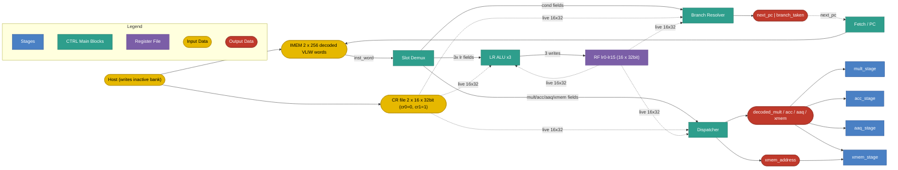

# Control Stage

## 1. Purpose

The Control (CTRL) stage is the front-end of the IPU pipeline. It owns the program
counter and the double-buffered instruction memory, resolves branches, executes
loop-register scalar arithmetic on three independent LR lanes, and dispatches
the decoded VLIW word to the downstream stages (MULT, ACC, AAQ, XMEM). It produces:

- The next `pc` and a `branch_taken` flag for fetch.
- Up to three loop-register writes (`lr0`–`lr15`) per cycle.
- Per-stage operand buses for MULT, ACC, AAQ, and XMEM, plus an `xmem_address`
  bus computed from CR/LR for the load/store path.

## 2. Block Diagram



## 3. Interfaces

### 3.0 Black Box Diagram

```
                         ┌──────────────────────────────────────┐
              clk  ─────>│                                      │
              rst  ─────>│                                      ├────> next_pc            [PC_W-1:0]
            valid  ─────>│                                      │
               pc  ─────>│                                      ├────> branch_taken       [0:0]
        inst_word  ─────>│                                      │
   cr_bank_active  ─────>│            CTRL Stage                ├────> lr_writes[0..2]    [{idx,32}]
          cr_file  ─────>│                                      │
          lr_file  ─────>│                                      ├────> decoded_mult_word  [MULT_W-1:0]
                         │                                      ├────> decoded_acc_word   [ACC_W-1:0]
                         │                                      ├────> decoded_aaq_word   [AAQ_W-1:0]
                         │                                      ├────> decoded_xmem_word  [XMEM_W-1:0]
                         │                                      ├────> xmem_address       [31:0]
                         └──────────────────────────────────────┘
```

### 3.1 Inputs

| Name | Type and Direction | Description |
|------|--------------------|-------------|
| `clk` | `input logic` | Clock signal. |
| `rst` | `input logic` | Synchronous reset. Initialises `pc` to 0 and clears `lr0`–`lr15`. |
| `valid` | `input logic` | Stage enable. When deasserted (`valid` = 0), the stage holds `pc`, performs no LR writes, and emits NOPs on all dispatch buses. |
| `pc` | `input logic [PC_W-1:0]` | Current program counter; indexes the active IMEM bank. Default `PC_W = 8` for 256-entry IMEM. |
| `inst_word` | `input logic [IW-1:0]` | Already-decoded VLIW word read from IMEM at address `pc`. Slot fields are explicit (no further bit-level decode is performed here). |
| `cr_bank_active` | `input logic [0:0]` | Selects which double-buffered CR bank is read this cycle. Driven externally by the host. |
| `cr_file` | `input logic [15:0][31:0]` | Live read of the 16 CR registers from the active bank. Values of `cr0` and `cr1` are guaranteed to be `0` and `1` respectively. |
| `lr_file` | `input logic [15:0][31:0]` | Live read of the 16 loop registers (`lr0`–`lr15`). Branch and LR-ALU operands are sampled from this view per the slot's `read` flag (`snapshot` for branches and ADD/SUB/INCR_MOD_POW2 sources, `live` only where the spec marks it). |

### 3.2 Outputs

| Name | Type and Direction | Description |
|------|--------------------|-------------|
| `next_pc` | `output logic [PC_W-1:0]` | Address fed back to fetch for the next cycle. Either `pc + 1` or the resolved branch target. |
| `branch_taken` | `output logic [0:0]` | Asserted when the cond slot evaluates to a taken branch (including unconditional `B`/`BR`). |
| `lr_writes[0..2]` | `output logic [2:0][{4,32}]` | Three LR write ports: 4-bit destination index + 32-bit value. A NOP lane drives an inactive write. |
| `decoded_mult_word` | `output logic [MULT_W-1:0]` | MULT-slot operand bus dispatched to the MULT stage. |
| `decoded_acc_word` | `output logic [ACC_W-1:0]` | ACC-slot operand bus dispatched to the ACC stage. |
| `decoded_aaq_word` | `output logic [AAQ_W-1:0]` | AAQ-slot operand bus dispatched to the AAQ stage. |
| `decoded_xmem_word` | `output logic [XMEM_W-1:0]` | XMEM-slot operand bus dispatched to the XMEM stage. |
| `xmem_address` | `output logic [31:0]` | Pre-computed `base + offset` for XMEM loads/stores, sourced from the appropriate CR base and LR offset of the XMEM slot. |

## 4. Parameters

| Name | Default | Description |
|------|---------|-------------|
| `IMEM_DEPTH` | `256` | Decoded-VLIW-word entries per IMEM bank. |
| `IMEM_BANKS` | `2` | Double-buffered: host writes the inactive bank; swap is host-triggered. |
| `CR_BANKS` | `2` | Double-buffered CR file. |
| `LR_LANES` | `3` | Independent LR sub-slots per VLIW word. |
| `LR_REG_COUNT` | `16` | `lr0`–`lr15`. |
| `CR_REG_COUNT` | `16` | `cr0`–`cr15` per bank. |
| `BRANCH_COND_COUNT` | `7` | `BEQ`, `BNE`, `BLT`, `BNZ`, `BZ`, `B`, `BR`. |
| `LR_OP_COUNT` | `4` | `SET`, `ADD`, `SUB`, `INCR_MOD_POW2`. |
| `SET_IMM_BITS` | `5` | Combined `src5` operand: bit 4 selects mode; bits [3:0] are a CR index *or* a signed 4-bit immediate. |

## 5. Data and Register Model

- `lr0`–`lr15` are 32-bit loop registers, written by the LR lanes and read live by every stage.
- `cr0`–`cr15` are 32-bit configuration registers, read-only to the program. The host populates the inactive bank and triggers a swap externally; there is no ISA instruction for the swap.
- **`cr0` is hard-wired to `0` (zero register)** and **`cr1` is hard-wired to `1` (one register)**. These two values are guaranteed by hardware and are the canonical operands for clearing or incrementing an LR via `ADD`/`SUB`.
- `cr15` is reserved for the global `dtype` selector and must not be used for application data.
- IMEM stores **already-decoded** VLIW words: each entry has slot fields laid out explicitly (no opcode-level decode happens inside CTRL — only slot demuxing).

## 6. Disclaimers

- The CTRL slot executes once per VLIW cycle.
- Slot execution order within a VLIW word: **CTRL** → MULT → ACC → AAQ → STR.
- Branch decisions update `pc` for the *next* cycle; the current cycle's downstream stages still run with the dispatched operand buses regardless of `branch_taken`.
- LR writes from the three lanes commit at end of cycle and are visible to next-cycle reads. Intra-cycle ordering across the three LR lanes is unspecified: programs **must not** target the same `lr` from two lanes in the same VLIW word.
- Double-buffer swap (CR + IMEM) is host-controlled and out-of-band; there is no ISA instruction for it.

## 7. Control Operations

### 7.1 Loop-Register Arithmetic (LR slot, replicated ×3)

The LR slot appears three times in every VLIW word. Each lane is an independent
sub-instruction sharing the same opcode set; the spec below describes one lane.
Lanes execute in parallel — see §6 for the same-destination restriction.

#### 7.1.1 Set (`SET`)

**Assembly syntax:** `SET dest src5`

- `dest`: destination loop register, `lr0`–`lr15` (4-bit `LrIdx`).
- `src5`: 5-bit combined operand. Bit 4 (MSB) selects mode; bits [3:0] carry the payload.

```text
// src5[4] = mode select; src5[3:0] = payload
if src5[4] == 0:
    value = cr[src5[3:0]]                    // 32-bit CR read; cr0 = 0, cr1 = 1
else:  // src5[4] == 1
    value = sign_extend_4_to_32(src5[3:0])   // signed 4-bit immediate, range −8..+7

dest = value
```

Notes:

- Large constants are *not* loaded inline by `SET`. The host populates `cr2`–`cr14` in the inactive bank and the program reads them via `SET dest crN`.
- Two canonical idioms: `SET lr0 cr0;;` clears `lr0` (because `cr0 = 0`); `SET lr0 cr1;;` sets `lr0` to 1.

#### 7.1.2 Add (`ADD`)

**Assembly syntax:** `ADD dest src_a src_b`

- `dest`: destination, `lr0`–`lr15`.
- `src_a`: first source, `lr0`–`lr15` (snapshot read).
- `src_b`: second source — `lr0`–`lr15`, `cr0`–`cr15`, or a 5-bit unsigned immediate `0`–`31` (snapshot read for register sources).

```text
dest = src_a + src_b                         // 32-bit two's complement add
```

Examples: `ADD lr0 lr1 lr2;;`, `ADD lr3 lr1 cr5;;`, `ADD lr4 lr1 7;;`.

#### 7.1.3 Subtract (`SUB`)

**Assembly syntax:** `SUB dest src_a src_b`

Operand shape identical to `ADD`.

```text
dest = src_a - src_b                         // 32-bit two's complement subtract
```

Examples: `SUB lr0 lr1 lr2;;`, `SUB lr3 lr1 cr5;;`, `SUB lr4 lr1 7;;`.

#### 7.1.4 Increment Modulo Power of Two (`INCR_MOD_POW2`)

**Assembly syntax:** `INCR_MOD_POW2 dst step k`

- `dst`: destination loop register, `lr0`–`lr15` (read and written).
- `step`: signed 32-bit increment from `lr0`–`lr15` or `cr0`–`cr15` (snapshot read; `LcrIdx`).
- `k`: 4-bit immediate; semantic range `[1, 9]`, encoded as `k − 1`.

```text
dst = (dst + step) & ((1 << k) - 1)          // mask to k low bits (mod 2^k)
```

Example: `INCR_MOD_POW2 lr2 lr3 4;;` (advance `lr2` by `lr3` and wrap modulo 16).

### 7.2 Conditional Control (COND slot)

A single cond slot appears per VLIW word. Branch operands are read from the
LR/CR snapshot (so an LR write in this cycle does not affect this cycle's branch).

| Mnemonic | Assembly Syntax | Condition | PC update on taken |
|----------|-----------------|-----------|--------------------|
| `BEQ` | `BEQ reg1 reg2 label` | `reg1 == reg2` | `pc ← label` |
| `BNE` | `BNE reg1 reg2 label` | `reg1 != reg2` | `pc ← label` |
| `BLT` | `BLT reg1 reg2 label` | `reg1 < reg2` (signed) | `pc ← label` |
| `BNZ` | `BNZ test_reg base_reg label` | `test_reg != base_reg` | `pc ← label` |
| `BZ` | `BZ test_reg base_reg label` | `test_reg == base_reg` | `pc ← label` |
| `B` | `B label` | always (unconditional) | `pc ← label` |
| `BR` | `BR reg` | always (unconditional) | `pc ← reg` |

`reg`, `reg1`, `reg2`, `test_reg`, `base_reg` are `LcrIdx` operands — any of `lr0`–`lr15` or `cr0`–`cr15`. `label` is a relative offset resolved by the assembler.

Shared evaluation pseudo-code:

```text
// All operands snapshot-read from {lr | cr}
a = read_lcr(reg1_idx)
b = read_lcr(reg2_idx)        // BNZ/BZ rename to test_reg/base_reg; same wiring
taken = evaluate(op, a, b)    // see condition column above; B/BR are unconditional

if op == BR:
    next_pc = read_lcr(reg_idx)
elif taken:
    next_pc = label
else:
    next_pc = pc + 1

branch_taken = taken
```

Notes:

- `BNZ` and `BZ` are convenience forms — semantically identical to `BNE` / `BEQ` with the same operand types — and remain in the ISA for clarity at call sites that test against a configured base register (often `cr0`).
- `BR` (branch register) takes its target from the low bits of an `LcrIdx` register and is the only branch whose target is not encoded in the instruction word.

## 8. ISA — Instructions Supported by This Stage

The CTRL stage executes the following mnemonics. Detailed binary encoding is
maintained in [`SLOT_BINARY_LAYOUT`](../../../src/tools/ipu-common/src/ipu_common/instruction_spec.py) and is not duplicated here.

**LR slot (replicated ×3 per VLIW word):**

- `SET`
- `ADD`
- `SUB`
- `INCR_MOD_POW2`

**COND slot (one per VLIW word):**

- `BEQ`
- `BNE`
- `BLT`
- `BNZ`
- `BZ`
- `B`
- `BR`
