# Control Stage

## 1. Purpose

The Control (CTRL) stage is the first stage of the IPU pipeline. It owns the
program counter, the double-buffered instruction memory (with a small
instruction cache in front), and the two 16×20-bit register files (CR
and LR) — both are **internal** to CTRL and not exposed on the stage
boundary. It resolves branches, executes local-register scalar arithmetic on
three independent LR lanes, and dispatches four per-stage buses
(`mult_vliw_bus`, `acc_vliw_bus`, `aaq_vliw_bus`, `str_vliw_bus`) into
the execute chain **MULT → ACC → AAQ → STORE**. All four buses are
driven into MULT; each stage consumes its own bus and forwards the
remaining buses to the next stage in the chain.

**XMEM** is **not a pipeline stage**, and it is **read-only**. CTRL
computes the XMEM read address from CR + LR and drives it on a dedicated
output port (`xmem_read_addr`, gated by `xmem_read_en`); XMEM has no
opcode field of its own (every access is a memory load). XMEM performs
the read and writes the returned data directly into the MULT stage's
input registers (e.g. `R0`/`R1`/`R_CYCLIC`/`R_MASK`).

The CTRL stage produces:

- The selection of **which instruction runs next** (handled internally — CTRL fetches both `PC + 1` and the branch target `label` in parallel from the dual-port `inst mem`, then the cond-evaluator's `taken` result picks which one is latched into `inst $` for the next clock; see §6).
- Up to three local-register writes (`LR0`–`LR15`) per cycle into the **internal** LR file.
- Four per-stage dispatch buses driven on the CTRL output:
  - `mult_vliw_bus`, `acc_vliw_bus`, `aaq_vliw_bus`, `str_vliw_bus` — each carries the corresponding stage's slot fields together with the CR/LR operand value(s) CTRL has already resolved for that stage. All four are driven from CTRL into MULT; MULT consumes `mult_vliw_bus` and forwards the remaining three to ACC; ACC consumes `acc_vliw_bus` and forwards the remaining two to AAQ; AAQ consumes `aaq_vliw_bus` and forwards `str_vliw_bus` to STORE. Downstream stages never read the register files and CR/LR are **not visible** to them. CTRL evaluates its three LR-ALU lanes first, so the forwarded values are this cycle's **post-LR-write** values, **not** the prior-cycle snapshot. The snapshot governs only CTRL's own reads — see §5.
- The **XMEM read address** — CTRL resolves the XMEM slot into a single read address (CR base + LR offset) and drives it on `xmem_read_addr` (gated by `xmem_read_en`). XMEM is **read-only**: it has no opcode field, every access is a memory load, and the returned data is written directly into the MULT stage's input registers.

The IPU is configured by an external **RISC-V host** over an **APB**
slave port on CTRL. The host writes the instruction memory (inactive
bank) and the CR register file (inactive bank) through APB transactions,
and triggers bank swaps via the same interface. The CR file, LR file,
instruction memory, and instruction cache are all CTRL-internal — none
of them is exposed as a port on the stage boundary.

## 2. Block Diagram

```mermaid
%%{init: {'flowchart': {'defaultRenderer': 'elk'}}}%%
flowchart LR
    HOST(["RISC-V Host"]):::yellow

    subgraph CTRL_STAGE["CTRL Stage (boundary)"]
        APB_SLAVE["APB slave (CR + IMEM config, bank-swap regs)"]:::teal
        IMEM["inst mem (2 banks)"]:::teal
        ICACHE["inst $ - holds current cycle inst"]:::teal
        CTRL["controller logic inst parser + Branch Resolver + LR ALU x3 Lanes (internal PC)"]:::teal
        CRRF["CR file 2 x 16 x 20bit (CR0=0, CR1=1)"]:::purple
        LRRF["LR file 16 x 20bit"]:::purple
    end

    mult_stage:::blue
    acc_stage:::blue
    aaq_stage:::blue
    store_stage:::blue
    XMEM["XMEM (read-only)"]:::yellow

    HOST -->|APB| APB_SLAVE
    APB_SLAVE -->|inactive-bank write + swap reg| IMEM
    APB_SLAVE -->|inactive-bank write + swap reg| CRRF

    ICACHE -->|current cycle inst| CTRL
    CTRL -->|read addr A = PC+1| IMEM
    CTRL -->|read addr B = label, on branch| IMEM
    IMEM -->|imem_a, imem_b 2R| ICACHE
    CTRL -->|icache_mux_sel = taken| ICACHE

    CRRF -.->|snapshot| CTRL
    LRRF -.->|snapshot| CTRL
    CTRL -->|3 LR writes| LRRF

    CTRL -->|mult_vliw_bus, acc_vliw_bus, aaq_vliw_bus, str_vliw_bus| mult_stage
    CTRL -->|xmem_read_addr, xmem_read_en| XMEM
    XMEM -->|fetched data| mult_stage
    mult_stage -->|acc_vliw_bus, aaq_vliw_bus, str_vliw_bus| acc_stage
    acc_stage -->|aaq_vliw_bus, str_vliw_bus| aaq_stage
    aaq_stage -->|str_vliw_bus| store_stage

    subgraph LEGEND["Legend"]
        L_blue["Downstream Stages"]:::blue
        L_teal["CTRL Internal Blocks"]:::teal
        L_purple["CTRL Internal Register Files"]:::purple
        L_yellow(["External"]):::yellow
    end

    classDef blue fill:#4a80c4,stroke:#2a5090,color:#fff
    classDef teal fill:#2e9e8c,stroke:#1a7060,color:#fff
    classDef purple fill:#7b5ea7,stroke:#5a3d8a,color:#fff
    classDef yellow fill:#e6b800,stroke:#b38a00,color:#000

```



## 3. Interfaces

The CTRL stage owns the entire fetch path (`inst mem`, `inst $`, PC,
the IMEM read-address lines, the IMEM read-data lines, and the
2:1 mux that picks the next-cycle `inst $`) **and** both register files
(CR and LR) as **internal** state. None of those — including the
current-cycle `inst $` read, the CR/LR snapshot reads, and the three
LR-write lanes — crosses the stage boundary. Externally, CTRL exposes
only the dispatch buses to the execute chain, the XMEM read-address
port, and an **APB slave** through which the RISC-V host configures
the inactive IMEM bank and the inactive CR bank and triggers bank
swaps.

### 3.0 Black Box Diagram

```
                         ┌──────────────────────────────────────┐
              clk  ─────>│                                      │
              rst  ─────>│                                      ├────> mult_vliw_bus        [MULT_BUS_W-1:0]
                         │                                      ├────> acc_vliw_bus         [ACC_BUS_W-1:0]
         apb_psel  ─────>│                                      ├────> aaq_vliw_bus         [AAQ_BUS_W-1:0]
       apb_penable ─────>│                                      ├────> str_vliw_bus         [STR_BUS_W-1:0]
        apb_pwrite ─────>│              CTRL Stage              │
         apb_paddr ─────>│                                      ├────> xmem_read_addr       [XMEM_ADDR_W-1:0]
        apb_pwdata ─────>│                                      ├────> xmem_read_en
                         │                                      │
                         │                                      ├────> apb_prdata           [APB_DATA_W-1:0]
                         │                                      ├────> apb_pready
                         │                                      ├────> apb_pslverr
                         └──────────────────────────────────────┘
```

Note: every fetch-path signal — `PC`, `next_pc`, `branch_taken`,
`imem_read_addr_a`, `imem_read_addr_b`, `imem_a`, `imem_b`,
`icache_mux_sel`, and `inst$_vliw` — and every register-file signal —
the CR/LR snapshot reads and the three LR-write lanes (`lr_write_en`,
`lr_write_idx`, `lr_write_data`) — is **internal** to the CTRL stage
and does not cross its boundary. The whole loop
`inst mem` ↔ PC ↔ `inst $` ↔ controller logic ↔ CRRF ↔ LRRF stays
inside the stage; the boundary carries only the dispatch buses, the
XMEM read-address port, and the APB slave.

### 3.1 Inputs

| Name | Type and Direction | Description |
|------|--------------------|-------------|
| `clk` | `input logic` | Clock signal. |
| `rst` | `input logic` | Synchronous reset. Initialises the internal `PC` to 0, clears any pending LR writes, and resets the APB slave state machine. |
| `apb_psel` | `input logic` | APB select. Asserted by the RISC-V host master to address the CTRL slave. |
| `apb_penable` | `input logic` | APB enable, asserted in the ACCESS phase of every APB transfer. |
| `apb_pwrite` | `input logic` | APB direction: `1` = write, `0` = read. Used for configuration writes into the inactive IMEM/CR banks and the bank-swap registers, and for register read-back. |
| `apb_paddr` | `input logic [APB_ADDR_W-1:0]` | APB byte address. Decoded inside CTRL into the IMEM-config region, the CR-config region, the bank-swap registers, and any status registers. |
| `apb_pwdata` | `input logic [APB_DATA_W-1:0]` | APB write data. |

### 3.2 Outputs

| Name | Type and Direction | Description |
|------|--------------------|-------------|
| `mult_vliw_bus` | `output logic [MULT_BUS_W-1:0]` | The MULT-slot portion of the current cycle's VLIW word, packaged with the CR/LR operand value(s) CTRL has already resolved for MULT. Driven into the MULT stage; MULT consumes this bus and does **not** forward it further. The values CTRL resolves and packs onto this bus are this cycle's **post-LR-write** values — CTRL evaluates its three LR-ALU lanes first; see §5 and §7. |
| `acc_vliw_bus` | `output logic [ACC_BUS_W-1:0]` | The ACC-slot portion of the current cycle's VLIW word plus its resolved CR/LR operand value(s). Driven into MULT in the same cycle as `mult_vliw_bus`; MULT forwards it unchanged to ACC, where it is consumed. |
| `aaq_vliw_bus` | `output logic [AAQ_BUS_W-1:0]` | The AAQ-slot portion of the current cycle's VLIW word plus its resolved CR/LR operand value(s). Driven into MULT in the same cycle as `mult_vliw_bus`; MULT and ACC forward it unchanged down the chain, and AAQ consumes it. |
| `str_vliw_bus` | `output logic [STR_BUS_W-1:0]` | The STORE-slot portion of the current cycle's VLIW word plus its resolved CR/LR operand value(s). Driven into MULT in the same cycle as `mult_vliw_bus`; forwarded unchanged through MULT, ACC, and AAQ, and consumed by STORE. |
| `xmem_read_addr` | `output logic [XMEM_ADDR_W-1:0]` | The resolved XMEM read address for this cycle, computed by CTRL as `CR[xmem.base_idx] + LR[xmem.offset_idx]` from this cycle's **post-LR-write** LR value. XMEM is **read-only** and has no opcode field — every access is a memory load; the returned data is written directly into the MULT stage's input registers (see §7.1). |
| `xmem_read_en` | `output logic` | Valid strobe for `xmem_read_addr`. Asserted exactly on cycles where the XMEM slot is non-NOP; deasserted on NOP cycles and during any bubble (see §9.2). |
| `apb_prdata` | `output logic [APB_DATA_W-1:0]` | APB read data. Returns the contents of CTRL-mapped APB registers (e.g. bank-swap state, status, register read-back). |
| `apb_pready` | `output logic` | APB ready handshake. Held low to insert wait states; pulled high to complete the ACCESS phase. |
| `apb_pslverr` | `output logic` | APB transfer error indication (e.g. address outside the mapped region, write to a read-only register). |

## 4. Parameters

| Name | Default | Description |
|------|---------|-------------|
| `REG_WIDTH` | `20` | Bit width of every CR and LR register. |
| `IMEM_BANKS` | `2` | Double-buffered: RISC-V host writes the inactive bank; swap is host-triggered. |
| `IMEM_DEPTH` | `256` | **Total** decoded-VLIW-word entries across both IMEM banks. With `IMEM_BANKS = 2`, each bank holds `IMEM_DEPTH / IMEM_BANKS = 128` entries. |
| `IMEM_BANK_DEPTH` | `128` | Entries per bank (= `IMEM_DEPTH / IMEM_BANKS`); also the address range PC must cover at runtime. |
| `IMEM_BANK_READ_PORTS` | `2` | Read ports per bank. Two reads in parallel are required on branch cycles to fetch `PC + 1` and `label` simultaneously (see §6.1, §6.2). Bank is 2R1W. |
| `ICACHE_ENTRIES` | `1` | Single-entry register that holds the **current cycle's instruction** — i.e. the VLIW at the current `PC`. Refilled at the end of every cycle from the IMEM read result selected by `icache_mux_sel`. See §6.2. |
| `CR_BANKS` | `2` | Double-buffered CR file; RISC-V host writes the inactive bank. |
| `LR_LANES` | `3` | Independent LR sub-slots per VLIW word. |
| `LR_REG_COUNT` | `16` | `LR0`–`LR15`. |
| `CR_REG_COUNT` | `16` | `CR0`–`CR15` per bank. |
| `BRANCH_COND_COUNT` | `7` | `BEQ`, `BNE`, `BLT`, `BNZ`, `BZ`, `B`, `BR`. |
| `LR_OP_COUNT` | `4` | `SET`, `ADD`, `SUB`, `INCR_MOD_POW2`. |
| `SET_IMM_BITS` | `5` | Combined `src5` operand: bit 4 selects mode; bits [3:0] are a CR index *or* a signed 4-bit immediate. |
| `XMEM_ADDR_W` | *impl* | Width of `xmem_read_addr`. Sized to address the external XMEM address space (= log2 of XMEM word count). |
| `APB_ADDR_W` | `32` | APB byte-address width on `apb_paddr`. |
| `APB_DATA_W` | `32` | APB data width on `apb_pwdata` / `apb_prdata`. |
| `MULT_BUS_W` | *impl* | Width of `mult_vliw_bus` (MULT slot fields + CTRL-resolved CR/LR operand values for MULT). |
| `ACC_BUS_W`  | *impl* | Width of `acc_vliw_bus` (ACC slot fields + resolved CR/LR operands for ACC). |
| `AAQ_BUS_W`  | *impl* | Width of `aaq_vliw_bus` (AAQ slot fields + resolved CR/LR operands for AAQ). |
| `STR_BUS_W`  | *impl* | Width of `str_vliw_bus` (STORE slot fields + resolved CR/LR operands for STORE). |

## 5. Data and Register Model

- For each instruction in the MULT, ACC, AAQ, and STORE stages, **CTRL** resolves the CR/LR operand value(s) from the register files (by the indices carried in that stage's slot fields) and **forwards** them on the dispatch bus. The downstream stages **never** read the register files and CR/LR are **not visible** to them — the operand value(s) arrive already resolved. CTRL evaluates its three LR-ALU lanes before forwarding, so a downstream stage sees this cycle's **post-LR-write** value (it reflects any LR write this same VLIW performs).
- **XMEM is not a pipeline stage** and is **read-only**. CTRL pre-resolves the XMEM address from CR + LR and forwards only the computed **read address** to XMEM (there is no XMEM opcode; every XMEM access is a memory load). XMEM accesses external memory and **writes the returned data directly into the MULT stage's input registers** (e.g. `R0`/`R1`/`R_CYCLIC`/`R_MASK`). It has no CR/LR read port and does not appear on the MULT → ACC → AAQ → STORE chain. Writes back to external memory are the responsibility of the STORE stage.
- The **prior-cycle snapshot** (read-before-write) applies **only to CTRL's own register reads**: the three LR-ALU lane source operands and the branch/COND operands. These see the values committed at end of cycle N−1 — an LR write generated in cycle N is **not** visible to CTRL's own reads in cycle N (it becomes visible to them only starting cycle N+1). The CR/LR operand values CTRL **forwards** to MULT/ACC/AAQ/STORE/XMEM are **not** the snapshot: CTRL evaluates its LR-ALU lanes first, then forwards the resulting **post-write** values for this cycle. So a downstream stage sees this cycle's LR writes, while CTRL's own LR-ALU/branch reads do not.
- `LR0`–`LR15` are **20-bit** local registers. They are written **only** by the LR-slot ops (`SET`, `ADD`, `SUB`, `INCR_MOD_POW2`). The RISC-V host cannot write LR.
- `CR0`–`CR15` are **20-bit** configuration registers, read-only to the program. The RISC-V host populates the inactive bank and triggers a swap externally; there is no ISA instruction for the swap.
- **`CR0` is hard-wired to `0` (zero register)** and **`CR1` is hard-wired to `1` (one register)**. These two values are guaranteed by hardware and are the canonical operands for clearing or incrementing an LR via `ADD`/`SUB`.
- `CR15` is reserved for the global `dtype` selector and must not be used for application data.
- IMEM stores **already-decoded** VLIW words: each entry has slot fields laid out explicitly (no opcode-level decode happens inside CTRL — only slot demuxing).
- The instruction cache (`inst $`) **is** the pipeline register that holds the **current cycle's instruction** (the VLIW at the current `PC`). It was filled at the *end of the previous cycle* with the next instruction CTRL resolved to be correct, so at every clock edge `inst $` contains exactly the instruction CTRL needs to execute.
- **No taken-branch bubble.** When the current cycle's instruction is a branch, CTRL issues **two speculative IMEM reads in parallel** during this same cycle — one for the fall-through `PC + 1` and one for the branch target `label`. Both responses are available by the end of the cycle. The cond evaluator's `taken` result then selects which of the two becomes the next-cycle `inst $`. The correct instruction is therefore always present at the start of the next clock — no NOP cycle is ever inserted because of a branch.
- The controller logic feeds off `inst $` directly: it demuxes the slot fields, drives the cond evaluator, the three LR ALU lanes, and the dispatch bus, all from the value latched into `inst $` at the end of the previous cycle.

## 6. Instruction Memory and Cache

The CTRL stage owns the entire fetch path: the bulk instruction memory
(`inst mem`), the single-entry instruction register (`inst $`) that holds
the current cycle's VLIW, and the internal program counter (`PC`).

### 6.1 Instruction Memory (`inst mem`)

- **Depth:** `IMEM_DEPTH = 256` decoded-VLIW-word entries **total** across the two banks — `IMEM_BANK_DEPTH = 128` entries per bank (`IMEM_DEPTH / IMEM_BANKS`).
- **Banks:** `IMEM_BANKS = 2` — double-buffered. At any time one bank is the *active* bank (fetched by the IPU) and the other is the *inactive* bank (writable by the RISC-V host).
- **Contents:** every entry is an **already-decoded** VLIW word. Slot fields (cond, three LR sub-slots, MULT, ACC, AAQ, STORE, XMEM) are laid out explicitly in the entry — CTRL only demultiplexes them, it does not perform any opcode-level decode.
- **Host write path:** the RISC-V host writes into the **inactive** bank only over the host bus. There is no ISA instruction to write `inst mem`; bank swaps are signalled externally via `imem_bank_sel`.
- **Read path — dual port:** CTRL issues **two reads in parallel** on every branch cycle (one at `PC + 1`, one at the branch target `label` — see §6.2). The active IMEM bank must therefore expose **two independent read ports** that can serve any pair of addresses in the same clock cycle. On non-branch cycles only one read port is used.
- **Per-bank port requirement:** each bank is sized as a **2R1W** SRAM macro — two read ports (consumed only when the bank is *active*) and one write port (consumed only when the bank is *inactive*, by the RISC-V host). Because active and inactive never coincide, reads and host writes never contend on the same bank.

> **Hardware sizing note:** the cheapest practical implementation is two single-bank 2R1W SRAMs (one per IMEM bank). Each bank stores 128 VLIW words. Dual-read on branch cycles is what eliminates the taken-branch bubble — without it, taken branches would cost one stall cycle each.

### 6.2 Instruction Cache (`inst $`)

- **Capacity:** `ICACHE_ENTRIES = 1` — a single VLIW-word register.
- **Role:** it **is** the instruction register the controller logic executes from. At every clock edge, `inst $` contains the VLIW word at the current `PC`. The controller logic reads `inst $` to demux slot fields, evaluate the cond slot, drive the LR ALUs, and produce the four per-stage dispatch buses (`mult_vliw_bus`, `acc_vliw_bus`, `aaq_vliw_bus`, `str_vliw_bus`) together with `xmem_read_addr` / `xmem_read_en`.
- **Refill policy:** during cycle N, CTRL is already preparing the *next-cycle* contents of `inst $`:
  - If the current cycle's instruction is **not a branch**, CTRL issues one IMEM read at `PC + 1` and writes the result into `inst $` at end of cycle N.
  - If the current cycle's instruction **is a branch**, CTRL issues **two IMEM reads in parallel** — one at `PC + 1` (fall-through) and one at `label` (branch target). At end of cycle N, the resolved `taken` selects which of the two is latched into `inst $`:
    ```text
    inst $ <= taken ? imem_b : imem_a       // imem_a = inst@PC+1, imem_b = inst$label
    ```
- **No bubble on a taken branch.** Because both candidates have already been fetched in parallel inside cycle N, the correct VLIW is sitting in `inst $` at the start of cycle N+1 regardless of which way the branch went.
- The cache is transparent to the ISA — programs cannot observe how the fetch was steered.

> **Hardware note:** issuing two IMEM reads in the same cycle requires the active IMEM bank to be a **2R1W SRAM** (two independent read ports + one write port for host loads of the *inactive* bank). See §6.1 for the per-bank port spec. At the 128-entries-per-bank scale this is a small, cheap macro.

### 6.3 Program Counter (`PC`)

- **What it holds:** the memory address (within the active IMEM bank) of the **current cycle's instruction** — i.e. the address that was used to fetch the VLIW currently sitting in `inst $`. At the start of every cycle, `PC` and `inst $` are coherent: `inst $ == inst_mem[active_bank][PC]`.
- **Width:** `PC_W = log2(IMEM_BANK_DEPTH) = 7` bits (default 128 entries per bank).
- **Purpose:** drives the **fall-through read address** every cycle — `imem_read_addr_a = PC + 1`. This causes IMEM to return the next sequential instruction so it can be latched into `inst $` for the next cycle.
- **Update rule (combinational, latched at end of cycle):**
  ```text
  target_pc = (cond.op == BR) ? reg_value : label
  next_PC   = taken ? target_pc : (PC + 1)
  PC      <= next_PC                       // every cycle
  ```
  On non-branch cycles `taken = 0` always, so `PC <= PC + 1`. On a branch cycle the cond evaluator's `taken` selects either the branch target `target_pc` (label target for `BEQ`/`BNE`/`BLT`/`BNZ`/`BZ`/`B`, register target for `BR`) or the fall-through `PC + 1`. Either way, by the next clock edge `PC` points at exactly the instruction that has just been latched into `inst $`.
- **Reset:** `rst` initialises `PC` to 0.
- **Not externally visible:** `PC` is internal state of the controller-logic block; no CTRL port carries it. Externally, the *effect* of `PC` is seen on `imem_read_addr_a` (which is always `PC + 1`) and on `imem_read_addr_b` (which is the computed branch target on branch cycles, don't-care otherwise).

### 6.4 Fetch Decision

Per cycle CTRL resolves the *next-cycle* value of `inst $`:

```text
// Cycle N: inst $ already holds the VLIW at the current PC and is being executed.
// CTRL runs in parallel:

is_branch = inst$.cond.op is one of {BEQ, BNE, BLT, BNZ, BZ, B, BR}

if is_branch:
    // Issue BOTH speculative reads in parallel this cycle
    imem_read_a = PC + 1                        // fall-through candidate
    branch_target = (inst$.cond.op == BR) ? reg_target_from_cond_slot : label_from_cond_slot
    imem_read_b = branch_target                 // taken candidate
    // Wait for cond evaluator
    inst $ <= taken ? imem_b : imem_a       // committed at end of cycle N
else:
    // Single sequential read; PC update is just +1
    imem_read_a = PC + 1
    inst $ <= imem_a                          // committed at end of cycle N
```

The instruction at the new PC is **always ready in `inst $` at the start of cycle N+1**, so the controller logic never sees a stall or bubble caused by a branch.

## 7. Dispatch Buses

CTRL drives five outward signals each cycle (in addition to APB):
four per-stage VLIW buses for the execute chain, plus the XMEM
read-address port. The cond and LR sub-slots are **not** carried on
any of these — CTRL has already consumed them internally.

### 7.1 XMEM Read Path (parallel path — not a stage)

The XMEM slot is delivered to **XMEM** (a **read-only** external-memory
access block, *not* a pipeline stage on the execute chain) on a
dedicated CTRL output port. The XMEM slot carries no opcode — every
XMEM access is a memory **load**, and the only piece of information
CTRL hands over is the **resolved read address**:

```text
// Inside CTRL — computed after the three LR ALUs (uses this cycle's post-write LR)
xmem_read_addr <= CR[inst$_vliw.xmem.base_idx]
                + LR[inst$_vliw.xmem.offset_idx]   // post-LR-write value, not the snapshot
xmem_read_en   <= (inst$_vliw.xmem != NOP) && !bubble
```

XMEM then performs the memory read and **writes the fetched
data directly into the MULT stage's input registers** (e.g. `R0`, `R1`,
`R_CYCLIC`, `R_MASK`).

Consequences:

- XMEM **does not** read the CR or LR register files (CR/LR are not
  visible to it). Its only input from CTRL is the resolved read
  address on `xmem_read_addr` (with `xmem_read_en`), which CTRL
  computed from the **post-LR-write** LR offset for this cycle — not
  the prior-cycle snapshot (see §5).
- XMEM has no opcode field; writes back to external memory are the
  responsibility of the STORE stage, not XMEM.
- XMEM does not sit on the four-bus daisy chain — it is a sideband
  fetch into MULT's input registers.
- The MULT stage sees XMEM's writes the same cycle the dispatch chain
  begins; software is responsible for not racing an XMEM load against
  a MULT op that reads the destination in the same cycle.

### 7.2 MULT → ACC → AAQ → STORE Path (four-bus serial chain)

CTRL drives **all four** per-stage buses — `mult_vliw_bus`,
`acc_vliw_bus`, `aaq_vliw_bus`, `str_vliw_bus` — onto MULT in the
same cycle. Each downstream stage consumes the bus addressed to it and
forwards only the still-unconsumed buses to the next stage:

```text
// CTRL output (this cycle's post-LR-write CR/LR values are baked in)
mult_vliw_bus = { mult_slot_fields, resolved_cr_lr_for_mult }
acc_vliw_bus  = { acc_slot_fields,  resolved_cr_lr_for_acc  }
aaq_vliw_bus  = { aaq_slot_fields,  resolved_cr_lr_for_aaq  }
str_vliw_bus  = { store_slot_fields, resolved_cr_lr_for_store }

// MULT: consumes mult_vliw_bus, forwards the other three
mult_to_acc = { acc_vliw_bus, aaq_vliw_bus, str_vliw_bus }

// ACC: consumes acc_vliw_bus, forwards the other two
acc_to_aaq  = { aaq_vliw_bus, str_vliw_bus }

// AAQ: consumes aaq_vliw_bus, forwards the last one
aaq_to_str  = { str_vliw_bus }
```

For each instruction these four stages execute, **CTRL** has already
looked up the CR/LR operand value(s) (by the indices carried in that
stage's slot fields) and packed them onto the corresponding bus; the
stages never read the register files. The packed values are this
cycle's **post-LR-write** values — CTRL evaluates its three LR-ALU
lanes first — **not** the prior-cycle snapshot, which is reserved for
CTRL's own reads. See §5.

## 8. APB Configuration Interface

The CTRL stage exposes a single **APB slave** for all RISC-V host
configuration. The slave's address map covers, at minimum:

- the **inactive IMEM bank** — every decoded-VLIW-word entry is
  writable from the host while that bank is inactive;
- the **inactive CR bank** — `CR0`/`CR1` remain hard-wired to `0`/`1`
  and any host write to those addresses returns `apb_pslverr`;
- the **IMEM bank-swap register** — host write triggers the active/
  inactive swap; the new active bank takes effect on the next CTRL
  fetch cycle;
- the **CR bank-swap register** — analogous swap for the CR file;
- optional read-only status (current active-bank IDs, last-error
  flags, etc.).

The IMEM and CR files remain double-buffered (`IMEM_BANKS = 2`,
`CR_BANKS = 2`): the host writes only the *inactive* bank, so APB
configuration traffic and the IPU's own active-bank reads never
contend. Host APB transactions therefore add **no** wait cycles to
the execute pipeline; `apb_pready` is gated only by the APB slave's
own write-port throughput, not by IPU activity.

The LR file is **not** APB-writable — it is only updated by the LR
ALU lanes (`SET`/`ADD`/`SUB`/`INCR_MOD_POW2`); see §5.

## 9. Hazards

CTRL is responsible for resolving the one architecturally-visible
hazard in the pipeline: a **RAW (read-after-write) hazard** from the
AAQ stage to the MULT or ACC stage.

The AAQ stage writes scalar result registers in the RF. Both MULT and
ACC can consume those same RF registers as source operands. If a MULT
or ACC instruction tries to read an AAQ-written register before the
AAQ write has committed to the RF, the consumer would observe stale
data.

### 9.1 Detection

CTRL tracks the destination RF index of every AAQ write that is still
in flight (within the architectural AAQ-to-RF latency window). Before
dispatching `inst$_vliw`, CTRL compares the source RF indices in the
MULT and ACC slot fields against those in-flight AAQ destinations. A
match indicates a hazard on that slot.

### 9.2 Resolution — Bubble Insertion

When CTRL detects a hazard it stalls the pipeline by inserting one or
more **bubble cycles** until the offending AAQ write is guaranteed to
have committed:

- `inst$_vliw` is **held** — PC does not advance and the dual IMEM
  prefetch is paused, so the same VLIW remains in `inst $` while the
  bubbles are issued.
- All four dispatch buses (`mult_vliw_bus`, `acc_vliw_bus`,
  `aaq_vliw_bus`, `str_vliw_bus`) carry an **all-NOP encoding** for
  their respective slots, so the chain does no useful work for the
  bubble cycle(s).
- `xmem_read_en` is deasserted for the bubble cycle(s), suppressing
  the XMEM read.
- LR writes are also held (no LR-lane commits this cycle).

CTRL resumes normal dispatch on the cycle after the offending AAQ
write has committed; the MULT/ACC consumer then sees the up-to-date
RF value.

The number of bubble cycles required is fixed by the architectural
AAQ-to-RF write latency.

## 10. ISA — Instruction Reference

The CTRL stage executes **11 mnemonics** across two slots: four local-register
ops in the **LR slot** (replicated ×3 lanes per VLIW word) and seven branches
in the **COND slot** (one per VLIW word). Detailed binary encoding is
maintained in `SLOT_BINARY_LAYOUT` in `src/tools/ipu-common/src/ipu_common/instruction_spec.py` and is not duplicated here.

An LR write performed in cycle N is **not** visible to **CTRL's own**
reads in the same cycle — the LR-ALU lane source operands and the
branch/COND operands use the prior-cycle snapshot (see §5). It **is**,
however, reflected in the operand values CTRL forwards to this cycle's
downstream MULT/ACC/AAQ/STORE/XMEM, because CTRL evaluates the LR-ALU
lanes before forwarding.

### 10.1 LR Slot (×3 lanes per VLIW word)

The LR slot appears three times in every VLIW word. Each lane is an
independent sub-instruction sharing the same opcode set, executed in
parallel by the three LR ALU lanes. Programs **must not** target the same
destination LR from two lanes in the same VLIW word (see §10).

#### 10.1.1 `SET` — Set Local Register

- **Summary:** Set a local register to a CR value or a small signed immediate.
- **Syntax:** `SET dest src5`
- **Operands:**
  - `dest` — destination local register, `LR0`–`LR15` (4-bit `LrIdx`).
  - `src5` — 5-bit combined operand. Bit 4 (MSB) selects mode; bits [3:0] carry the payload.
- **Operation:**
  ```text
  if src5[4] == 0:
      value = CR[src5[3:0]]                    // 20-bit CR read; CR0 = 0, CR1 = 1
  else:  // src5[4] == 1
      value = sign_extend_4_to_20(src5[3:0])   // signed 4-bit immediate, range −8..+7
  dest = value
  ```
- **Examples:**
  - `SET LR0 CR5;;` — load `CR5` into `LR0`.
  - `SET LR0 CR0;;` — clear `LR0` (because `CR0 = 0`).
  - `SET LR1 CR1;;` — set `LR1` to 1.
  - `SET LR2 #-3;;` — set `LR2` to −3 (signed 4-bit immediate, MSB = 1).
- **Notes:** Large constants are *not* loaded inline by `SET`. The RISC-V host populates `CR2`–`CR14` in the inactive bank; the program reads them via `SET dest CRN`.

#### 10.1.2 `ADD` — Add

- **Summary:** Add two operands and write the 20-bit truncated result to a local register.
- **Syntax:** `ADD dest src_a src_b`
- **Operands:**
  - `dest` — destination, `LR0`–`LR15`.
  - `src_a` — first source, `LR0`–`LR15`.
  - `src_b` — second source: `LR0`–`LR15`, `CR0`–`CR15`, or a 5-bit unsigned immediate `0`–`31`.
- **Operation:**
  ```text
  dest = (src_a + src_b)[19:0]                 // 20-bit two's complement add (wrap on overflow)
  ```
- **Examples:** `ADD LR0 LR1 LR2;;`, `ADD LR3 LR1 CR5;;`, `ADD LR4 LR1 7;;`.

#### 10.1.3 `SUB` — Subtract

- **Summary:** Subtract the second source from the first; write the 20-bit truncated result to a local register.
- **Syntax:** `SUB dest src_a src_b`
- **Operands:** identical to `ADD`.
- **Operation:**
  ```text
  dest = (src_a - src_b)[19:0]                 // 20-bit two's complement subtract (wrap on underflow)
  ```
- **Examples:** `SUB LR0 LR1 LR2;;`, `SUB LR3 LR1 CR5;;`, `SUB LR4 LR1 7;;`.

#### 10.1.4 `INCR_MOD_POW2` — Increment Local Register Modulo Power of Two

- **Summary:** Add a step into the destination LR, then mask to `k` low bits.
- **Syntax:** `INCR_MOD_POW2 dst step k`
- **Operands:**
  - `dst` — destination local register, `LR0`–`LR15` (read and written).
  - `step` — signed 20-bit increment from `LR0`–`LR15` or `CR0`–`CR15` (`LcrIdx`).
  - `k` — 4-bit immediate; semantic range `[1, 9]`, encoded as `k − 1` (mask = `(1 << k) − 1`).
- **Operation:**
  ```text
  dst = (dst + step) & ((1 << k) - 1)          // mask to k low bits (mod 2^k)
  ```
- **Example:** `INCR_MOD_POW2 LR2 LR3 4;;` — advance `LR2` by `LR3` and wrap modulo 16.

### 10.2 COND Slot (one per VLIW word)

A single cond slot appears per VLIW word.

Shared evaluation pseudo-code (applies to every cond mnemonic):

```text
// All operands read from {LR | CR}
a = read_lcr(reg1_idx)
b = read_lcr(reg2_idx)        // BNZ/BZ rename to test_reg/base_reg; same wiring
taken = evaluate(op, a, b)    // op-specific condition below; B/BR are unconditional

if op == BR:
    next_pc = read_lcr(reg_idx)
elif taken:
    next_pc = label
else:
    next_pc = pc + 1

branch_taken = taken
```

`reg`, `reg1`, `reg2`, `test_reg`, `base_reg` are `LcrIdx` operands — any of
`LR0`–`LR15` or `CR0`–`CR15`. `label` is a relative offset resolved by the
assembler.

#### 10.2.1 `BEQ` — Branch if Equal

- **Summary:** Branch to `label` if two registers hold equal values.
- **Syntax:** `BEQ reg1 reg2 label`
- **Operands:**
  - `reg1` — first register to compare (`LR0`–`LR15` or `CR0`–`CR15`).
  - `reg2` — second register to compare (`LR0`–`LR15` or `CR0`–`CR15`).
  - `label` — branch target label.
- **Operation:** `if (reg1 == reg2) pc ← label else pc ← pc + 1`.
- **Example:** `BEQ LR0 LR1 end;;`.

#### 10.2.2 `BNE` — Branch if Not Equal

- **Summary:** Branch to `label` if two registers differ.
- **Syntax:** `BNE reg1 reg2 label`
- **Operands:** identical to `BEQ`.
- **Operation:** `if (reg1 != reg2) pc ← label else pc ← pc + 1`.
- **Example:** `BNE LR0 CR0 loop;;`.

#### 10.2.3 `BLT` — Branch if Less Than

- **Summary:** Signed less-than comparison; branch to `label` if `reg1 < reg2`.
- **Syntax:** `BLT reg1 reg2 label`
- **Operands:** identical to `BEQ`.
- **Operation:** `if (signed(reg1) < signed(reg2)) pc ← label else pc ← pc + 1`.
- **Example:** `BLT LR0 CR1 smaller;;`.

#### 10.2.4 `BNZ` — Branch if Not Zero (semantic name)

- **Summary:** Branch to `label` if `test_reg` differs from `base_reg`. Convenience form of `BNE` named for the common case where `base_reg = CR0` (the constant-zero register).
- **Syntax:** `BNZ test_reg base_reg label`
- **Operands:**
  - `test_reg` — register to test (`LR0`–`LR15` or `CR0`–`CR15`).
  - `base_reg` — base comparison register (typically `CR0` to test against zero).
  - `label` — branch target label.
- **Operation:** `if (test_reg != base_reg) pc ← label else pc ← pc + 1`.
- **Example:** `BNZ LR3 CR0 loop;;`.

#### 10.2.5 `BZ` — Branch if Zero (semantic name)

- **Summary:** Branch to `label` if `test_reg` equals `base_reg`. Convenience form of `BEQ` named for the common case where `base_reg = CR0`.
- **Syntax:** `BZ test_reg base_reg label`
- **Operands:** identical to `BNZ`.
- **Operation:** `if (test_reg == base_reg) pc ← label else pc ← pc + 1`.
- **Example:** `BZ LR0 CR0 zero;;`.

#### 10.2.6 `B` — Unconditional Branch

- **Summary:** Always branch to `label`.
- **Syntax:** `B label`
- **Operands:**
  - `label` — branch target label.
- **Operation:** `pc ← label`.
- **Example:** `B start;;`.

#### 10.2.7 `BR` — Branch Register

- **Summary:** Always branch to the address held in a register. The only branch whose target is **not** encoded in the instruction word.
- **Syntax:** `BR reg`
- **Operands:**
  - `reg` — register containing the target address (`LR0`–`LR15` or `CR0`–`CR15`).
- **Operation:** `pc ← reg` (low `PC_W` bits used as the new PC).
- **Example:** `BR LR0;;`.

### 10.3 Summary Table

| Slot | Mnemonic | Operands | One-line Effect |
|------|----------|----------|-----------------|
| LR   | `SET`            | `dest src5`              | `dest = CR[src5[3:0]]` or signed-4 imm |
| LR   | `ADD`            | `dest src_a src_b`       | `dest = (src_a + src_b)[19:0]` |
| LR   | `SUB`            | `dest src_a src_b`       | `dest = (src_a - src_b)[19:0]` |
| LR   | `INCR_MOD_POW2`  | `dst step k`             | `dst = (dst + step) & ((1<<k) - 1)` |
| COND | `BEQ`            | `reg1 reg2 label`        | branch if `reg1 == reg2` |
| COND | `BNE`            | `reg1 reg2 label`        | branch if `reg1 != reg2` |
| COND | `BLT`            | `reg1 reg2 label`        | branch if `signed(reg1) < signed(reg2)` |
| COND | `BNZ`            | `test_reg base_reg label`| branch if `test_reg != base_reg` |
| COND | `BZ`             | `test_reg base_reg label`| branch if `test_reg == base_reg` |
| COND | `B`              | `label`                  | unconditional `pc ← label` |
| COND | `BR`             | `reg`                    | unconditional `pc ← reg` |
