# Control Stage

## 1. Purpose

The Control (CTRL) stage is the first stage of the IPU pipeline. It owns the
program counter, the double-buffered instruction memory (with a small
instruction cache in front), and the two 16×20-bit register files (CR
and LR). It resolves branches, executes local-register scalar arithmetic on
three independent LR lanes, and dispatches the decoded VLIW word down the
execute chain **MULT → ACC → AAQ → STORE**, where each stage consumes its
own slot fields and forwards the residual word to the next stage.

**XMEM** is **not a pipeline stage**, and it is **read-only**. CTRL
computes the XMEM read address from CR + LR and hands that single
address to XMEM; XMEM has no opcode field of its own (every access is a
memory load). XMEM performs the read and writes the returned data
directly into the MULT stage's input registers (e.g.
`R0`/`R1`/`R_CYCLIC`/`R_MASK`).

The CTRL stage produces:

- The selection of **which instruction runs next** (handled internally — CTRL fetches both `PC + 1` and the branch target `label` in parallel from the dual-port `inst mem`, then the cond-evaluator's `taken` result picks which one is latched into `inst $` for the next clock; see §6).
- Up to three local-register writes (`LR0`–`LR15`) per cycle.
- A dispatched decoded-VLIW-word, split at the CTRL output into two parallel paths:
  - **XMEM path** — CTRL resolves the XMEM slot into a single read address (CR base + LR offset) and hands it to XMEM. XMEM is **read-only**: it has no opcode field, every access is a memory load, and the returned data is written directly into the MULT stage's input registers.
  - **MULT → ACC → AAQ → STORE chain** — the remaining VLIW fields are handed to MULT and forwarded down the chain, each stage stripping its own fields. The relevant CR/LR operand values are **forwarded** from the register file as the **prior-cycle snapshot** (the stages do not perform their own register-file reads — see §5).

The IPU is configured by an external **RISC-V host** that writes the
instruction memory (inactive bank) and the CR register file (inactive bank)
over a host bus; bank swaps are triggered externally.

## 2. Block Diagram

```mermaid
%%{init: {'flowchart': {'defaultRenderer': 'elk'}}}%%
flowchart LR
    HOST(["RISC-V Host"]):::yellow
    IMEM["inst mem (2 banks)"]:::teal
    ICACHE["inst $ - holds current cycle inst"]:::teal

    CTRL["controller logic inst parser + Branch Resolver + LR ALU x3 Lanes (internal PC)"]:::teal
    CRRF["CR file 2 x 16 x 20bit (CR0=0, CR1=1)"]:::purple
    LRRF["LR file 16 x 20bit"]:::purple
    BUS(["dispatched VLIW word bus"]):::red
    mult_stage:::blue
    acc_stage:::blue
    aaq_stage:::blue
    store_stage:::blue
    XMEM["XMEM"]:::yellow

    HOST -->|RISC-V config| IMEM
    HOST -->|RISC-V config| CRRF

    ICACHE -->|current cycle inst| CTRL
    CTRL -->|read addr A = PC+1| IMEM
    CTRL -->|read addr B = label, on branch| IMEM
    IMEM -->|imem_a, imem_b 2R| ICACHE
    CTRL -->|icache_mux_sel = taken| ICACHE

    CRRF -.-> CTRL
    LRRF -.-> CTRL

    CTRL --> LRRF
    CTRL --> BUS

    BUS -->|VLIW minus ctrl fields| mult_stage
    BUS -->|xmem resolved address| XMEM
    XMEM -->|fetched data| mult_stage
    mult_stage -->|VLIW minus mult fields| acc_stage
    acc_stage -->|VLIW minus acc fields| aaq_stage
    aaq_stage -->|store fields| store_stage

    CRRF -.->|snapshot| mult_stage
    CRRF -.->|snapshot| acc_stage
    CRRF -.->|snapshot| aaq_stage
    CRRF -.->|snapshot| store_stage
    LRRF -.->|snapshot| mult_stage
    LRRF -.->|snapshot| acc_stage
    LRRF -.->|snapshot| aaq_stage
    LRRF -.->|snapshot| store_stage

    subgraph LEGEND["Legend"]
        L_blue["Downstream Stages"]:::blue
        L_teal["CTRL Main Blocks"]:::teal
        L_purple["Register Files"]:::purple
        L_yellow(["External"]):::yellow
        L_red(["Output Buses"]):::red
    end

    classDef blue fill:#4a80c4,stroke:#2a5090,color:#fff
    classDef teal fill:#2e9e8c,stroke:#1a7060,color:#fff
    classDef purple fill:#7b5ea7,stroke:#5a3d8a,color:#fff
    classDef yellow fill:#e6b800,stroke:#b38a00,color:#000
    classDef red fill:#c0392b,stroke:#922b21,color:#fff

```



## 3. Interfaces

The CTRL stage owns the entire fetch path (`inst mem`, `inst $`, PC,
the IMEM read-address lines, the IMEM read-data lines, and the
2:1 mux that picks the next-cycle `inst $`) as **internal** state.
Externally, CTRL's interface is the much smaller set of signals that
cross to the shared register files and to the dispatch bus: the read of
the current VLIW out of `inst $`, the two register-file snapshot reads
(CRRF, LRRF), the three LR-write ports back to LRRF, and the dispatch
bus. The RISC-V host configures `inst mem` and the CR file directly
(not through CTRL) — those ports are therefore not part of CTRL's
interface either.

### 3.0 Black Box Diagram

```
                         ┌──────────────────────────────────────┐
              clk  ─────>│                                      │
              rst  ─────>│                                      ├────> lr_write_en[0..2]    [2:0]
                         │              CTRL Stage              ├────> lr_write_idx[0..2]   [2:0][3:0]
       inst$_vliw  ─────>│       (controller logic block)       ├────> lr_write_data[0..2]  [2:0][19:0]
                         │                                      │
          cr_file  ─────>│                                      │
          lr_file  ─────>│                                      ├────> dispatch_word        [IW-1:0]
                         └──────────────────────────────────────┘
```

Note: every fetch-path signal — `PC`, `next_pc`, `branch_taken`,
`imem_read_addr_a`, `imem_read_addr_b`, `imem_a`, `imem_b`, and the
mux-select `icache_mux_sel` — is **internal** to the CTRL stage and
does not cross its boundary. The only fetch-path signal CTRL needs to
consume at its boundary is `inst$_vliw` (the current cycle's VLIW read
out of `inst $`); everything else stays inside the fetch path
(`inst mem` ↔ PC ↔ `inst $` ↔ controller logic).

### 3.1 Inputs

| Name | Type and Direction | Description |
|------|--------------------|-------------|
| `clk` | `input logic` | Clock signal. |
| `rst` | `input logic` | Synchronous reset. Initialises the internal `PC` to 0 and clears any pending LR writes. |
| `inst$_vliw` | `input logic [IW-1:0]` | The current cycle's VLIW instruction, read combinationally from `inst $`. `inst $` was latched at the end of cycle N−1 with whichever of the two IMEM read results (`imem_a` or `imem_b`) was selected by `icache_mux_sel` — so this is always the correct instruction at the current `PC`, on **every** cycle including the one right after a taken branch (no bubble). |
| `cr_file` | `input logic [15:0][19:0]` | The 16 CR registers from the active bank (`CR0` and `CR1` are hard-wired to `0` and `1`). |
| `lr_file` | `input logic [15:0][19:0]` | The 16 local registers (`LR0`–`LR15`). |

### 3.2 Outputs

| Name | Type and Direction | Description |
|------|--------------------|-------------|
| `lr_write_en[0..2]` | `output logic [2:0]` | One enable per LR lane; deasserted for NOP lanes. |
| `lr_write_idx[0..2]` | `output logic [2:0][3:0]` | Destination LR index per lane. |
| `lr_write_data[0..2]` | `output logic [2:0][19:0]` | 20-bit value to write per lane. |
| `dispatch_word` | `output logic [IW-1:0]` | The decoded VLIW word for the current cycle, driven onto the dispatched VLIW word bus in §2. The bus splits downstream into two parallel paths: the XMEM slot is routed to XMEM (not a stage; **read-only**, no opcode) as a single resolved read address — CTRL reads CR base + LR offset, forwards the computed address, and XMEM writes its returned data into the MULT stage's input registers. The MULT/ACC/AAQ/STORE portion is handed to MULT, then forwarded down MULT → ACC → AAQ → STORE with each stage stripping its own fields. For each instruction in those four stages, the relevant CR/LR operand values are **forwarded** from the register file as the **prior-cycle snapshot** (those stages do not perform their own register-file reads — see §5). |

## 4. Parameters

| Name | Default | Description |
|------|---------|-------------|
| `REG_WIDTH` | `20` | Bit width of every CR and LR register. |
| `IMEM_BANKS` | `2` | Double-buffered: RISC-V host writes the inactive bank; swap is host-triggered. |
| `IMEM_DEPTH` | `256` | **Total** decoded-VLIW-word entries across both IMEM banks. With `IMEM_BANKS = 2`, each bank holds `IMEM_DEPTH / IMEM_BANKS = 128` entries. |
| `IMEM_BANK_DEPTH` | `128` | Entries per bank (= `IMEM_DEPTH / IMEM_BANKS`); also the address range PC must cover at runtime. |
| `IMEM_BANK_READ_PORTS` | `2` | Read ports per bank. Two reads in parallel are required on branch cycles to fetch `PC + 1` and `label` simultaneously (see §6.1, §6.2). Bank is 2R1W. |
| `ICACHE_ENTRIES` | `1` | Single-entry register that holds the **current cycle's instruction** — i.e. the VLIW at the current `PC`. Refilled at the end of every cycle from the IMEM read result selected by `icache_mux_sel`. See §6.2. |
| `CR_BANKS` | `2` | Double-buffered CR file; RISC-V host writes the inactive bank. |
| `LR_LANES` | `3` | Independent LR sub-slots per VLIW word. |
| `LR_REG_COUNT` | `16` | `LR0`–`LR15`. |
| `CR_REG_COUNT` | `16` | `CR0`–`CR15` per bank. |
| `BRANCH_COND_COUNT` | `7` | `BEQ`, `BNE`, `BLT`, `BNZ`, `BZ`, `B`, `BR`. |
| `LR_OP_COUNT` | `4` | `SET`, `ADD`, `SUB`, `INCR_MOD_POW2`. |
| `SET_IMM_BITS` | `5` | Combined `src5` operand: bit 4 selects mode; bits [3:0] are a CR index *or* a signed 4-bit immediate. |

## 5. Data and Register Model

- For each instruction in the MULT, ACC, AAQ, and STORE stages, the relevant CR/LR operand values are **forwarded** from the register file based on the indices carried in that stage's slot fields. The downstream stages do not perform their own register-file reads — the operand value(s) needed by the instruction arrive already resolved.
- **XMEM is not a pipeline stage** and is **read-only**. CTRL pre-resolves the XMEM address from CR + LR and forwards only the computed **read address** to XMEM (there is no XMEM opcode; every XMEM access is a memory load). XMEM accesses external memory and **writes the returned data directly into the MULT stage's input registers** (e.g. `R0`/`R1`/`R_CYCLIC`/`R_MASK`). It has no CR/LR read port and does not appear on the MULT → ACC → AAQ → STORE chain. Writes back to external memory are the responsibility of the STORE stage.
- CR/LR reads (in CTRL **and** in every downstream stage) are always a **snapshot from the previous CTRL execution** — i.e. the values committed at end of cycle N−1. LR writes generated in cycle N commit at end of cycle N and become visible only starting cycle N+1. This applies uniformly: branches, LR-ALU sources, and MULT/ACC/AAQ/STORE/XMEM operand reads all see the same prior-cycle snapshot.
- `LR0`–`LR15` are **20-bit** local registers. They are written **only** by the LR-slot ops (`SET`, `ADD`, `SUB`, `INCR_MOD_POW2`). The RISC-V host cannot write LR.
- `CR0`–`CR15` are **20-bit** configuration registers, read-only to the program. The RISC-V host populates the inactive bank and triggers a swap externally; there is no ISA instruction for the swap.
- **`CR0` is hard-wired to `0` (zero register)** and **`CR1` is hard-wired to `1` (one register)**. These two values are guaranteed by hardware and are the canonical operands for clearing or incrementing an LR via `ADD`/`SUB`.
- `CR15` is reserved for the global `dtype` selector and must not be used for application data.
- IMEM stores **already-decoded** VLIW words: each entry has slot fields laid out explicitly (no opcode-level decode happens inside CTRL — only slot demuxing).
- The instruction cache (`inst $`) **is** the pipeline register that holds the **current cycle's instruction** (the VLIW at the current `PC`). It was filled at the *end of the previous cycle* with the next instruction CTRL resolved to be correct, so at every clock edge `inst $` contains exactly the instruction CTRL needs to execute.
- **No taken-branch bubble.** When the current cycle's instruction is a branch, CTRL issues **two speculative IMEM reads in parallel** during this same cycle — one for the fall-through `PC + 1` and one for the branch target `label`. Both responses are available by the end of the cycle. The cond evaluator's `taken` result then selects which of the two becomes the next-cycle `inst $`. The correct instruction is therefore always present at the start of the next clock — no NOP cycle is ever inserted because of a branch.
- The controller logic feeds off `inst $` directly: it demuxes the slot fields, drives the cond evaluator, the three LR ALU lanes, and the dispatch bus, all from the value latched into `inst $` at the end of the previous cycle.

## 6. Instruction Memory and Cache

The CTRL stage owns the entire fetch path: the bulk instruction memory
(`inst mem`), the single-entry instruction register (`inst $`) that holds
the current cycle's VLIW, and the internal program counter (`PC`).

### 6.1 Instruction Memory (`inst mem`)

- **Depth:** `IMEM_DEPTH = 256` decoded-VLIW-word entries **total** across the two banks — `IMEM_BANK_DEPTH = 128` entries per bank (`IMEM_DEPTH / IMEM_BANKS`).
- **Banks:** `IMEM_BANKS = 2` — double-buffered. At any time one bank is the *active* bank (fetched by the IPU) and the other is the *inactive* bank (writable by the RISC-V host).
- **Contents:** every entry is an **already-decoded** VLIW word. Slot fields (cond, three LR sub-slots, MULT, ACC, AAQ, STORE, XMEM) are laid out explicitly in the entry — CTRL only demultiplexes them, it does not perform any opcode-level decode.
- **Host write path:** the RISC-V host writes into the **inactive** bank only over the host bus. There is no ISA instruction to write `inst mem`; bank swaps are signalled externally via `imem_bank_sel`.
- **Read path — dual port:** CTRL issues **two reads in parallel** on every branch cycle (one at `PC + 1`, one at the branch target `label` — see §6.2). The active IMEM bank must therefore expose **two independent read ports** that can serve any pair of addresses in the same clock cycle. On non-branch cycles only one read port is used.
- **Per-bank port requirement:** each bank is sized as a **2R1W** SRAM macro — two read ports (consumed only when the bank is *active*) and one write port (consumed only when the bank is *inactive*, by the RISC-V host). Because active and inactive never coincide, reads and host writes never contend on the same bank.

> **Hardware sizing note:** the cheapest practical implementation is two single-bank 2R1W SRAMs (one per IMEM bank). Each bank stores 128 VLIW words. Dual-read on branch cycles is what eliminates the taken-branch bubble — without it, taken branches would cost one stall cycle each.

### 6.2 Instruction Cache (`inst $`)

- **Capacity:** `ICACHE_ENTRIES = 1` — a single VLIW-word register.
- **Role:** it **is** the instruction register the controller logic executes from. At every clock edge, `inst $` contains the VLIW word at the current `PC`. The controller logic reads `inst $` to demux slot fields, evaluate the cond slot, drive the LR ALUs, and produce `dispatch_word`.
- **Refill policy:** during cycle N, CTRL is already preparing the *next-cycle* contents of `inst $`:
  - If the current cycle's instruction is **not a branch**, CTRL issues one IMEM read at `PC + 1` and writes the result into `inst $` at end of cycle N.
  - If the current cycle's instruction **is a branch**, CTRL issues **two IMEM reads in parallel** — one at `PC + 1` (fall-through) and one at `label` (branch target). At end of cycle N, the resolved `taken` selects which of the two is latched into `inst $`:
    ```text
    inst $ <= taken ? imem_b : imem_a       // imem_a = inst@PC+1, imem_b = inst$label
    ```
- **No bubble on a taken branch.** Because both candidates have already been fetched in parallel inside cycle N, the correct VLIW is sitting in `inst $` at the start of cycle N+1 regardless of which way the branch went.
- The cache is transparent to the ISA — programs cannot observe how the fetch was steered.

> **Hardware note:** issuing two IMEM reads in the same cycle requires the active IMEM bank to be a **2R1W SRAM** (two independent read ports + one write port for host loads of the *inactive* bank). See §6.1 for the per-bank port spec. At the 128-entries-per-bank scale this is a small, cheap macro.

### 6.3 Program Counter (`PC`)

- **What it holds:** the memory address (within the active IMEM bank) of the **current cycle's instruction** — i.e. the address that was used to fetch the VLIW currently sitting in `inst $`. At the start of every cycle, `PC` and `inst $` are coherent: `inst $ == inst_mem[active_bank][PC]`.
- **Width:** `PC_W = log2(IMEM_BANK_DEPTH) = 7` bits (default 128 entries per bank).
- **Purpose:** drives the **fall-through read address** every cycle — `imem_read_addr_a = PC + 1`. This causes IMEM to return the next sequential instruction so it can be latched into `inst $` for the next cycle.
- **Update rule (combinational, latched at end of cycle):**
  ```text
  next_PC = taken ? label : (PC + 1)
  PC      <= next_PC                       // every cycle
  ```
  On non-branch cycles `taken = 0` always, so `PC <= PC + 1`. On a branch cycle the cond evaluator's `taken` selects either the branch target `label` (extracted from `inst $`'s cond slot) or the fall-through `PC + 1`. Either way, by the next clock edge `PC` points at exactly the instruction that has just been latched into `inst $`.
- **Reset:** `rst` initialises `PC` to 0.
- **Not externally visible:** `PC` is internal state of the controller-logic block; no CTRL port carries it. Externally, the *effect* of `PC` is seen on `imem_read_addr_a` (which is always `PC + 1`) and on `imem_read_addr_b` (which is `label` on branch cycles, don't-care otherwise).

### 6.4 Fetch Decision

Per cycle CTRL resolves the *next-cycle* value of `inst $`:

```text
// Cycle N: inst $ already holds the VLIW at the current PC and is being executed.
// CTRL runs in parallel:

is_branch = inst$.cond.op is one of {BEQ, BNE, BLT, BNZ, BZ, B, BR}

if is_branch:
    // Issue BOTH speculative reads in parallel this cycle
    imem_read_a = PC + 1                        // fall-through candidate
    imem_read_b = label_from_cond_slot          // taken candidate
    // Wait for cond evaluator
    inst $ <= taken ? imem_b : imem_a       // committed at end of cycle N
else:
    // Single sequential read; PC update is just +1
    imem_read_a = PC + 1
    inst $ <= imem_a                          // committed at end of cycle N
```

The instruction at the new PC is **always ready in `inst $` at the start of cycle N+1**, so the controller logic never sees a stall or bubble caused by a branch.

## 7. Dispatched VLIW Word Bus

The `dispatch_word` output carries the completed VLIW instruction (minus
the cond and LR sub-slots, which CTRL has already consumed) to the
downstream stages. The bus is split at the CTRL boundary into two
parallel paths:

### 7.1 XMEM Fetch Path (parallel path — not a stage)

The XMEM slot is delivered to **XMEM** (a **read-only** external-memory
access block, *not* a pipeline stage on the execute chain). The XMEM
slot carries no opcode — every XMEM access is a memory **load**, and
the only piece of information CTRL hands over is the **resolved read
address**:

```text
// Inside CTRL — runs in parallel with cond / LR ALUs
xmem_addr    = CR[inst$_vliw.xmem.base_idx]
             + LR[inst$_vliw.xmem.offset_idx]
xmem_payload = { xmem_addr }    // no opcode; XMEM is read-only
```

XMEM then performs the memory read and **writes the fetched
data directly into the MULT stage's input registers** (e.g. `R0`, `R1`,
`R_CYCLIC`, `R_MASK`).

Consequences:

- XMEM **does not** read the CR or LR register files. Its only input
  from the dispatch bus is the resolved read address.
- XMEM has no opcode field; writes back to external memory are the
  responsibility of the STORE stage, not XMEM.
- XMEM does not produce a `dispatch_word` residual — it is a sideband
  fetch into MULT's input registers, not a chain stage.
- The MULT stage sees XMEM's writes the same cycle the rest of the
  dispatch chain begins; software is responsible for not racing an
  XMEM load against a MULT op that reads the destination in the same
  cycle.

### 7.2 MULT → ACC → AAQ → STORE Path (serial chain)

The remaining slot fields (MULT + ACC + AAQ + STORE) travel as a single
residual VLIW word handed first to **MULT**. Each stage strips its own
slot fields and forwards what remains to the next stage:

```text
mult_in   = dispatch_word.{mult, acc, aaq, store}
acc_in    = mult_in - mult fields
aaq_in    = acc_in  - acc  fields
store_in  = aaq_in  - aaq  fields
```

For each instruction these four stages execute, the relevant CR/LR
operand values are **forwarded** from the register file (looked up by
the indices carried in the stage's slot fields). The values are taken
from the prior-cycle snapshot, the same snapshot CTRL itself uses — see
§5.

## 8. Hazards

CTRL is responsible for resolving the one architecturally-visible
hazard in the pipeline: a **RAW (read-after-write) hazard** from the
AAQ stage to the MULT or ACC stage.

The AAQ stage writes scalar result registers in the RF. Both MULT and
ACC can consume those same RF registers as source operands. If a MULT
or ACC instruction tries to read an AAQ-written register before the
AAQ write has committed to the RF, the consumer would observe stale
data.

### 8.1 Detection

CTRL tracks the destination RF index of every AAQ write that is still
in flight (within the architectural AAQ-to-RF latency window). Before
dispatching `inst$_vliw`, CTRL compares the source RF indices in the
MULT and ACC slot fields against those in-flight AAQ destinations. A
match indicates a hazard on that slot.

### 8.2 Resolution — Bubble Insertion

When CTRL detects a hazard it stalls the pipeline by inserting one or
more **bubble cycles** until the offending AAQ write is guaranteed to
have committed:

- `inst$_vliw` is **held** — PC does not advance and the dual IMEM
  prefetch is paused, so the same VLIW remains in `inst $` while the
  bubbles are issued.
- `dispatch_word` carries an **all-NOP encoding** for every downstream
  slot (MULT, ACC, AAQ, STORE), so the chain does no useful work for
  the bubble cycle(s).
- The XMEM read is suppressed for the bubble cycle(s).
- LR writes are also held (no LR-lane commits this cycle).

CTRL resumes normal dispatch on the cycle after the offending AAQ
write has committed; the MULT/ACC consumer then sees the up-to-date
RF value.

The number of bubble cycles required is fixed by the architectural
AAQ-to-RF write latency.

## 9. ISA — Instruction Reference

The CTRL stage executes **11 mnemonics** across two slots: four local-register
ops in the **LR slot** (replicated ×3 lanes per VLIW word) and seven branches
in the **COND slot** (one per VLIW word). Detailed binary encoding is
maintained in [`SLOT_BINARY_LAYOUT`](../../../src/tools/ipu-common/src/ipu_common/instruction_spec.py) and is not duplicated here.

An LR write performed in cycle N is **not** visible to reads in the same
cycle — see §5 for the prior-cycle register-file behavior that applies
uniformly to CTRL and every downstream stage.

### 9.1 LR Slot (×3 lanes per VLIW word)

The LR slot appears three times in every VLIW word. Each lane is an
independent sub-instruction sharing the same opcode set, executed in
parallel by the three LR ALU lanes. Programs **must not** target the same
destination LR from two lanes in the same VLIW word (see §10).

#### 9.1.1 `SET` — Set Local Register

- **Summary:** Set a local register to a CR value or a small signed immediate.
- **Syntax:** `SET dest src5`
- **Operands:**
  - `dest` — destination local register, `LR0`–`LR15` (4-bit `LrIdx`).
  - `src5` — 5-bit combined operand. Bit 4 (MSB) selects mode; bits [3:0] carry the payload.
- **Operation:**
  ```text
  if src5[4] == 0:
      value = CR[src5[3:0]]                    // 20-bit CR read; CR0 = 0, CR1 = 1
  else:  // src5[4] == 1
      value = sign_extend_4_to_20(src5[3:0])   // signed 4-bit immediate, range −8..+7
  dest = value
  ```
- **Examples:**
  - `SET LR0 CR5;;` — load `CR5` into `LR0`.
  - `SET LR0 CR0;;` — clear `LR0` (because `CR0 = 0`).
  - `SET LR1 CR1;;` — set `LR1` to 1.
  - `SET LR2 #-3;;` — set `LR2` to −3 (signed 4-bit immediate, MSB = 1).
- **Notes:** Large constants are *not* loaded inline by `SET`. The RISC-V host populates `CR2`–`CR14` in the inactive bank; the program reads them via `SET dest CRN`.

#### 9.1.2 `ADD` — Add

- **Summary:** Add two operands and write the 20-bit truncated result to a local register.
- **Syntax:** `ADD dest src_a src_b`
- **Operands:**
  - `dest` — destination, `LR0`–`LR15`.
  - `src_a` — first source, `LR0`–`LR15`.
  - `src_b` — second source: `LR0`–`LR15`, `CR0`–`CR15`, or a 5-bit unsigned immediate `0`–`31`.
- **Operation:**
  ```text
  dest = (src_a + src_b)[19:0]                 // 20-bit two's complement add (wrap on overflow)
  ```
- **Examples:** `ADD LR0 LR1 LR2;;`, `ADD LR3 LR1 CR5;;`, `ADD LR4 LR1 7;;`.

#### 9.1.3 `SUB` — Subtract

- **Summary:** Subtract the second source from the first; write the 20-bit truncated result to a local register.
- **Syntax:** `SUB dest src_a src_b`
- **Operands:** identical to `ADD`.
- **Operation:**
  ```text
  dest = (src_a - src_b)[19:0]                 // 20-bit two's complement subtract (wrap on underflow)
  ```
- **Examples:** `SUB LR0 LR1 LR2;;`, `SUB LR3 LR1 CR5;;`, `SUB LR4 LR1 7;;`.

#### 9.1.4 `INCR_MOD_POW2` — Increment Local Register Modulo Power of Two

- **Summary:** Add a step into the destination LR, then mask to `k` low bits.
- **Syntax:** `INCR_MOD_POW2 dst step k`
- **Operands:**
  - `dst` — destination local register, `LR0`–`LR15` (read and written).
  - `step` — signed 20-bit increment from `LR0`–`LR15` or `CR0`–`CR15` (`LcrIdx`).
  - `k` — 4-bit immediate; semantic range `[1, 9]`, encoded as `k − 1` (mask = `(1 << k) − 1`).
- **Operation:**
  ```text
  dst = (dst + step) & ((1 << k) - 1)          // mask to k low bits (mod 2^k)
  ```
- **Example:** `INCR_MOD_POW2 LR2 LR3 4;;` — advance `LR2` by `LR3` and wrap modulo 16.

### 9.2 COND Slot (one per VLIW word)

A single cond slot appears per VLIW word.

Shared evaluation pseudo-code (applies to every cond mnemonic):

```text
// All operands read from {LR | CR}
a = read_lcr(reg1_idx)
b = read_lcr(reg2_idx)        // BNZ/BZ rename to test_reg/base_reg; same wiring
taken = evaluate(op, a, b)    // op-specific condition below; B/BR are unconditional

if op == BR:
    next_pc = read_lcr(reg_idx)
elif taken:
    next_pc = label
else:
    next_pc = pc + 1

branch_taken = taken
```

`reg`, `reg1`, `reg2`, `test_reg`, `base_reg` are `LcrIdx` operands — any of
`LR0`–`LR15` or `CR0`–`CR15`. `label` is a relative offset resolved by the
assembler.

#### 9.2.1 `BEQ` — Branch if Equal

- **Summary:** Branch to `label` if two registers hold equal values.
- **Syntax:** `BEQ reg1 reg2 label`
- **Operands:**
  - `reg1` — first register to compare (`LR0`–`LR15` or `CR0`–`CR15`).
  - `reg2` — second register to compare (`LR0`–`LR15` or `CR0`–`CR15`).
  - `label` — branch target label.
- **Operation:** `if (reg1 == reg2) pc ← label else pc ← pc + 1`.
- **Example:** `BEQ LR0 LR1 end;;`.

#### 9.2.2 `BNE` — Branch if Not Equal

- **Summary:** Branch to `label` if two registers differ.
- **Syntax:** `BNE reg1 reg2 label`
- **Operands:** identical to `BEQ`.
- **Operation:** `if (reg1 != reg2) pc ← label else pc ← pc + 1`.
- **Example:** `BNE LR0 CR0 loop;;`.

#### 9.2.3 `BLT` — Branch if Less Than

- **Summary:** Signed less-than comparison; branch to `label` if `reg1 < reg2`.
- **Syntax:** `BLT reg1 reg2 label`
- **Operands:** identical to `BEQ`.
- **Operation:** `if (signed(reg1) < signed(reg2)) pc ← label else pc ← pc + 1`.
- **Example:** `BLT LR0 CR1 smaller;;`.

#### 9.2.4 `BNZ` — Branch if Not Zero (semantic name)

- **Summary:** Branch to `label` if `test_reg` differs from `base_reg`. Convenience form of `BNE` named for the common case where `base_reg = CR0` (the constant-zero register).
- **Syntax:** `BNZ test_reg base_reg label`
- **Operands:**
  - `test_reg` — register to test (`LR0`–`LR15` or `CR0`–`CR15`).
  - `base_reg` — base comparison register (typically `CR0` to test against zero).
  - `label` — branch target label.
- **Operation:** `if (test_reg != base_reg) pc ← label else pc ← pc + 1`.
- **Example:** `BNZ LR3 CR0 loop;;`.

#### 9.2.5 `BZ` — Branch if Zero (semantic name)

- **Summary:** Branch to `label` if `test_reg` equals `base_reg`. Convenience form of `BEQ` named for the common case where `base_reg = CR0`.
- **Syntax:** `BZ test_reg base_reg label`
- **Operands:** identical to `BNZ`.
- **Operation:** `if (test_reg == base_reg) pc ← label else pc ← pc + 1`.
- **Example:** `BZ LR0 CR0 zero;;`.

#### 9.2.6 `B` — Unconditional Branch

- **Summary:** Always branch to `label`.
- **Syntax:** `B label`
- **Operands:**
  - `label` — branch target label.
- **Operation:** `pc ← label`.
- **Example:** `B start;;`.

#### 9.2.7 `BR` — Branch Register

- **Summary:** Always branch to the address held in a register. The only branch whose target is **not** encoded in the instruction word.
- **Syntax:** `BR reg`
- **Operands:**
  - `reg` — register containing the target address (`LR0`–`LR15` or `CR0`–`CR15`).
- **Operation:** `pc ← reg` (low `PC_W` bits used as the new PC).
- **Example:** `BR LR0;;`.

### 9.3 Summary Table

| Slot | Mnemonic | Operands | One-line Effect |
|------|----------|----------|-----------------|
| LR   | `SET`            | `dest src5`              | `dest = CR[src5[3:0]]` or signed-4 imm |
| LR   | `ADD`            | `dest src_a src_b`       | `dest = (src_a + src_b)[19:0]` |
| LR   | `SUB`            | `dest src_a src_b`       | `dest = (src_a - src_b)[19:0]` |
| LR   | `INCR_MOD_POW2`  | `dst step k`             | `dst = (dst + step) & ((1<<k) - 1)` |
| COND | `BEQ`            | `reg1 reg2 label`        | branch if `reg1 == reg2` |
| COND | `BNE`            | `reg1 reg2 label`        | branch if `reg1 != reg2` |
| COND | `BLT`            | `reg1 reg2 label`        | branch if `signed(reg1) < signed(reg2)` |
| COND | `BNZ`            | `test_reg base_reg label`| branch if `test_reg != base_reg` |
| COND | `BZ`             | `test_reg base_reg label`| branch if `test_reg == base_reg` |
| COND | `B`              | `label`                  | unconditional `pc ← label` |
| COND | `BR`             | `reg`                    | unconditional `pc ← reg` |
