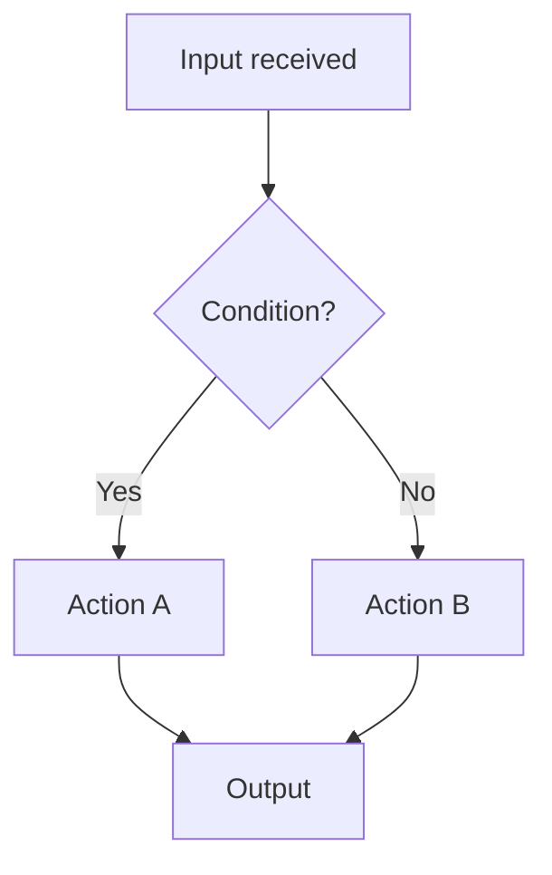

# Module Name

## General Information

**Purpose:** One-sentence summary of what this module does.

**Role:** Describe the general role of this module within the IPU pipeline.

**Integration:** Where this module sits in the system — which units feed into it and which units it feeds.

**Main Use Cases:**

- Use case 1
- Use case 2
- Use case 3

---

### Black Box Diagram

```
          ┌──────────────────────┐
 in_a --> │                      │ --> out_x
 in_b --> │      MODULE NAME      │ --> out_y
 cfg  --> │                      │
          └──────────────────────┘
```

---

## Interfaces

| Name | Type and Direction | Description |
|------|--------------------|-------------|
| `signal_name` | `input logic [N:0]` | Short description |
| `signal_name` | `output logic` | Short description |

### Parameters

| Name | Default | Description |
|------|---------|-------------|
| `PARAM_NAME` | `value` | What this parameter controls |

---

## Assumptions

List any assumptions made about interface behavior, data validity, or system context:

- Signal `X` is always valid when `valid` is asserted.
- ...

---

## Operation Logic

### Logic Flow

Describe from a black-box perspective how the module behaves — inputs, outputs, and requirements. Cover edge cases explicitly.



### Configuration

Describe how the module is configured:

- What configuration registers or signals exist.
- When configurations take effect (e.g., at reset, on a specific cycle, dynamically).

### Required TP and Latency

| Metric | Requirement | Notes |
|--------|-------------|-------|
| Throughput | 1 result/cycle | Sustained |
| Latency | N cycles | From input valid to output valid |
