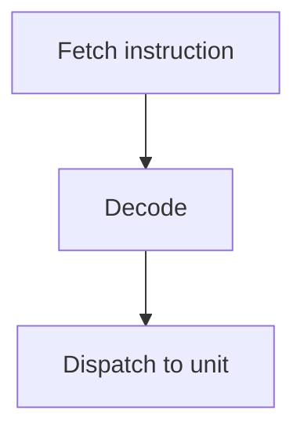

# Control Unit

## General Information

**Purpose:** TODO

**Role:** TODO

**Integration:** TODO

**Main Use Cases:**

- TODO

---

### Black Box Diagram

```
          ┌──────────────────────┐
 prog --> │                      │ --> decoded_op
 pc   --> │     CONTROL UNIT     │ --> dispatch
          │                      │ --> pc_next
          └──────────────────────┘
```

---

## Interfaces

| Name | Type and Direction | Description |
|------|--------------------|-------------|
| `TODO` | `input logic [N:0]` | TODO |

### Parameters

| Name | Default | Description |
|------|---------|-------------|
| `TODO` | `0` | TODO |

---

## Assumptions

- TODO

---

## Operation Logic

### Logic Flow

TODO



### Configuration

TODO

### Required TP and Latency

| Metric | Requirement | Notes |
|--------|-------------|-------|
| Throughput | TODO | |
| Latency | TODO | |
